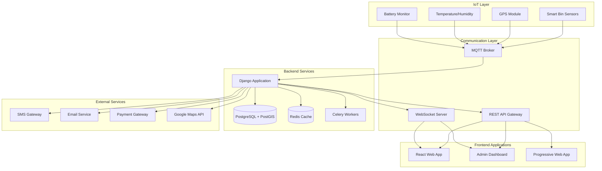
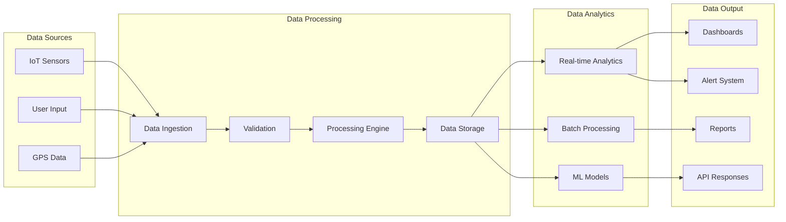
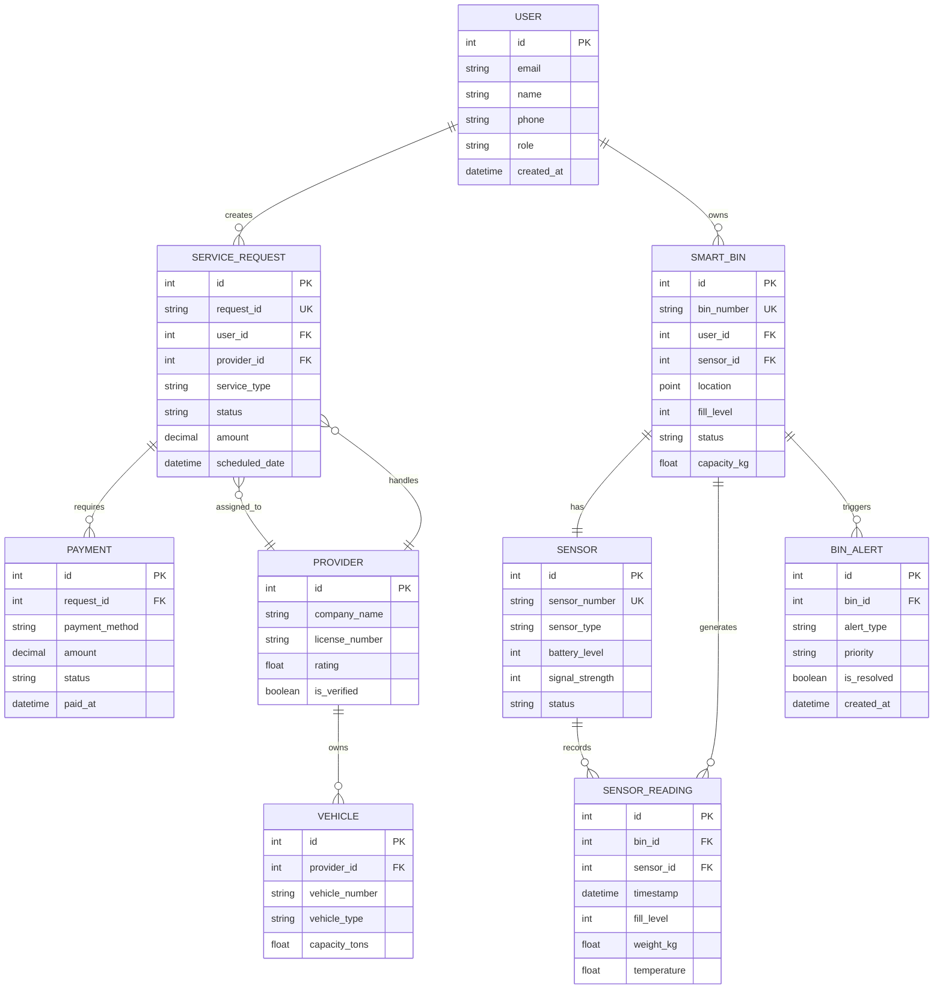
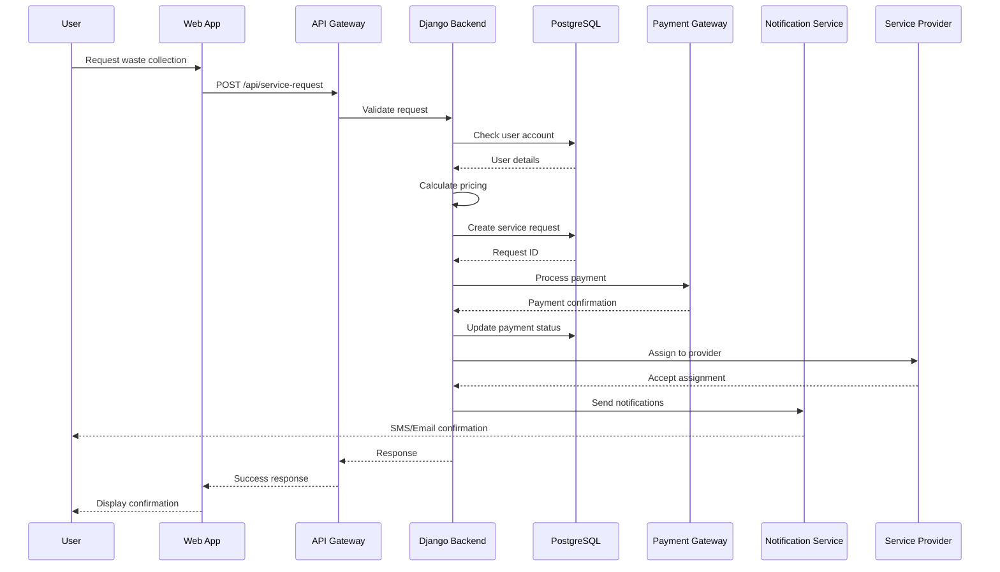
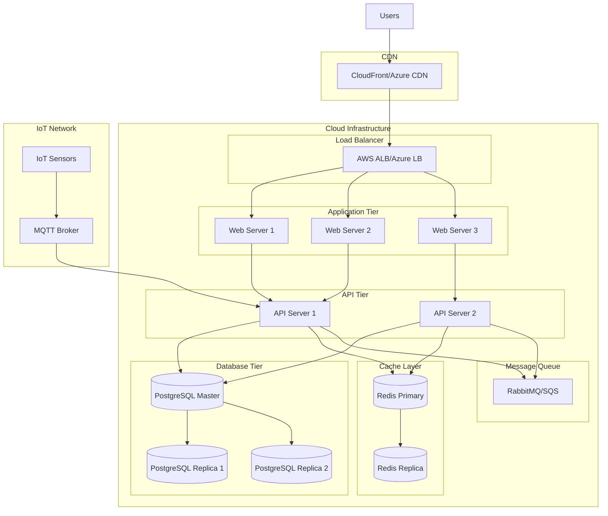

# Wasgo System Diagrams

## 1. System Architecture Diagram

### Mermaid Version


### Draw.io XML Version
```xml
<mxGraphModel dx="1246" dy="643" grid="1" gridSize="10" guides="1" tooltips="1" connect="1" arrows="1" fold="1" page="1" pageScale="1" pageWidth="1200" pageHeight="800" math="0" shadow="0">
  <root>
    <mxCell id="0" />
    <mxCell id="1" parent="0" />
    
    <!-- IoT Layer -->
    <mxCell id="iot-layer" value="IoT Layer" style="swimlane;fillColor=#E8F5E9;strokeColor=#4CAF50;fontStyle=1;fontSize=14;" vertex="1" parent="1">
      <mxGeometry x="40" y="40" width="240" height="200" as="geometry" />
    </mxCell>
    <mxCell id="sensor1" value="Smart Bin Sensors" style="rounded=1;whiteSpace=wrap;html=1;fillColor=#C8E6C9;" vertex="1" parent="iot-layer">
      <mxGeometry x="20" y="40" width="200" height="30" as="geometry" />
    </mxCell>
    <mxCell id="sensor2" value="GPS Module" style="rounded=1;whiteSpace=wrap;html=1;fillColor=#C8E6C9;" vertex="1" parent="iot-layer">
      <mxGeometry x="20" y="80" width="200" height="30" as="geometry" />
    </mxCell>
    <mxCell id="sensor3" value="Temperature/Humidity" style="rounded=1;whiteSpace=wrap;html=1;fillColor=#C8E6C9;" vertex="1" parent="iot-layer">
      <mxGeometry x="20" y="120" width="200" height="30" as="geometry" />
    </mxCell>
    <mxCell id="sensor4" value="Battery Monitor" style="rounded=1;whiteSpace=wrap;html=1;fillColor=#C8E6C9;" vertex="1" parent="iot-layer">
      <mxGeometry x="20" y="160" width="200" height="30" as="geometry" />
    </mxCell>
    
    <!-- Communication Layer -->
    <mxCell id="comm-layer" value="Communication Layer" style="swimlane;fillColor=#E3F2FD;strokeColor=#2196F3;fontStyle=1;fontSize=14;" vertex="1" parent="1">
      <mxGeometry x="320" y="40" width="240" height="200" as="geometry" />
    </mxCell>
    <mxCell id="mqtt" value="MQTT Broker" style="rounded=1;whiteSpace=wrap;html=1;fillColor=#BBDEFB;" vertex="1" parent="comm-layer">
      <mxGeometry x="20" y="40" width="200" height="30" as="geometry" />
    </mxCell>
    <mxCell id="websocket" value="WebSocket Server" style="rounded=1;whiteSpace=wrap;html=1;fillColor=#BBDEFB;" vertex="1" parent="comm-layer">
      <mxGeometry x="20" y="80" width="200" height="30" as="geometry" />
    </mxCell>
    <mxCell id="api" value="REST API Gateway" style="rounded=1;whiteSpace=wrap;html=1;fillColor=#BBDEFB;" vertex="1" parent="comm-layer">
      <mxGeometry x="20" y="120" width="200" height="30" as="geometry" />
    </mxCell>
    
    <!-- Backend Services -->
    <mxCell id="backend-layer" value="Backend Services" style="swimlane;fillColor=#FFF3E0;strokeColor=#FF9800;fontStyle=1;fontSize=14;" vertex="1" parent="1">
      <mxGeometry x="600" y="40" width="240" height="200" as="geometry" />
    </mxCell>
    <mxCell id="django" value="Django Application" style="rounded=1;whiteSpace=wrap;html=1;fillColor=#FFE0B2;" vertex="1" parent="backend-layer">
      <mxGeometry x="20" y="40" width="200" height="30" as="geometry" />
    </mxCell>
    <mxCell id="postgres" value="PostgreSQL + PostGIS" style="shape=cylinder;whiteSpace=wrap;html=1;fillColor=#FFE0B2;" vertex="1" parent="backend-layer">
      <mxGeometry x="20" y="80" width="200" height="40" as="geometry" />
    </mxCell>
    <mxCell id="redis" value="Redis Cache" style="shape=cylinder;whiteSpace=wrap;html=1;fillColor=#FFE0B2;" vertex="1" parent="backend-layer">
      <mxGeometry x="20" y="130" width="95" height="40" as="geometry" />
    </mxCell>
    <mxCell id="celery" value="Celery Workers" style="rounded=1;whiteSpace=wrap;html=1;fillColor=#FFE0B2;" vertex="1" parent="backend-layer">
      <mxGeometry x="125" y="130" width="95" height="40" as="geometry" />
    </mxCell>
    
    <!-- Frontend Applications -->
    <mxCell id="frontend-layer" value="Frontend Applications" style="swimlane;fillColor=#F3E5F5;strokeColor=#9C27B0;fontStyle=1;fontSize=14;" vertex="1" parent="1">
      <mxGeometry x="880" y="40" width="240" height="200" as="geometry" />
    </mxCell>
    <mxCell id="react" value="React Web App" style="rounded=1;whiteSpace=wrap;html=1;fillColor=#E1BEE7;" vertex="1" parent="frontend-layer">
      <mxGeometry x="20" y="40" width="200" height="30" as="geometry" />
    </mxCell>
    <mxCell id="admin" value="Admin Dashboard" style="rounded=1;whiteSpace=wrap;html=1;fillColor=#E1BEE7;" vertex="1" parent="frontend-layer">
      <mxGeometry x="20" y="80" width="200" height="30" as="geometry" />
    </mxCell>
    <mxCell id="pwa" value="Progressive Web App" style="rounded=1;whiteSpace=wrap;html=1;fillColor=#E1BEE7;" vertex="1" parent="frontend-layer">
      <mxGeometry x="20" y="120" width="200" height="30" as="geometry" />
    </mxCell>
    
    <!-- External Services -->
    <mxCell id="external-layer" value="External Services" style="swimlane;fillColor=#FFEBEE;strokeColor=#F44336;fontStyle=1;fontSize=14;" vertex="1" parent="1">
      <mxGeometry x="440" y="280" width="320" height="160" as="geometry" />
    </mxCell>
    <mxCell id="sms" value="SMS Gateway" style="rounded=1;whiteSpace=wrap;html=1;fillColor=#FFCDD2;" vertex="1" parent="external-layer">
      <mxGeometry x="20" y="40" width="140" height="30" as="geometry" />
    </mxCell>
    <mxCell id="email" value="Email Service" style="rounded=1;whiteSpace=wrap;html=1;fillColor=#FFCDD2;" vertex="1" parent="external-layer">
      <mxGeometry x="170" y="40" width="140" height="30" as="geometry" />
    </mxCell>
    <mxCell id="payment" value="Payment Gateway" style="rounded=1;whiteSpace=wrap;html=1;fillColor=#FFCDD2;" vertex="1" parent="external-layer">
      <mxGeometry x="20" y="80" width="140" height="30" as="geometry" />
    </mxCell>
    <mxCell id="maps" value="Google Maps API" style="rounded=1;whiteSpace=wrap;html=1;fillColor=#FFCDD2;" vertex="1" parent="external-layer">
      <mxGeometry x="170" y="80" width="140" height="30" as="geometry" />
    </mxCell>
    
    <!-- Connections -->
    <mxCell id="edge1" style="edgeStyle=orthogonalEdgeStyle;rounded=0;orthogonalLoop=1;jettySize=auto;html=1;strokeWidth=2;strokeColor=#4CAF50;" edge="1" parent="1" source="sensor1" target="mqtt">
      <mxGeometry relative="1" as="geometry" />
    </mxCell>
    <mxCell id="edge2" style="edgeStyle=orthogonalEdgeStyle;rounded=0;orthogonalLoop=1;jettySize=auto;html=1;strokeWidth=2;strokeColor=#2196F3;" edge="1" parent="1" source="mqtt" target="django">
      <mxGeometry relative="1" as="geometry" />
    </mxCell>
    <mxCell id="edge3" style="edgeStyle=orthogonalEdgeStyle;rounded=0;orthogonalLoop=1;jettySize=auto;html=1;strokeWidth=2;strokeColor=#FF9800;" edge="1" parent="1" source="django" target="postgres">
      <mxGeometry relative="1" as="geometry" />
    </mxCell>
    <mxCell id="edge4" style="edgeStyle=orthogonalEdgeStyle;rounded=0;orthogonalLoop=1;jettySize=auto;html=1;strokeWidth=2;strokeColor=#9C27B0;" edge="1" parent="1" source="api" target="react">
      <mxGeometry relative="1" as="geometry" />
    </mxCell>
    <mxCell id="edge5" style="edgeStyle=orthogonalEdgeStyle;rounded=0;orthogonalLoop=1;jettySize=auto;html=1;strokeWidth=2;strokeColor=#F44336;" edge="1" parent="1" source="django" target="external-layer">
      <mxGeometry relative="1" as="geometry" />
    </mxCell>
  </root>
</mxGraphModel>
```

## 2. Data Flow Diagram

### Mermaid Version


### Draw.io XML Version
```xml
<mxGraphModel dx="1246" dy="643" grid="1" gridSize="10" guides="1" tooltips="1" connect="1" arrows="1" fold="1" page="1" pageScale="1" pageWidth="1200" pageHeight="600" math="0" shadow="0">
  <root>
    <mxCell id="0" />
    <mxCell id="1" parent="0" />
    
    <!-- Data Sources -->
    <mxCell id="sources" value="Data Sources" style="swimlane;fillColor=#E8F5E9;strokeColor=#4CAF50;fontStyle=1;" vertex="1" parent="1">
      <mxGeometry x="40" y="40" width="200" height="180" as="geometry" />
    </mxCell>
    <mxCell id="iot-data" value="IoT Sensors" style="shape=parallelogram;perimeter=parallelogramPerimeter;whiteSpace=wrap;html=1;fillColor=#C8E6C9;" vertex="1" parent="sources">
      <mxGeometry x="20" y="40" width="160" height="30" as="geometry" />
    </mxCell>
    <mxCell id="user-data" value="User Input" style="shape=parallelogram;perimeter=parallelogramPerimeter;whiteSpace=wrap;html=1;fillColor=#C8E6C9;" vertex="1" parent="sources">
      <mxGeometry x="20" y="80" width="160" height="30" as="geometry" />
    </mxCell>
    <mxCell id="gps-data" value="GPS Data" style="shape=parallelogram;perimeter=parallelogramPerimeter;whiteSpace=wrap;html=1;fillColor=#C8E6C9;" vertex="1" parent="sources">
      <mxGeometry x="20" y="120" width="160" height="30" as="geometry" />
    </mxCell>
    
    <!-- Data Processing -->
    <mxCell id="processing" value="Data Processing" style="swimlane;fillColor=#E3F2FD;strokeColor=#2196F3;fontStyle=1;" vertex="1" parent="1">
      <mxGeometry x="280" y="40" width="400" height="180" as="geometry" />
    </mxCell>
    <mxCell id="ingest" value="Data Ingestion" style="shape=process;whiteSpace=wrap;html=1;backgroundOutline=1;fillColor=#BBDEFB;" vertex="1" parent="processing">
      <mxGeometry x="20" y="40" width="160" height="40" as="geometry" />
    </mxCell>
    <mxCell id="validate" value="Validation" style="shape=process;whiteSpace=wrap;html=1;backgroundOutline=1;fillColor=#BBDEFB;" vertex="1" parent="processing">
      <mxGeometry x="200" y="40" width="160" height="40" as="geometry" />
    </mxCell>
    <mxCell id="process-engine" value="Processing Engine" style="shape=process;whiteSpace=wrap;html=1;backgroundOutline=1;fillColor=#BBDEFB;" vertex="1" parent="processing">
      <mxGeometry x="20" y="100" width="160" height="40" as="geometry" />
    </mxCell>
    <mxCell id="storage" value="Data Storage" style="shape=cylinder;whiteSpace=wrap;html=1;fillColor=#BBDEFB;" vertex="1" parent="processing">
      <mxGeometry x="200" y="100" width="160" height="60" as="geometry" />
    </mxCell>
    
    <!-- Data Analytics -->
    <mxCell id="analytics" value="Data Analytics" style="swimlane;fillColor=#FFF3E0;strokeColor=#FF9800;fontStyle=1;" vertex="1" parent="1">
      <mxGeometry x="720" y="40" width="200" height="180" as="geometry" />
    </mxCell>
    <mxCell id="realtime" value="Real-time Analytics" style="rounded=1;whiteSpace=wrap;html=1;fillColor=#FFE0B2;" vertex="1" parent="analytics">
      <mxGeometry x="20" y="40" width="160" height="30" as="geometry" />
    </mxCell>
    <mxCell id="batch" value="Batch Processing" style="rounded=1;whiteSpace=wrap;html=1;fillColor=#FFE0B2;" vertex="1" parent="analytics">
      <mxGeometry x="20" y="80" width="160" height="30" as="geometry" />
    </mxCell>
    <mxCell id="ml" value="ML Models" style="rounded=1;whiteSpace=wrap;html=1;fillColor=#FFE0B2;" vertex="1" parent="analytics">
      <mxGeometry x="20" y="120" width="160" height="30" as="geometry" />
    </mxCell>
    
    <!-- Data Output -->
    <mxCell id="output" value="Data Output" style="swimlane;fillColor=#F3E5F5;strokeColor=#9C27B0;fontStyle=1;" vertex="1" parent="1">
      <mxGeometry x="960" y="40" width="200" height="180" as="geometry" />
    </mxCell>
    <mxCell id="dashboard" value="Dashboards" style="shape=document;whiteSpace=wrap;html=1;boundedLbl=1;fillColor=#E1BEE7;" vertex="1" parent="output">
      <mxGeometry x="20" y="35" width="160" height="25" as="geometry" />
    </mxCell>
    <mxCell id="alerts" value="Alert System" style="shape=document;whiteSpace=wrap;html=1;boundedLbl=1;fillColor=#E1BEE7;" vertex="1" parent="output">
      <mxGeometry x="20" y="70" width="160" height="25" as="geometry" />
    </mxCell>
    <mxCell id="reports" value="Reports" style="shape=document;whiteSpace=wrap;html=1;boundedLbl=1;fillColor=#E1BEE7;" vertex="1" parent="output">
      <mxGeometry x="20" y="105" width="160" height="25" as="geometry" />
    </mxCell>
    <mxCell id="api-out" value="API Responses" style="shape=document;whiteSpace=wrap;html=1;boundedLbl=1;fillColor=#E1BEE7;" vertex="1" parent="output">
      <mxGeometry x="20" y="140" width="160" height="25" as="geometry" />
    </mxCell>
    
    <!-- Flow Arrows -->
    <mxCell id="flow1" style="edgeStyle=orthogonalEdgeStyle;rounded=0;orthogonalLoop=1;jettySize=auto;html=1;strokeWidth=2;strokeColor=#4CAF50;endArrow=classic;endFill=1;" edge="1" parent="1" source="iot-data" target="ingest">
      <mxGeometry relative="1" as="geometry" />
    </mxCell>
    <mxCell id="flow2" style="edgeStyle=orthogonalEdgeStyle;rounded=0;orthogonalLoop=1;jettySize=auto;html=1;strokeWidth=2;strokeColor=#2196F3;endArrow=classic;endFill=1;" edge="1" parent="1" source="ingest" target="validate">
      <mxGeometry relative="1" as="geometry" />
    </mxCell>
    <mxCell id="flow3" style="edgeStyle=orthogonalEdgeStyle;rounded=0;orthogonalLoop=1;jettySize=auto;html=1;strokeWidth=2;strokeColor=#2196F3;endArrow=classic;endFill=1;" edge="1" parent="1" source="validate" target="process-engine">
      <mxGeometry relative="1" as="geometry" />
    </mxCell>
    <mxCell id="flow4" style="edgeStyle=orthogonalEdgeStyle;rounded=0;orthogonalLoop=1;jettySize=auto;html=1;strokeWidth=2;strokeColor=#2196F3;endArrow=classic;endFill=1;" edge="1" parent="1" source="process-engine" target="storage">
      <mxGeometry relative="1" as="geometry" />
    </mxCell>
    <mxCell id="flow5" style="edgeStyle=orthogonalEdgeStyle;rounded=0;orthogonalLoop=1;jettySize=auto;html=1;strokeWidth=2;strokeColor=#FF9800;endArrow=classic;endFill=1;" edge="1" parent="1" source="storage" target="realtime">
      <mxGeometry relative="1" as="geometry" />
    </mxCell>
    <mxCell id="flow6" style="edgeStyle=orthogonalEdgeStyle;rounded=0;orthogonalLoop=1;jettySize=auto;html=1;strokeWidth=2;strokeColor=#9C27B0;endArrow=classic;endFill=1;" edge="1" parent="1" source="realtime" target="dashboard">
      <mxGeometry relative="1" as="geometry" />
    </mxCell>
  </root>
</mxGraphModel>
```

## 3. Entity Relationship Diagram (ERD)

### Mermaid Version


### Draw.io XML Version
```xml
<mxGraphModel dx="1246" dy="643" grid="1" gridSize="10" guides="1" tooltips="1" connect="1" arrows="1" fold="1" page="1" pageScale="1" pageWidth="1400" pageHeight="800" math="0" shadow="0">
  <root>
    <mxCell id="0" />
    <mxCell id="1" parent="0" />
    
    <!-- USER Entity -->
    <mxCell id="user-entity" value="USER" style="swimlane;fontStyle=1;childLayout=stackLayout;horizontal=1;startSize=30;horizontalStack=0;resizeParent=1;resizeParentMax=0;resizeLast=0;collapsible=1;marginBottom=0;fillColor=#E8F5E9;strokeColor=#4CAF50;" vertex="1" parent="1">
      <mxGeometry x="80" y="80" width="200" height="180" as="geometry" />
    </mxCell>
    <mxCell id="user-id" value="id: INT (PK)" style="text;strokeColor=none;fillColor=none;align=left;verticalAlign=middle;spacingLeft=4;spacingRight=4;overflow=hidden;points=[[0,0.5],[1,0.5]];portConstraint=eastwest;rotatable=0;" vertex="1" parent="user-entity">
      <mxGeometry y="30" width="200" height="25" as="geometry" />
    </mxCell>
    <mxCell id="user-email" value="email: VARCHAR" style="text;strokeColor=none;fillColor=none;align=left;verticalAlign=middle;spacingLeft=4;spacingRight=4;overflow=hidden;points=[[0,0.5],[1,0.5]];portConstraint=eastwest;rotatable=0;" vertex="1" parent="user-entity">
      <mxGeometry y="55" width="200" height="25" as="geometry" />
    </mxCell>
    <mxCell id="user-name" value="name: VARCHAR" style="text;strokeColor=none;fillColor=none;align=left;verticalAlign=middle;spacingLeft=4;spacingRight=4;overflow=hidden;points=[[0,0.5],[1,0.5]];portConstraint=eastwest;rotatable=0;" vertex="1" parent="user-entity">
      <mxGeometry y="80" width="200" height="25" as="geometry" />
    </mxCell>
    <mxCell id="user-phone" value="phone: VARCHAR" style="text;strokeColor=none;fillColor=none;align=left;verticalAlign=middle;spacingLeft=4;spacingRight=4;overflow=hidden;points=[[0,0.5],[1,0.5]];portConstraint=eastwest;rotatable=0;" vertex="1" parent="user-entity">
      <mxGeometry y="105" width="200" height="25" as="geometry" />
    </mxCell>
    <mxCell id="user-role" value="role: VARCHAR" style="text;strokeColor=none;fillColor=none;align=left;verticalAlign=middle;spacingLeft=4;spacingRight=4;overflow=hidden;points=[[0,0.5],[1,0.5]];portConstraint=eastwest;rotatable=0;" vertex="1" parent="user-entity">
      <mxGeometry y="130" width="200" height="25" as="geometry" />
    </mxCell>
    <mxCell id="user-created" value="created_at: DATETIME" style="text;strokeColor=none;fillColor=none;align=left;verticalAlign=middle;spacingLeft=4;spacingRight=4;overflow=hidden;points=[[0,0.5],[1,0.5]];portConstraint=eastwest;rotatable=0;" vertex="1" parent="user-entity">
      <mxGeometry y="155" width="200" height="25" as="geometry" />
    </mxCell>
    
    <!-- SMART_BIN Entity -->
    <mxCell id="bin-entity" value="SMART_BIN" style="swimlane;fontStyle=1;childLayout=stackLayout;horizontal=1;startSize=30;horizontalStack=0;resizeParent=1;resizeParentMax=0;resizeLast=0;collapsible=1;marginBottom=0;fillColor=#E3F2FD;strokeColor=#2196F3;" vertex="1" parent="1">
      <mxGeometry x="360" y="80" width="200" height="230" as="geometry" />
    </mxCell>
    <mxCell id="bin-id" value="id: INT (PK)" style="text;strokeColor=none;fillColor=none;align=left;verticalAlign=middle;spacingLeft=4;spacingRight=4;overflow=hidden;points=[[0,0.5],[1,0.5]];portConstraint=eastwest;rotatable=0;" vertex="1" parent="bin-entity">
      <mxGeometry y="30" width="200" height="25" as="geometry" />
    </mxCell>
    <mxCell id="bin-number" value="bin_number: VARCHAR (UK)" style="text;strokeColor=none;fillColor=none;align=left;verticalAlign=middle;spacingLeft=4;spacingRight=4;overflow=hidden;points=[[0,0.5],[1,0.5]];portConstraint=eastwest;rotatable=0;" vertex="1" parent="bin-entity">
      <mxGeometry y="55" width="200" height="25" as="geometry" />
    </mxCell>
    <mxCell id="bin-user" value="user_id: INT (FK)" style="text;strokeColor=none;fillColor=none;align=left;verticalAlign=middle;spacingLeft=4;spacingRight=4;overflow=hidden;points=[[0,0.5],[1,0.5]];portConstraint=eastwest;rotatable=0;" vertex="1" parent="bin-entity">
      <mxGeometry y="80" width="200" height="25" as="geometry" />
    </mxCell>
    <mxCell id="bin-sensor" value="sensor_id: INT (FK)" style="text;strokeColor=none;fillColor=none;align=left;verticalAlign=middle;spacingLeft=4;spacingRight=4;overflow=hidden;points=[[0,0.5],[1,0.5]];portConstraint=eastwest;rotatable=0;" vertex="1" parent="bin-entity">
      <mxGeometry y="105" width="200" height="25" as="geometry" />
    </mxCell>
    <mxCell id="bin-location" value="location: POINT" style="text;strokeColor=none;fillColor=none;align=left;verticalAlign=middle;spacingLeft=4;spacingRight=4;overflow=hidden;points=[[0,0.5],[1,0.5]];portConstraint=eastwest;rotatable=0;" vertex="1" parent="bin-entity">
      <mxGeometry y="130" width="200" height="25" as="geometry" />
    </mxCell>
    <mxCell id="bin-fill" value="fill_level: INT" style="text;strokeColor=none;fillColor=none;align=left;verticalAlign=middle;spacingLeft=4;spacingRight=4;overflow=hidden;points=[[0,0.5],[1,0.5]];portConstraint=eastwest;rotatable=0;" vertex="1" parent="bin-entity">
      <mxGeometry y="155" width="200" height="25" as="geometry" />
    </mxCell>
    <mxCell id="bin-status" value="status: VARCHAR" style="text;strokeColor=none;fillColor=none;align=left;verticalAlign=middle;spacingLeft=4;spacingRight=4;overflow=hidden;points=[[0,0.5],[1,0.5]];portConstraint=eastwest;rotatable=0;" vertex="1" parent="bin-entity">
      <mxGeometry y="180" width="200" height="25" as="geometry" />
    </mxCell>
    <mxCell id="bin-capacity" value="capacity_kg: FLOAT" style="text;strokeColor=none;fillColor=none;align=left;verticalAlign=middle;spacingLeft=4;spacingRight=4;overflow=hidden;points=[[0,0.5],[1,0.5]];portConstraint=eastwest;rotatable=0;" vertex="1" parent="bin-entity">
      <mxGeometry y="205" width="200" height="25" as="geometry" />
    </mxCell>
    
    <!-- SENSOR Entity -->
    <mxCell id="sensor-entity" value="SENSOR" style="swimlane;fontStyle=1;childLayout=stackLayout;horizontal=1;startSize=30;horizontalStack=0;resizeParent=1;resizeParentMax=0;resizeLast=0;collapsible=1;marginBottom=0;fillColor=#FFF3E0;strokeColor=#FF9800;" vertex="1" parent="1">
      <mxGeometry x="640" y="80" width="200" height="180" as="geometry" />
    </mxCell>
    <mxCell id="sensor-id" value="id: INT (PK)" style="text;strokeColor=none;fillColor=none;align=left;verticalAlign=middle;spacingLeft=4;spacingRight=4;overflow=hidden;points=[[0,0.5],[1,0.5]];portConstraint=eastwest;rotatable=0;" vertex="1" parent="sensor-entity">
      <mxGeometry y="30" width="200" height="25" as="geometry" />
    </mxCell>
    <mxCell id="sensor-number" value="sensor_number: VARCHAR (UK)" style="text;strokeColor=none;fillColor=none;align=left;verticalAlign=middle;spacingLeft=4;spacingRight=4;overflow=hidden;points=[[0,0.5],[1,0.5]];portConstraint=eastwest;rotatable=0;" vertex="1" parent="sensor-entity">
      <mxGeometry y="55" width="200" height="25" as="geometry" />
    </mxCell>
    <mxCell id="sensor-type" value="sensor_type: VARCHAR" style="text;strokeColor=none;fillColor=none;align=left;verticalAlign=middle;spacingLeft=4;spacingRight=4;overflow=hidden;points=[[0,0.5],[1,0.5]];portConstraint=eastwest;rotatable=0;" vertex="1" parent="sensor-entity">
      <mxGeometry y="80" width="200" height="25" as="geometry" />
    </mxCell>
    <mxCell id="sensor-battery" value="battery_level: INT" style="text;strokeColor=none;fillColor=none;align=left;verticalAlign=middle;spacingLeft=4;spacingRight=4;overflow=hidden;points=[[0,0.5],[1,0.5]];portConstraint=eastwest;rotatable=0;" vertex="1" parent="sensor-entity">
      <mxGeometry y="105" width="200" height="25" as="geometry" />
    </mxCell>
    <mxCell id="sensor-signal" value="signal_strength: INT" style="text;strokeColor=none;fillColor=none;align=left;verticalAlign=middle;spacingLeft=4;spacingRight=4;overflow=hidden;points=[[0,0.5],[1,0.5]];portConstraint=eastwest;rotatable=0;" vertex="1" parent="sensor-entity">
      <mxGeometry y="130" width="200" height="25" as="geometry" />
    </mxCell>
    <mxCell id="sensor-status" value="status: VARCHAR" style="text;strokeColor=none;fillColor=none;align=left;verticalAlign=middle;spacingLeft=4;spacingRight=4;overflow=hidden;points=[[0,0.5],[1,0.5]];portConstraint=eastwest;rotatable=0;" vertex="1" parent="sensor-entity">
      <mxGeometry y="155" width="200" height="25" as="geometry" />
    </mxCell>
    
    <!-- SERVICE_REQUEST Entity -->
    <mxCell id="request-entity" value="SERVICE_REQUEST" style="swimlane;fontStyle=1;childLayout=stackLayout;horizontal=1;startSize=30;horizontalStack=0;resizeParent=1;resizeParentMax=0;resizeLast=0;collapsible=1;marginBottom=0;fillColor=#F3E5F5;strokeColor=#9C27B0;" vertex="1" parent="1">
      <mxGeometry x="80" y="340" width="200" height="230" as="geometry" />
    </mxCell>
    <mxCell id="request-id" value="id: INT (PK)" style="text;strokeColor=none;fillColor=none;align=left;verticalAlign=middle;spacingLeft=4;spacingRight=4;overflow=hidden;points=[[0,0.5],[1,0.5]];portConstraint=eastwest;rotatable=0;" vertex="1" parent="request-entity">
      <mxGeometry y="30" width="200" height="25" as="geometry" />
    </mxCell>
    <mxCell id="request-rid" value="request_id: VARCHAR (UK)" style="text;strokeColor=none;fillColor=none;align=left;verticalAlign=middle;spacingLeft=4;spacingRight=4;overflow=hidden;points=[[0,0.5],[1,0.5]];portConstraint=eastwest;rotatable=0;" vertex="1" parent="request-entity">
      <mxGeometry y="55" width="200" height="25" as="geometry" />
    </mxCell>
    <mxCell id="request-user" value="user_id: INT (FK)" style="text;strokeColor=none;fillColor=none;align=left;verticalAlign=middle;spacingLeft=4;spacingRight=4;overflow=hidden;points=[[0,0.5],[1,0.5]];portConstraint=eastwest;rotatable=0;" vertex="1" parent="request-entity">
      <mxGeometry y="80" width="200" height="25" as="geometry" />
    </mxCell>
    <mxCell id="request-provider" value="provider_id: INT (FK)" style="text;strokeColor=none;fillColor=none;align=left;verticalAlign=middle;spacingLeft=4;spacingRight=4;overflow=hidden;points=[[0,0.5],[1,0.5]];portConstraint=eastwest;rotatable=0;" vertex="1" parent="request-entity">
      <mxGeometry y="105" width="200" height="25" as="geometry" />
    </mxCell>
    <mxCell id="request-type" value="service_type: VARCHAR" style="text;strokeColor=none;fillColor=none;align=left;verticalAlign=middle;spacingLeft=4;spacingRight=4;overflow=hidden;points=[[0,0.5],[1,0.5]];portConstraint=eastwest;rotatable=0;" vertex="1" parent="request-entity">
      <mxGeometry y="130" width="200" height="25" as="geometry" />
    </mxCell>
    <mxCell id="request-status" value="status: VARCHAR" style="text;strokeColor=none;fillColor=none;align=left;verticalAlign=middle;spacingLeft=4;spacingRight=4;overflow=hidden;points=[[0,0.5],[1,0.5]];portConstraint=eastwest;rotatable=0;" vertex="1" parent="request-entity">
      <mxGeometry y="155" width="200" height="25" as="geometry" />
    </mxCell>
    <mxCell id="request-amount" value="amount: DECIMAL" style="text;strokeColor=none;fillColor=none;align=left;verticalAlign=middle;spacingLeft=4;spacingRight=4;overflow=hidden;points=[[0,0.5],[1,0.5]];portConstraint=eastwest;rotatable=0;" vertex="1" parent="request-entity">
      <mxGeometry y="180" width="200" height="25" as="geometry" />
    </mxCell>
    <mxCell id="request-date" value="scheduled_date: DATETIME" style="text;strokeColor=none;fillColor=none;align=left;verticalAlign=middle;spacingLeft=4;spacingRight=4;overflow=hidden;points=[[0,0.5],[1,0.5]];portConstraint=eastwest;rotatable=0;" vertex="1" parent="request-entity">
      <mxGeometry y="205" width="200" height="25" as="geometry" />
    </mxCell>
    
    <!-- SENSOR_READING Entity -->
    <mxCell id="reading-entity" value="SENSOR_READING" style="swimlane;fontStyle=1;childLayout=stackLayout;horizontal=1;startSize=30;horizontalStack=0;resizeParent=1;resizeParentMax=0;resizeLast=0;collapsible=1;marginBottom=0;fillColor=#FFEBEE;strokeColor=#F44336;" vertex="1" parent="1">
      <mxGeometry x="920" y="80" width="200" height="205" as="geometry" />
    </mxCell>
    <mxCell id="reading-id" value="id: INT (PK)" style="text;strokeColor=none;fillColor=none;align=left;verticalAlign=middle;spacingLeft=4;spacingRight=4;overflow=hidden;points=[[0,0.5],[1,0.5]];portConstraint=eastwest;rotatable=0;" vertex="1" parent="reading-entity">
      <mxGeometry y="30" width="200" height="25" as="geometry" />
    </mxCell>
    <mxCell id="reading-bin" value="bin_id: INT (FK)" style="text;strokeColor=none;fillColor=none;align=left;verticalAlign=middle;spacingLeft=4;spacingRight=4;overflow=hidden;points=[[0,0.5],[1,0.5]];portConstraint=eastwest;rotatable=0;" vertex="1" parent="reading-entity">
      <mxGeometry y="55" width="200" height="25" as="geometry" />
    </mxCell>
    <mxCell id="reading-sensor" value="sensor_id: INT (FK)" style="text;strokeColor=none;fillColor=none;align=left;verticalAlign=middle;spacingLeft=4;spacingRight=4;overflow=hidden;points=[[0,0.5],[1,0.5]];portConstraint=eastwest;rotatable=0;" vertex="1" parent="reading-entity">
      <mxGeometry y="80" width="200" height="25" as="geometry" />
    </mxCell>
    <mxCell id="reading-time" value="timestamp: DATETIME" style="text;strokeColor=none;fillColor=none;align=left;verticalAlign=middle;spacingLeft=4;spacingRight=4;overflow=hidden;points=[[0,0.5],[1,0.5]];portConstraint=eastwest;rotatable=0;" vertex="1" parent="reading-entity">
      <mxGeometry y="105" width="200" height="25" as="geometry" />
    </mxCell>
    <mxCell id="reading-fill" value="fill_level: INT" style="text;strokeColor=none;fillColor=none;align=left;verticalAlign=middle;spacingLeft=4;spacingRight=4;overflow=hidden;points=[[0,0.5],[1,0.5]];portConstraint=eastwest;rotatable=0;" vertex="1" parent="reading-entity">
      <mxGeometry y="130" width="200" height="25" as="geometry" />
    </mxCell>
    <mxCell id="reading-weight" value="weight_kg: FLOAT" style="text;strokeColor=none;fillColor=none;align=left;verticalAlign=middle;spacingLeft=4;spacingRight=4;overflow=hidden;points=[[0,0.5],[1,0.5]];portConstraint=eastwest;rotatable=0;" vertex="1" parent="reading-entity">
      <mxGeometry y="155" width="200" height="25" as="geometry" />
    </mxCell>
    <mxCell id="reading-temp" value="temperature: FLOAT" style="text;strokeColor=none;fillColor=none;align=left;verticalAlign=middle;spacingLeft=4;spacingRight=4;overflow=hidden;points=[[0,0.5],[1,0.5]];portConstraint=eastwest;rotatable=0;" vertex="1" parent="reading-entity">
      <mxGeometry y="180" width="200" height="25" as="geometry" />
    </mxCell>
    
    <!-- Relationships -->
    <mxCell id="rel1" value="owns" style="edgeStyle=orthogonalEdgeStyle;rounded=0;orthogonalLoop=1;jettySize=auto;html=1;startArrow=ERone;startFill=0;endArrow=ERzeroToMany;endFill=1;strokeWidth=2;" edge="1" parent="1" source="user-entity" target="bin-entity">
      <mxGeometry relative="1" as="geometry" />
    </mxCell>
    <mxCell id="rel2" value="has" style="edgeStyle=orthogonalEdgeStyle;rounded=0;orthogonalLoop=1;jettySize=auto;html=1;startArrow=ERone;startFill=0;endArrow=ERone;endFill=0;strokeWidth=2;" edge="1" parent="1" source="bin-entity" target="sensor-entity">
      <mxGeometry relative="1" as="geometry" />
    </mxCell>
    <mxCell id="rel3" value="generates" style="edgeStyle=orthogonalEdgeStyle;rounded=0;orthogonalLoop=1;jettySize=auto;html=1;startArrow=ERone;startFill=0;endArrow=ERzeroToMany;endFill=1;strokeWidth=2;" edge="1" parent="1" source="bin-entity" target="reading-entity">
      <mxGeometry relative="1" as="geometry" />
    </mxCell>
    <mxCell id="rel4" value="creates" style="edgeStyle=orthogonalEdgeStyle;rounded=0;orthogonalLoop=1;jettySize=auto;html=1;startArrow=ERone;startFill=0;endArrow=ERzeroToMany;endFill=1;strokeWidth=2;" edge="1" parent="1" source="user-entity" target="request-entity">
      <mxGeometry relative="1" as="geometry" />
    </mxCell>
  </root>
</mxGraphModel>
```

## 4. Sequence Diagram - Service Request Flow

### Mermaid Version


## 5. Deployment Architecture

### Mermaid Version


## Instructions for Using These Diagrams

### For Mermaid Diagrams:
1. Copy the Mermaid code
2. Use in markdown files with ```mermaid code blocks
3. Or use Mermaid Live Editor: https://mermaid.live/
4. Export as PNG/SVG for presentations

### For Draw.io Diagrams:
1. Open draw.io (https://app.diagrams.net/)
2. Create new diagram
3. Go to Extras > Edit Diagram
4. Replace the XML content with the provided code
5. Click Apply
6. Save and export as needed

### Converting PlantUML to Draw.io:
1. Generate PNG from PlantUML
2. Import PNG to draw.io as background
3. Trace over with draw.io shapes for editable version

These diagrams cover:
- System Architecture
- Data Flow
- Entity Relationships
- Sequence Diagrams
- Deployment Architecture

All formatted for both documentation (Mermaid) and presentation (Draw.io).