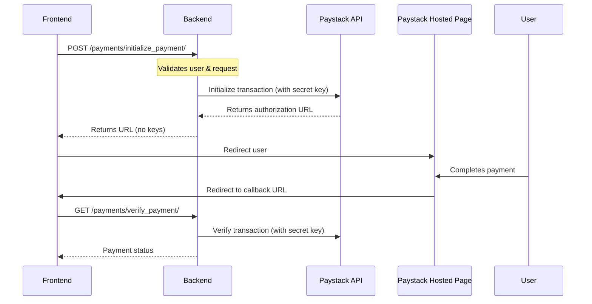
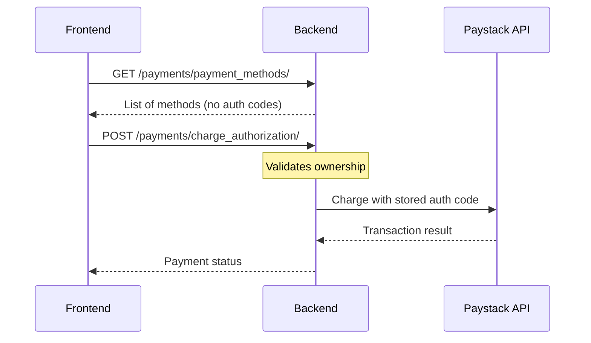

# Secure Paystack Payment Integration

## Overview

This implementation ensures that all sensitive payment operations and API keys are handled exclusively on the backend, with the frontend only receiving non-sensitive data like payment URLs and references.

## Security Architecture

### Backend (Server-Side Only)
- **API Keys Storage**: Paystack secret keys stored in environment variables
- **Payment Initialization**: All payment creation handled server-side
- **Transaction Verification**: Server verifies all transactions with Paystack
- **Authorization Storage**: Payment authorization codes stored encrypted in database
- **Webhook Processing**: Signature verification and event processing

### Frontend (Client-Side)
- **No API Keys**: Frontend never receives or stores API keys
- **Redirect Flow**: Users redirected to Paystack's hosted payment page
- **Reference Only**: Frontend only handles payment references, not sensitive data
- **Method IDs**: Saved payment methods referenced by ID only

## Implementation Flow

### 1. New Payment Flow



### 2. Saved Card Payment Flow



## API Endpoints

### Initialize Payment
```http
POST /api/payments/initialize_payment/
Authorization: Bearer {user_token}

{
  "amount": 5000.00,
  "email": "user@example.com",
  "request_id": "uuid",
  "callback_url": "https://app.com/payment/callback"
}

Response:
{
  "success": true,
  "data": {
    "payment_id": "123",
    "reference": "WASGO-ABC123",
    "authorization_url": "https://checkout.paystack.com/..."
  }
}
```

### Charge Saved Card
```http
POST /api/payments/charge_authorization/
Authorization: Bearer {user_token}

{
  "payment_method_id": "456",  // Only ID, no auth code
  "amount": 5000.00,
  "email": "user@example.com"
}
```

### Verify Payment
```http
GET /api/payments/verify_payment/?reference=WASGO-ABC123
Authorization: Bearer {user_token}
```

### Get Payment Methods
```http
GET /api/payments/payment_methods/
Authorization: Bearer {user_token}

Response:
{
  "success": true,
  "data": [
    {
      "id": "456",
      "type": "card",
      "last4": "4081",
      "brand": "visa",
      "exp_month": "12",
      "exp_year": "2025"
      // No authorization_code exposed
    }
  ]
}
```

## Security Features

### 1. Environment Variables
```python
# settings.py
import os
from dotenv import load_dotenv

load_dotenv()

PAYSTACK_SECRET_KEY = os.getenv('PAYSTACK_SECRET_KEY')
PAYSTACK_PUBLIC_KEY = os.getenv('PAYSTACK_PUBLIC_KEY')

# Never expose these in API responses
```

### 2. User Ownership Verification
```python
# Every payment operation verifies ownership
payment_method = PaymentMethod.objects.get(id=method_id)
if payment_method.user != request.user:
    return Response({'error': 'Unauthorized'}, status=403)
```

### 3. Webhook Signature Verification
```python
def verify_webhook_signature(payload, signature):
    computed = hmac.new(
        secret_key.encode(),
        payload.encode(),
        hashlib.sha512
    ).hexdigest()
    return computed == signature
```

### 4. Database Encryption
```python
# Consider encrypting sensitive fields
from django_cryptography.fields import encrypt

class PaymentMethod(Basemodel):
    authorization_code = encrypt(models.CharField(max_length=100))
```

## Frontend Integration

### React Component Usage
```tsx
import PaystackPaymentSecure from './PaystackPaymentSecure';

function CheckoutPage() {
  const handlePaymentSuccess = (reference) => {
    // Payment successful, reference received
    console.log('Payment reference:', reference);
  };

  return (
    <PaystackPaymentSecure
      amount={5000}
      email="user@example.com"
      requestId="request-uuid"
      onSuccess={handlePaymentSuccess}
    />
  );
}
```

### No Direct Paystack Library
The frontend doesn't use `react-paystack` library directly. Instead:
1. Frontend calls backend to initialize payment
2. Backend returns Paystack checkout URL
3. Frontend redirects to Paystack's hosted page
4. After payment, user redirected back to app
5. Frontend verifies payment with backend

## Deployment Checklist

### Backend
- [ ] Set `PAYSTACK_SECRET_KEY` in environment variables
- [ ] Set `PAYSTACK_PUBLIC_KEY` in environment variables  
- [ ] Configure webhook URL in Paystack dashboard
- [ ] Enable HTTPS for production
- [ ] Set up database encryption for sensitive fields
- [ ] Configure CORS for your frontend domain
- [ ] Set up rate limiting for payment endpoints
- [ ] Enable audit logging for payment operations

### Frontend
- [ ] Remove any hardcoded API keys
- [ ] Set backend API URL in environment variables
- [ ] Implement proper error handling
- [ ] Add loading states during payment processing
- [ ] Test redirect flow thoroughly
- [ ] Implement timeout handling

### Paystack Dashboard
- [ ] Add webhook endpoint: `https://api.yourdomain.com/payments/webhook/`
- [ ] Configure callback URL
- [ ] Enable appropriate payment channels
- [ ] Set up test/live mode correctly
- [ ] Configure payment page customization

## Testing

### Test Cards (Paystack Test Mode)
```
Success: 4084084084084081
Failed: 4084080000000409
```

### Test Flow
1. Initialize payment with test amount
2. Use test card on Paystack page
3. Verify redirect and callback
4. Check webhook processing
5. Verify payment status in database

## Error Handling

### Common Errors and Solutions

1. **Invalid Signature Error**
   - Ensure webhook URL is correct
   - Verify secret key is properly set
   - Check for trailing slashes in URLs

2. **Unauthorized Payment Method**
   - User trying to use another user's saved card
   - Implement proper ownership checks

3. **Payment Verification Failed**
   - Network timeout - implement retry logic
   - Invalid reference - check database consistency

## Monitoring

### Key Metrics to Track
- Payment success rate
- Average payment processing time
- Failed payment reasons
- Webhook processing delays
- Saved card usage rate

### Logging
```python
import logging

logger = logging.getLogger('payments')

# Log all payment operations
logger.info(f"Payment initialized: {reference} for user {user_id}")
logger.error(f"Payment failed: {reference} - {error}")
logger.warning(f"Unauthorized access attempt: user {user_id}")
```

## Support

For issues or questions:
1. Check Paystack API documentation
2. Review error logs
3. Test in Paystack test mode first
4. Contact Paystack support for API issues