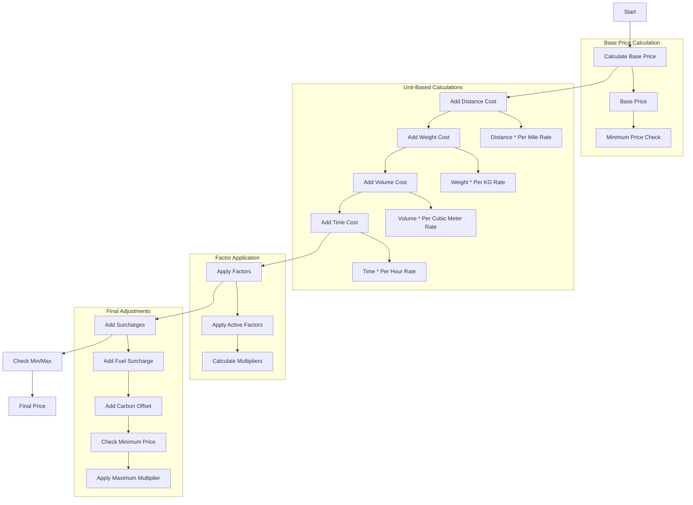

# Pricing Configuration Flow

## Base Rates Structure

### 1. Fixed Base Components

-   **Base Price**: Starting price for any job
-   **Minimum Price**: Absolute minimum charge regardless of calculations
-   **Maximum Price Multiplier**: Cap on how much the final price can be multiplied

### 2. Per-Unit Base Rates

-   **Per Mile**: Distance-based pricing
-   **Per KG**: Weight-based pricing
-   **Per Cubic Meter**: Volume-based pricing
-   **Per Hour**: Time-based pricing

### 3. Additional Charges

-   **Fuel Surcharge**: Percentage added to account for fuel costs
-   **Carbon Offset**: Percentage for environmental impact

## Pricing Calculation Flow

## Detailed Calculation Steps

1. **Start with Base Price**

    - Initial fixed cost for any job
    - Acts as a starting point for all calculations

2. **Add Unit-Based Costs**

    - Distance Cost = Miles × Per Mile Rate
    - Weight Cost = Weight (kg) × Per KG Rate
    - Volume Cost = Volume (m³) × Per Cubic Meter Rate
    - Time Cost = Hours × Per Hour Rate

3. **Apply Active Factors**

    - Each active factor can modify the price
    - Factors can be additive or multiplicative
    - Example factors:
        - Time of day
        - Weather conditions
        - Special handling requirements
        - Vehicle type
        - Service level

4. **Add Surcharges**

    - Fuel Surcharge = (Subtotal × Fuel Surcharge Percentage)
    - Carbon Offset = (Subtotal × Carbon Offset Rate)

5. **Final Price Adjustments**
    - Check against Minimum Price
    - Apply Maximum Price Multiplier if needed

## Example Calculation

Let's say we have a job with:

-   Base Price: $50
-   Distance: 10 miles
-   Weight: 100 kg
-   Volume: 2 m³
-   Time: 2 hours
-   Active Factors: +20% for rush hour
-   Fuel Surcharge: 5%
-   Carbon Offset: 2%

Calculation:

1. Base Price: $50
2. Distance Cost: 10 miles × $2/mile = $20
3. Weight Cost: 100 kg × $0.5/kg = $50
4. Volume Cost: 2 m³ × $10/m³ = $20
5. Time Cost: 2 hours × $15/hour = $30
6. Subtotal: $50 + $20 + $50 + $20 + $30 = $170
7. Factor Adjustment: $170 × 1.20 = $204
8. Fuel Surcharge: $204 × 0.05 = $10.20
9. Carbon Offset: $204 × 0.02 = $4.08
10. Final Price: $204 + $10.20 + $4.08 = $218.28

## Configuration Guidelines

1. **Base Price**

    - Set a reasonable starting point
    - Consider operational costs
    - Should cover basic overhead

2. **Per-Unit Rates**

    - Distance: Consider fuel and vehicle costs
    - Weight: Account for vehicle capacity and handling
    - Volume: Consider space utilization
    - Time: Factor in labor and opportunity costs

3. **Minimum Price**

    - Set to cover basic operational costs
    - Should be higher than base price
    - Consider minimum profitable job size

4. **Maximum Multiplier**

    - Set to prevent unreasonable charges
    - Consider market rates
    - Account for peak demand periods

5. **Surcharges**
    - Fuel: Track fuel price trends
    - Carbon: Consider environmental impact
    - Adjust periodically based on market conditions

## Best Practices

1. **Regular Review**

    - Review and adjust rates quarterly
    - Monitor market conditions
    - Track competitor pricing

2. **Factor Management**

    - Keep factors relevant and up-to-date
    - Remove obsolete factors
    - Add new factors as needed

3. **Testing**

    - Test new configurations with sample jobs
    - Verify calculations with real-world scenarios
    - Monitor customer feedback

4. **Documentation**
    - Keep pricing rules well-documented
    - Train staff on pricing logic
    - Maintain clear communication with customers
