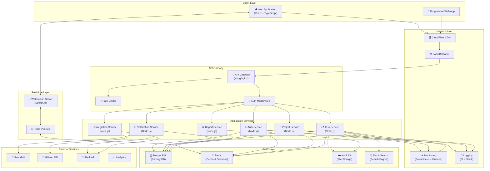

# System Architecture

## Overview
The Task Management System follows a microservices-oriented architecture with clear separation of concerns, designed for scalability, maintainability, and high availability.

## Architecture Diagram



## Technology Stack

### Frontend
| Component | Technology | Purpose |
|-----------|------------|---------|
| Framework | React 18 | UI framework |
| Language | TypeScript 5 | Type safety |
| State Management | Redux Toolkit | Global state |
| Routing | React Router v6 | Navigation |
| UI Library | Material-UI v5 | Component library |
| Forms | React Hook Form | Form handling |
| HTTP Client | Axios | API communication |
| WebSocket | Socket.io-client | Real-time updates |
| Charts | Recharts | Data visualization |
| Testing | Jest + React Testing Library | Unit/Integration tests |

### Backend
| Component | Technology | Purpose |
|-----------|------------|---------|
| Runtime | Node.js 20 LTS | JavaScript runtime |
| Framework | Express.js | Web framework |
| Language | TypeScript 5 | Type safety |
| ORM | Prisma | Database ORM |
| Authentication | JWT + Passport.js | Auth management |
| Validation | Joi | Input validation |
| WebSocket | Socket.io | Real-time communication |
| Queue | Bull | Job queue |
| Testing | Jest + Supertest | Unit/Integration tests |

### Database & Storage
| Component | Technology | Purpose |
|-----------|------------|---------|
| Primary DB | PostgreSQL 15 | Relational data |
| Cache | Redis 7 | Caching & sessions |
| Search | ElasticSearch 8 | Full-text search |
| File Storage | AWS S3 | Object storage |
| CDN | CloudFlare | Static content delivery |

### Infrastructure
| Component | Technology | Purpose |
|-----------|------------|---------|
| Container | Docker | Containerization |
| Orchestration | Kubernetes | Container orchestration |
| CI/CD | GitHub Actions | Automation |
| Monitoring | Prometheus + Grafana | Metrics & visualization |
| Logging | ELK Stack | Log aggregation |
| API Gateway | Kong | API management |
| Load Balancer | nginx | Traffic distribution |

## Architectural Patterns

### 1. Microservices Architecture
```yaml
Services:
  auth-service:
    responsibilities:
      - User authentication
      - Token management
      - Password management
    database: PostgreSQL
    cache: Redis
    
  project-service:
    responsibilities:
      - Project CRUD
      - Team management
      - Project settings
    database: PostgreSQL
    cache: Redis
    
  task-service:
    responsibilities:
      - Task CRUD
      - Comments
      - Attachments
    database: PostgreSQL
    cache: Redis
    search: ElasticSearch
    
  notification-service:
    responsibilities:
      - Email notifications
      - In-app notifications
      - Push notifications
    database: PostgreSQL
    queue: Redis/Bull
    
  report-service:
    responsibilities:
      - Report generation
      - Analytics
      - Exports
    database: PostgreSQL (read replica)
    storage: S3
```

### 2. Event-Driven Architecture
```javascript
// Event Bus Implementation
class EventBus {
  events = {
    'task.created': ['notification-service', 'activity-service'],
    'task.updated': ['notification-service', 'search-service'],
    'task.assigned': ['notification-service', 'email-service'],
    'sprint.started': ['notification-service', 'metrics-service'],
    'sprint.completed': ['report-service', 'metrics-service'],
    'user.registered': ['email-service', 'analytics-service'],
    'project.created': ['activity-service', 'search-service']
  }
}
```

### 3. CQRS Pattern
```typescript
// Command Side
interface CreateTaskCommand {
  projectId: string;
  title: string;
  description: string;
  assignees: string[];
}

// Query Side
interface TaskQueryModel {
  id: string;
  title: string;
  status: string;
  assignees: User[];
  comments: Comment[];
  // Denormalized for performance
  projectName: string;
  sprintName: string;
}
```

### 4. Repository Pattern
```typescript
interface TaskRepository {
  create(task: CreateTaskDTO): Promise<Task>;
  findById(id: string): Promise<Task>;
  findByProject(projectId: string): Promise<Task[]>;
  update(id: string, updates: UpdateTaskDTO): Promise<Task>;
  delete(id: string): Promise<void>;
}

class PostgresTaskRepository implements TaskRepository {
  // Implementation
}

class CachedTaskRepository implements TaskRepository {
  constructor(
    private repository: TaskRepository,
    private cache: RedisCache
  ) {}
  // Caching decorator implementation
}
```

## Security Architecture

### Authentication & Authorization
```yaml
Authentication:
  type: JWT
  algorithm: RS256
  access_token_ttl: 15m
  refresh_token_ttl: 7d
  
Authorization:
  type: RBAC
  roles:
    - admin
    - project_manager
    - developer
    - viewer
  
  permissions:
    admin: ["*"]
    project_manager: ["project.*", "task.*", "sprint.*"]
    developer: ["task.read", "task.update", "comment.*"]
    viewer: ["*.read"]
```

### Security Layers
1. **Network Security**
   - HTTPS/TLS 1.3
   - Web Application Firewall (WAF)
   - DDoS protection (CloudFlare)

2. **Application Security**
   - Input validation
   - SQL injection prevention (Parameterized queries)
   - XSS protection (Content Security Policy)
   - CSRF tokens
   - Rate limiting

3. **Data Security**
   - Encryption at rest (AES-256)
   - Encryption in transit (TLS)
   - Database encryption
   - Secure file storage (S3 with encryption)

## Scalability Strategy

### Horizontal Scaling
```yaml
Service Replicas:
  auth-service: 2-4 instances
  project-service: 2-6 instances
  task-service: 4-10 instances
  notification-service: 2-4 instances
  report-service: 1-3 instances
  
Auto-scaling Rules:
  CPU: > 70% for 5 minutes
  Memory: > 80% for 5 minutes
  Request Rate: > 1000 req/s
```

### Caching Strategy
```javascript
// Multi-level caching
const cacheLevels = {
  L1: 'Browser Cache (Service Worker)',
  L2: 'CDN Cache (CloudFlare)',
  L3: 'Application Cache (Redis)',
  L4: 'Database Cache (Query Cache)'
};

// Cache TTLs
const cacheTTL = {
  staticAssets: '1 year',
  userProfile: '1 hour',
  projectList: '5 minutes',
  taskList: '1 minute',
  realtimeData: 'no-cache'
};
```

### Database Optimization
1. **Read Replicas**
   - Master: Write operations
   - Replica 1: Read operations
   - Replica 2: Analytics & Reports

2. **Partitioning**
   ```sql
   -- Partition by project
   CREATE TABLE tasks_partition (
     LIKE tasks INCLUDING ALL
   ) PARTITION BY HASH (project_id);
   
   -- Partition by date
   CREATE TABLE activity_logs_partition (
     LIKE activity_logs INCLUDING ALL
   ) PARTITION BY RANGE (created_at);
   ```

3. **Indexing Strategy**
   ```sql
   -- Composite indexes for common queries
   CREATE INDEX idx_tasks_project_status 
     ON tasks(project_id, status);
   
   CREATE INDEX idx_tasks_assignee_status 
     ON task_assignees(user_id, task_id);
   ```

## Deployment Architecture

### Container Strategy
```dockerfile
# Multi-stage build
FROM node:20-alpine AS builder
WORKDIR /app
COPY package*.json ./
RUN npm ci --only=production

FROM node:20-alpine
WORKDIR /app
COPY --from=builder /app/node_modules ./node_modules
COPY . .
EXPOSE 3000
CMD ["node", "dist/index.js"]
```

### Kubernetes Configuration
```yaml
apiVersion: apps/v1
kind: Deployment
metadata:
  name: task-service
spec:
  replicas: 3
  selector:
    matchLabels:
      app: task-service
  template:
    metadata:
      labels:
        app: task-service
    spec:
      containers:
      - name: task-service
        image: task-service:latest
        ports:
        - containerPort: 3000
        env:
        - name: NODE_ENV
          value: "production"
        resources:
          requests:
            memory: "256Mi"
            cpu: "250m"
          limits:
            memory: "512Mi"
            cpu: "500m"
```

## Monitoring & Observability

### Metrics Collection
```yaml
Application Metrics:
  - Request rate
  - Response time
  - Error rate
  - Active users
  - Database connections
  
Business Metrics:
  - Tasks created/completed
  - Sprint velocity
  - User engagement
  - Feature adoption
  
Infrastructure Metrics:
  - CPU usage
  - Memory usage
  - Disk I/O
  - Network traffic
```

### Logging Strategy
```javascript
// Structured logging
const logger = winston.createLogger({
  format: winston.format.json(),
  transports: [
    new winston.transports.File({ 
      filename: 'error.log', 
      level: 'error' 
    }),
    new winston.transports.File({ 
      filename: 'combined.log' 
    })
  ]
});

// Log levels
const logLevels = {
  error: 0,    // System errors
  warn: 1,     // Warning conditions
  info: 2,     // Informational
  http: 3,     // HTTP requests
  verbose: 4,  // Detailed info
  debug: 5,    // Debug info
  silly: 6     // Everything
};
```

## Disaster Recovery

### Backup Strategy
```yaml
Database Backups:
  frequency: Daily
  retention: 30 days
  type: Full + Incremental
  storage: AWS S3 (different region)
  
File Backups:
  frequency: Real-time
  retention: 90 days
  type: Versioning
  storage: S3 with cross-region replication
```

### Recovery Objectives
- **RTO (Recovery Time Objective):** 4 hours
- **RPO (Recovery Point Objective):** 1 hour
- **Availability Target:** 99.9% (8.76 hours downtime/year)

## Performance Requirements

### Response Time Targets
| Operation | Target | Max |
|-----------|--------|-----|
| Page Load | < 2s | 3s |
| API Response | < 200ms | 500ms |
| Search | < 500ms | 1s |
| File Upload | < 5s/MB | 10s/MB |
| Report Generation | < 10s | 30s |
| WebSocket Latency | < 100ms | 200ms |

### Capacity Planning
| Metric | Current | Target | Max |
|--------|---------|--------|-----|
| Concurrent Users | 1,000 | 10,000 | 50,000 |
| Requests/Second | 500 | 5,000 | 10,000 |
| Database Connections | 100 | 500 | 1,000 |
| Storage | 1 TB | 10 TB | 100 TB |