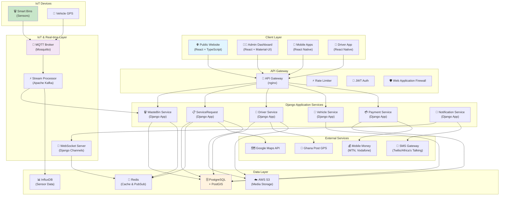

# Wasgo System Architecture

## Overview
The Wasgo Smart Waste Management System follows a microservices-oriented architecture designed to handle IoT data streams, real-time tracking, and geospatial operations for waste management in Ghana.

## Architecture Diagram



## Component Details

### 1. Client Applications

#### Public Website (React)
- **Purpose**: Customer portal for service requests
- **Tech Stack**: React 18, TypeScript, Redux Toolkit
- **Features**:
  - Service request creation
  - Request tracking
  - Payment processing
  - Bin location maps

#### Admin Dashboard (React)
- **Purpose**: System management and monitoring
- **Tech Stack**: React, Material-UI, Recharts
- **Features**:
  - Real-time bin monitoring
  - Driver management
  - Analytics dashboards
  - Report generation

#### Mobile Apps (React Native)
- **Purpose**: Customer and driver mobile applications
- **Tech Stack**: React Native, Expo
- **Features**:
  - Offline support
  - Push notifications
  - GPS tracking
  - Camera integration

### 2. Backend Services (Django)

#### Core Django Applications
```python
INSTALLED_APPS = [
    # Core apps
    'apps.WasteBin',
    'apps.ServiceRequest',
    'apps.Driver',
    'apps.Vehicle',
    'apps.Provider',
    'apps.Payment',
    'apps.Notification',
    'apps.Location',
    
    # Supporting apps
    'apps.Authentication',
    'apps.Analytics',
    'apps.Tracking',
    
    # Third-party
    'rest_framework',
    'django.contrib.gis',
    'channels',
    'corsheaders',
]
```

#### API Structure
```
/api/v1/
├── /bins/              # Smart bin management
├── /service-requests/  # Service requests
├── /drivers/          # Driver operations
├── /vehicles/         # Fleet management
├── /payments/         # Payment processing
├── /analytics/        # Analytics endpoints
└── /notifications/    # Notification management
```

### 3. IoT Infrastructure

#### MQTT Broker Configuration
```yaml
# mosquitto.conf
listener 8883
protocol mqtt
cafile /etc/mosquitto/ca.crt
certfile /etc/mosquitto/server.crt
keyfile /etc/mosquitto/server.key
require_certificate true

# Topic structure
# sensors/{bin_id}/readings
# vehicles/{vehicle_id}/location
# alerts/{type}/{id}
```

#### Sensor Data Pipeline
```python
# Stream processing pipeline
class SensorDataProcessor:
    def process_reading(self, data):
        # 1. Validate data
        validated = self.validate_sensor_data(data)
        
        # 2. Store in time-series DB
        self.store_time_series(validated)
        
        # 3. Update bin status
        self.update_bin_status(validated)
        
        # 4. Check alert conditions
        self.check_alerts(validated)
        
        # 5. Broadcast updates
        self.broadcast_updates(validated)
```

### 4. Database Architecture

#### PostgreSQL with PostGIS
```sql
-- Enable PostGIS extension
CREATE EXTENSION postgis;

-- Example spatial index
CREATE INDEX idx_bins_location 
ON wastebin_smartbin 
USING GIST(location);

-- Spatial query example
SELECT * FROM wastebin_smartbin
WHERE ST_DWithin(
    location,
    ST_MakePoint(%s, %s)::geography,
    1000  -- 1km radius
);
```

#### Redis Caching Strategy
```python
# Cache configuration
CACHES = {
    'default': {
        'BACKEND': 'django_redis.cache.RedisCache',
        'LOCATION': 'redis://127.0.0.1:6379/1',
        'OPTIONS': {
            'CLIENT_CLASS': 'django_redis.client.DefaultClient',
        },
        'KEY_PREFIX': 'wasgo',
        'TIMEOUT': 300,  # 5 minutes default
    }
}

# Cache usage patterns
@cache_page(60 * 5)  # Cache for 5 minutes
def get_bin_status(request, bin_id):
    pass

# Real-time data (30 seconds)
cache.set(f'driver_location_{driver_id}', location, 30)
```

### 5. Security Architecture

#### Authentication & Authorization
```python
# JWT Configuration
SIMPLE_JWT = {
    'ACCESS_TOKEN_LIFETIME': timedelta(minutes=30),
    'REFRESH_TOKEN_LIFETIME': timedelta(days=7),
    'ROTATE_REFRESH_TOKENS': True,
    'ALGORITHM': 'HS256',
}

# Permission Classes
class IsOwnerOrAdmin(BasePermission):
    def has_object_permission(self, request, view, obj):
        return obj.user == request.user or request.user.is_staff
```

#### API Security
- Rate limiting: 100 requests/minute per user
- DDoS protection via CloudFlare
- Input validation and sanitization
- SQL injection prevention (Django ORM)
- XSS protection (Django templates)
- CSRF protection enabled

### 6. Scaling Strategy

#### Horizontal Scaling
```yaml
# docker-compose.yml
services:
  django:
    image: wasgo/backend
    deploy:
      replicas: 3
      resources:
        limits:
          cpus: '2'
          memory: 2G
    environment:
      - DATABASE_URL=postgresql://...
      - REDIS_URL=redis://...
```

#### Load Balancing
```nginx
upstream django_backend {
    least_conn;
    server backend1:8000;
    server backend2:8000;
    server backend3:8000;
}

server {
    location /api/ {
        proxy_pass http://django_backend;
        proxy_set_header X-Real-IP $remote_addr;
    }
}
```

### 7. Monitoring & Observability

#### Metrics Collection
```python
# Prometheus metrics
from prometheus_client import Counter, Histogram

request_count = Counter(
    'wasgo_requests_total',
    'Total requests',
    ['method', 'endpoint']
)

request_latency = Histogram(
    'wasgo_request_duration_seconds',
    'Request latency',
    ['method', 'endpoint']
)
```

#### Logging Strategy
```python
LOGGING = {
    'version': 1,
    'handlers': {
        'file': {
            'class': 'logging.handlers.RotatingFileHandler',
            'filename': '/var/log/wasgo/django.log',
            'maxBytes': 1024 * 1024 * 100,  # 100MB
            'backupCount': 10,
        },
        'elasticsearch': {
            'class': 'CMRESHandler',
            'hosts': [{'host': 'elasticsearch', 'port': 9200}],
            'index_name': 'wasgo-logs',
        },
    },
}
```

### 8. Deployment Architecture

#### Container Orchestration (Kubernetes)
```yaml
apiVersion: apps/v1
kind: Deployment
metadata:
  name: wasgo-backend
spec:
  replicas: 3
  selector:
    matchLabels:
      app: wasgo-backend
  template:
    metadata:
      labels:
        app: wasgo-backend
    spec:
      containers:
      - name: django
        image: wasgo/backend:latest
        ports:
        - containerPort: 8000
        env:
        - name: DATABASE_URL
          valueFrom:
            secretKeyRef:
              name: wasgo-secrets
              key: database-url
```

#### CI/CD Pipeline (GitHub Actions)
```yaml
name: Deploy to Production
on:
  push:
    branches: [main]
jobs:
  deploy:
    runs-on: ubuntu-latest
    steps:
      - uses: actions/checkout@v2
      - name: Run tests
        run: python manage.py test
      - name: Build Docker image
        run: docker build -t wasgo/backend:${{ github.sha }} .
      - name: Deploy to Kubernetes
        run: kubectl apply -f k8s/
```

### 9. Disaster Recovery

#### Backup Strategy
- **Database**: Daily automated backups to S3
- **Files**: Real-time replication to S3
- **Configuration**: Version controlled in Git
- **Recovery Time Objective (RTO)**: 4 hours
- **Recovery Point Objective (RPO)**: 1 hour

#### High Availability
- Multi-AZ deployment in AWS
- Database replication (Primary + 2 Read Replicas)
- Redis Sentinel for cache failover
- Load balancer health checks

### 10. Ghana-Specific Considerations

#### Network Optimization
```python
# Compression middleware for slow networks
MIDDLEWARE = [
    'django.middleware.gzip.GZipMiddleware',
    'compression_middleware.CompressionMiddleware',
]

# Image optimization
THUMBNAIL_ALIASES = {
    '': {
        'mobile': {'size': (400, 300), 'quality': 60},
        'desktop': {'size': (800, 600), 'quality': 80},
    },
}
```

#### Offline Support
```javascript
// Service Worker for offline functionality
self.addEventListener('fetch', event => {
  event.respondWith(
    caches.match(event.request)
      .then(response => response || fetch(event.request))
      .catch(() => caches.match('/offline.html'))
  );
});
```

#### Mobile Money Integration
```python
# Multiple provider support
PAYMENT_PROVIDERS = {
    'mtn': {
        'api_url': 'https://api.mtn.com/mobilemoney',
        'timeout': 30,
    },
    'vodafone': {
        'api_url': 'https://api.vodafone.gh/cash',
        'timeout': 30,
    },
    'airteltigo': {
        'api_url': 'https://api.airteltigo.gh/money',
        'timeout': 30,
    },
}
```

## Performance Requirements

### Response Times
- API endpoints: < 200ms (p95)
- Dashboard load: < 2 seconds
- Mobile app launch: < 3 seconds
- Real-time updates: < 100ms latency

### Throughput
- 10,000 concurrent users
- 1,000 requests/second
- 100,000 sensor readings/hour
- 50 GB data/day

### Availability
- 99.9% uptime (8.76 hours downtime/year)
- Planned maintenance windows: Sunday 2-4 AM GMT

## Technology Stack Summary

### Backend
- **Language**: Python 3.10+
- **Framework**: Django 4.2+
- **API**: Django REST Framework
- **Real-time**: Django Channels
- **Task Queue**: Celery + Redis

### Frontend
- **Web**: React 18 + TypeScript
- **Mobile**: React Native + Expo
- **State**: Redux Toolkit
- **UI**: Material-UI

### Infrastructure
- **Cloud**: AWS/Azure
- **Containers**: Docker
- **Orchestration**: Kubernetes
- **CI/CD**: GitHub Actions
- **Monitoring**: Prometheus + Grafana

### Data
- **Primary DB**: PostgreSQL + PostGIS
- **Cache**: Redis
- **Time Series**: InfluxDB
- **Search**: ElasticSearch
- **File Storage**: AWS S3

### IoT
- **Protocol**: MQTT
- **Broker**: Mosquitto
- **Stream Processing**: Apache Kafka
- **Edge Computing**: AWS IoT Core