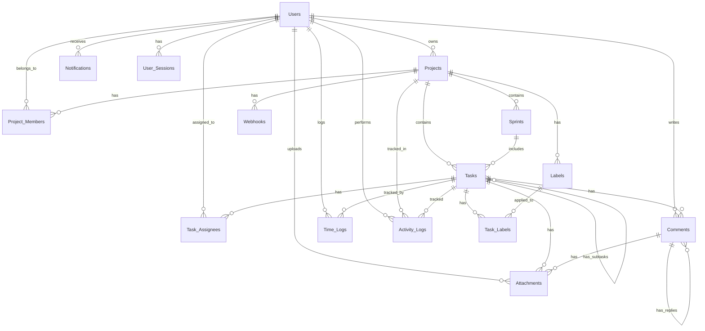

# Entity Relationship Diagram (ERD)

## Database Schema Overview

The Task Management System uses PostgreSQL as the primary database with the following main entities:

## Entities and Attributes

### 1. Users
Primary entity for system users and authentication.

```sql
Users {
    user_id         UUID            PRIMARY KEY
    email           VARCHAR(255)    UNIQUE NOT NULL
    password_hash   VARCHAR(255)    NOT NULL
    first_name      VARCHAR(100)    NOT NULL
    last_name       VARCHAR(100)    NOT NULL
    avatar_url      VARCHAR(500)    NULL
    phone           VARCHAR(20)     NULL
    role            ENUM            DEFAULT 'member'
    is_active       BOOLEAN         DEFAULT true
    is_verified     BOOLEAN         DEFAULT false
    last_login      TIMESTAMP       NULL
    created_at      TIMESTAMP       DEFAULT NOW()
    updated_at      TIMESTAMP       DEFAULT NOW()
    deleted_at      TIMESTAMP       NULL
}
```

### 2. Projects
Container for organizing work and teams.

```sql
Projects {
    project_id      UUID            PRIMARY KEY
    project_key     VARCHAR(10)     UNIQUE NOT NULL
    name            VARCHAR(255)    NOT NULL
    description     TEXT            NULL
    owner_id        UUID            FOREIGN KEY -> Users.user_id
    visibility      ENUM            DEFAULT 'private'
    status          ENUM            DEFAULT 'active'
    start_date      DATE            NULL
    end_date        DATE            NULL
    color           VARCHAR(7)      DEFAULT '#3B82F6'
    icon            VARCHAR(50)     NULL
    created_at      TIMESTAMP       DEFAULT NOW()
    updated_at      TIMESTAMP       DEFAULT NOW()
    archived_at     TIMESTAMP       NULL
}
```

### 3. Project_Members
Many-to-many relationship between Users and Projects.

```sql
Project_Members {
    member_id       UUID            PRIMARY KEY
    project_id      UUID            FOREIGN KEY -> Projects.project_id
    user_id         UUID            FOREIGN KEY -> Users.user_id
    role            ENUM            DEFAULT 'developer'
    permissions     JSONB           NULL
    joined_at       TIMESTAMP       DEFAULT NOW()
    UNIQUE(project_id, user_id)
}
```

### 4. Sprints
Time-boxed iterations for project work.

```sql
Sprints {
    sprint_id       UUID            PRIMARY KEY
    project_id      UUID            FOREIGN KEY -> Projects.project_id
    sprint_number   INTEGER         NOT NULL
    name            VARCHAR(255)    NOT NULL
    goal            TEXT            NULL
    start_date      DATE            NOT NULL
    end_date        DATE            NOT NULL
    status          ENUM            DEFAULT 'planning'
    capacity        INTEGER         DEFAULT 0
    created_by      UUID            FOREIGN KEY -> Users.user_id
    created_at      TIMESTAMP       DEFAULT NOW()
    updated_at      TIMESTAMP       DEFAULT NOW()
    completed_at    TIMESTAMP       NULL
    UNIQUE(project_id, sprint_number)
}
```

### 5. Tasks
Core work items within projects.

```sql
Tasks {
    task_id         UUID            PRIMARY KEY
    task_key        VARCHAR(20)     UNIQUE NOT NULL
    project_id      UUID            FOREIGN KEY -> Projects.project_id
    sprint_id       UUID            FOREIGN KEY -> Sprints.sprint_id NULL
    parent_task_id  UUID            FOREIGN KEY -> Tasks.task_id NULL
    title           VARCHAR(500)    NOT NULL
    description     TEXT            NULL
    task_type       ENUM            DEFAULT 'task'
    status          ENUM            DEFAULT 'todo'
    priority        ENUM            DEFAULT 'medium'
    story_points    INTEGER         NULL
    estimated_hours DECIMAL(5,2)    NULL
    actual_hours    DECIMAL(5,2)    NULL
    due_date        TIMESTAMP       NULL
    reporter_id     UUID            FOREIGN KEY -> Users.user_id
    created_at      TIMESTAMP       DEFAULT NOW()
    updated_at      TIMESTAMP       DEFAULT NOW()
    completed_at    TIMESTAMP       NULL
    archived_at     TIMESTAMP       NULL
}
```

### 6. Task_Assignees
Many-to-many relationship for task assignments.

```sql
Task_Assignees {
    assignment_id   UUID            PRIMARY KEY
    task_id         UUID            FOREIGN KEY -> Tasks.task_id
    user_id         UUID            FOREIGN KEY -> Users.user_id
    assigned_by     UUID            FOREIGN KEY -> Users.user_id
    assigned_at     TIMESTAMP       DEFAULT NOW()
    UNIQUE(task_id, user_id)
}
```

### 7. Comments
Discussion threads on tasks.

```sql
Comments {
    comment_id      UUID            PRIMARY KEY
    task_id         UUID            FOREIGN KEY -> Tasks.task_id
    user_id         UUID            FOREIGN KEY -> Users.user_id
    parent_id       UUID            FOREIGN KEY -> Comments.comment_id NULL
    content         TEXT            NOT NULL
    is_edited       BOOLEAN         DEFAULT false
    created_at      TIMESTAMP       DEFAULT NOW()
    updated_at      TIMESTAMP       DEFAULT NOW()
    deleted_at      TIMESTAMP       NULL
}
```

### 8. Attachments
File attachments for tasks and comments.

```sql
Attachments {
    attachment_id   UUID            PRIMARY KEY
    task_id         UUID            FOREIGN KEY -> Tasks.task_id NULL
    comment_id      UUID            FOREIGN KEY -> Comments.comment_id NULL
    uploaded_by     UUID            FOREIGN KEY -> Users.user_id
    file_name       VARCHAR(255)    NOT NULL
    file_size       BIGINT          NOT NULL
    file_type       VARCHAR(100)    NOT NULL
    file_url        VARCHAR(500)    NOT NULL
    thumbnail_url   VARCHAR(500)    NULL
    created_at      TIMESTAMP       DEFAULT NOW()
    CHECK (task_id IS NOT NULL OR comment_id IS NOT NULL)
}
```

### 9. Labels
Tags for categorizing tasks.

```sql
Labels {
    label_id        UUID            PRIMARY KEY
    project_id      UUID            FOREIGN KEY -> Projects.project_id
    name            VARCHAR(50)     NOT NULL
    color           VARCHAR(7)      NOT NULL
    description     VARCHAR(255)    NULL
    created_at      TIMESTAMP       DEFAULT NOW()
    UNIQUE(project_id, name)
}
```

### 10. Task_Labels
Many-to-many relationship between Tasks and Labels.

```sql
Task_Labels {
    task_id         UUID            FOREIGN KEY -> Tasks.task_id
    label_id        UUID            FOREIGN KEY -> Labels.label_id
    PRIMARY KEY(task_id, label_id)
}
```

### 11. Activity_Logs
Audit trail for all system activities.

```sql
Activity_Logs {
    log_id          UUID            PRIMARY KEY
    user_id         UUID            FOREIGN KEY -> Users.user_id
    project_id      UUID            FOREIGN KEY -> Projects.project_id NULL
    task_id         UUID            FOREIGN KEY -> Tasks.task_id NULL
    action_type     VARCHAR(50)     NOT NULL
    entity_type     VARCHAR(50)     NOT NULL
    entity_id       UUID            NOT NULL
    old_value       JSONB           NULL
    new_value       JSONB           NULL
    ip_address      INET            NULL
    user_agent      TEXT            NULL
    created_at      TIMESTAMP       DEFAULT NOW()
}
```

### 12. Notifications
User notifications for various events.

```sql
Notifications {
    notification_id UUID            PRIMARY KEY
    user_id         UUID            FOREIGN KEY -> Users.user_id
    type            VARCHAR(50)     NOT NULL
    title           VARCHAR(255)    NOT NULL
    message         TEXT            NOT NULL
    data            JSONB           NULL
    is_read         BOOLEAN         DEFAULT false
    read_at         TIMESTAMP       NULL
    created_at      TIMESTAMP       DEFAULT NOW()
}
```

### 13. Time_Logs
Time tracking entries for tasks.

```sql
Time_Logs {
    time_log_id     UUID            PRIMARY KEY
    task_id         UUID            FOREIGN KEY -> Tasks.task_id
    user_id         UUID            FOREIGN KEY -> Users.user_id
    duration_hours  DECIMAL(5,2)    NOT NULL
    description     TEXT            NULL
    log_date        DATE            NOT NULL
    is_billable     BOOLEAN         DEFAULT true
    created_at      TIMESTAMP       DEFAULT NOW()
    updated_at      TIMESTAMP       DEFAULT NOW()
}
```

### 14. User_Sessions
Active user sessions for security.

```sql
User_Sessions {
    session_id      UUID            PRIMARY KEY
    user_id         UUID            FOREIGN KEY -> Users.user_id
    token_hash      VARCHAR(255)    UNIQUE NOT NULL
    ip_address      INET            NOT NULL
    user_agent      TEXT            NULL
    expires_at      TIMESTAMP       NOT NULL
    created_at      TIMESTAMP       DEFAULT NOW()
    last_activity   TIMESTAMP       DEFAULT NOW()
    is_active       BOOLEAN         DEFAULT true
}
```

### 15. Webhooks
Integration endpoints for external services.

```sql
Webhooks {
    webhook_id      UUID            PRIMARY KEY
    project_id      UUID            FOREIGN KEY -> Projects.project_id
    name            VARCHAR(255)    NOT NULL
    url             VARCHAR(500)    NOT NULL
    secret          VARCHAR(255)    NOT NULL
    events          TEXT[]          NOT NULL
    is_active       BOOLEAN         DEFAULT true
    created_by      UUID            FOREIGN KEY -> Users.user_id
    created_at      TIMESTAMP       DEFAULT NOW()
    updated_at      TIMESTAMP       DEFAULT NOW()
}
```

## Relationships

### One-to-Many Relationships
1. **Users → Projects** (owner_id)
   - One user can own multiple projects
   
2. **Projects → Sprints**
   - One project can have multiple sprints
   
3. **Projects → Tasks**
   - One project contains multiple tasks
   
4. **Sprints → Tasks**
   - One sprint can contain multiple tasks
   
5. **Users → Comments**
   - One user can create multiple comments
   
6. **Tasks → Comments**
   - One task can have multiple comments
   
7. **Users → Time_Logs**
   - One user can have multiple time log entries
   
8. **Tasks → Time_Logs**
   - One task can have multiple time log entries

### Many-to-Many Relationships
1. **Users ↔ Projects** (via Project_Members)
   - Users can be members of multiple projects
   - Projects can have multiple members
   
2. **Tasks ↔ Users** (via Task_Assignees)
   - Tasks can be assigned to multiple users
   - Users can be assigned to multiple tasks
   
3. **Tasks ↔ Labels** (via Task_Labels)
   - Tasks can have multiple labels
   - Labels can be applied to multiple tasks

### Self-Referential Relationships
1. **Tasks → Tasks** (parent_task_id)
   - Tasks can have subtasks
   
2. **Comments → Comments** (parent_id)
   - Comments can have replies

## ERD Visual Representation



## Indexes

### Primary Indexes
- All PRIMARY KEY columns are automatically indexed

### Secondary Indexes
```sql
-- Performance optimization indexes
CREATE INDEX idx_tasks_project_sprint ON Tasks(project_id, sprint_id);
CREATE INDEX idx_tasks_status ON Tasks(status) WHERE status != 'done';
CREATE INDEX idx_tasks_assignee ON Task_Assignees(user_id);
CREATE INDEX idx_comments_task ON Comments(task_id);
CREATE INDEX idx_activity_logs_user ON Activity_Logs(user_id, created_at DESC);
CREATE INDEX idx_notifications_user_unread ON Notifications(user_id, is_read) WHERE is_read = false;
CREATE INDEX idx_time_logs_task_date ON Time_Logs(task_id, log_date);
CREATE INDEX idx_project_members_user ON Project_Members(user_id);
CREATE INDEX idx_sessions_token ON User_Sessions(token_hash);
CREATE INDEX idx_sessions_expires ON User_Sessions(expires_at) WHERE is_active = true;
```

## Database Constraints

### Check Constraints
```sql
-- Ensure sprint dates are valid
ALTER TABLE Sprints ADD CONSTRAINT check_sprint_dates 
    CHECK (end_date > start_date);

-- Ensure task estimates are positive
ALTER TABLE Tasks ADD CONSTRAINT check_positive_estimates 
    CHECK (estimated_hours >= 0 AND actual_hours >= 0 AND story_points >= 0);

-- Ensure time logs are positive
ALTER TABLE Time_Logs ADD CONSTRAINT check_positive_duration 
    CHECK (duration_hours > 0);

-- Ensure valid priority values
ALTER TABLE Tasks ADD CONSTRAINT check_priority_values 
    CHECK (priority IN ('low', 'medium', 'high', 'critical'));

-- Ensure valid status values
ALTER TABLE Tasks ADD CONSTRAINT check_status_values 
    CHECK (status IN ('todo', 'in_progress', 'review', 'done', 'cancelled'));
```

### Foreign Key Constraints
All foreign key relationships include:
- `ON DELETE CASCADE` for dependent records (e.g., comments, attachments)
- `ON DELETE SET NULL` for optional relationships (e.g., sprint_id in tasks)
- `ON DELETE RESTRICT` for critical relationships (e.g., project owner)

## Data Types Legend

- **UUID**: Universally Unique Identifier (128-bit)
- **VARCHAR(n)**: Variable-length character string
- **TEXT**: Unlimited length text
- **TIMESTAMP**: Date and time with timezone
- **DATE**: Date without time
- **BOOLEAN**: True/False values
- **INTEGER**: 32-bit integer
- **BIGINT**: 64-bit integer
- **DECIMAL(p,s)**: Precise decimal numbers
- **JSONB**: Binary JSON data
- **INET**: IP address
- **TEXT[]**: Array of text values
- **ENUM**: Predefined set of values

## Performance Considerations

1. **Partitioning**: Activity_Logs table should be partitioned by created_at for better performance
2. **Archival**: Old completed tasks and sprints can be moved to archive tables
3. **Caching**: Frequently accessed data (user profiles, project members) should be cached in Redis
4. **Read Replicas**: Use read replicas for reporting and analytics queries
5. **Connection Pooling**: Implement connection pooling to optimize database connections