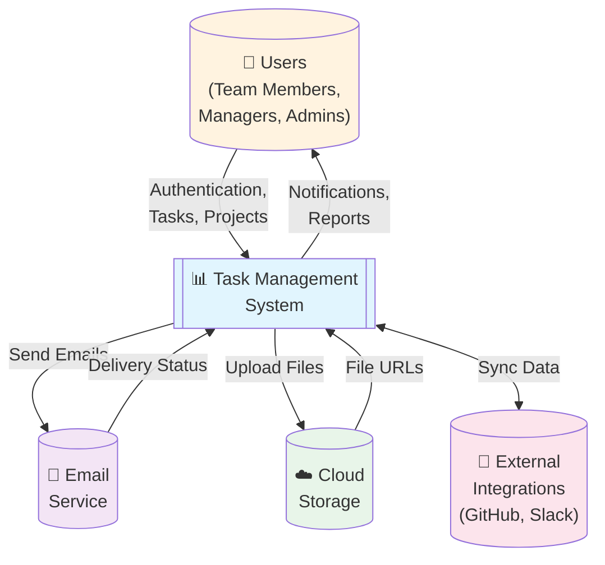
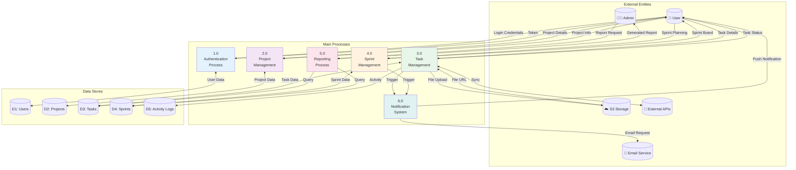
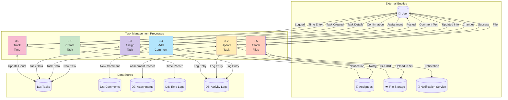
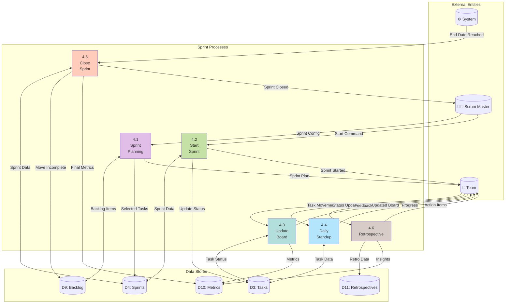

# Data Flow Diagrams (DFD)

## Overview
This document contains Data Flow Diagrams at different levels showing how data moves through the Task Management System.

## Level 0 - Context Diagram



## Level 1 - Main System Processes



## Level 2 - Task Management Process



## Level 2 - Sprint Management Process



## Level 2 - Reporting Process

```mermaid
graph TB
    subgraph "External Entities"
        Manager[("📊 Manager")]
        Scheduler[("⏰ Scheduler")]
        Email[("📧 Email")]
    end
    
    subgraph "Reporting Processes"
        Request["5.1<br/>Request<br/>Report"]
        Generate["5.2<br/>Generate<br/>Report"]
        Format["5.3<br/>Format<br/>Output"]
        Deliver["5.4<br/>Deliver<br/>Report"]
        Cache["5.5<br/>Cache<br/>Results"]
    end
    
    subgraph "Data Stores"
        TaskDB[("D3: Tasks")]
        SprintDB[("D4: Sprints")]
        TimeDB[("D8: Time Logs")]
        ReportCache[("D12: Report Cache")]
        Templates[("D13: Templates")]
    end
    
    Manager -->|"Report Params"| Request
    Scheduler -->|"Scheduled Job"| Request
    Request -->|"Check Cache"| ReportCache
    
    alt "Cache Hit"
        ReportCache -->|"Cached Report"| Deliver
    else "Cache Miss"
        Request -->|"Query Request"| Generate
        Generate -->|"Fetch Data"| TaskDB
        Generate -->|"Fetch Data"| SprintDB
        Generate -->|"Fetch Data"| TimeDB
        Generate -->|"Raw Data"| Format
        
        Format -->|"Get Template"| Templates
        Format -->|"Formatted Report"| Deliver
        Format -->|"Store"| ReportCache
    end
    
    Deliver -->|"Report"| Manager
    Deliver -->|"Email Report"| Email
    
    style Request fill:#fff9c4
    style Generate fill:#c5cae9
    style Format fill:#b2ebf2
    style Deliver fill:#c8e6c9
    style Cache fill:#ffe0b2
```

## Data Dictionary

### Primary Data Stores

| Data Store | Description | Key Attributes |
|------------|-------------|----------------|
| D1: Users | User account information | user_id, email, password_hash, profile |
| D2: Projects | Project details | project_id, name, owner, members, settings |
| D3: Tasks | Task information | task_id, title, description, status, assignees |
| D4: Sprints | Sprint data | sprint_id, project_id, start_date, end_date |
| D5: Activity Logs | System audit trail | log_id, user_id, action, timestamp |
| D6: Comments | Task discussions | comment_id, task_id, user_id, content |
| D7: Attachments | File metadata | attachment_id, file_url, size, type |
| D8: Time Logs | Time tracking | time_id, task_id, user_id, hours |
| D9: Backlog | Product backlog | item_id, priority, story_points |
| D10: Metrics | Performance metrics | metric_id, type, value, timestamp |
| D11: Retrospectives | Sprint retrospectives | retro_id, sprint_id, feedback |
| D12: Report Cache | Cached reports | report_id, parameters, data, expiry |
| D13: Templates | Report templates | template_id, format, layout |

### Data Flow Types

| Flow Type | Description | Format |
|-----------|-------------|--------|
| User Input | Data entered by users | JSON/Form Data |
| API Response | System responses | JSON |
| Database Query | Database operations | SQL |
| File Upload | Binary file data | Multipart/Binary |
| Notifications | Alert messages | JSON/Push |
| Reports | Generated documents | PDF/Excel/CSV |
| Real-time Updates | WebSocket messages | JSON |
| Integration Sync | External API data | JSON/XML |

## Data Flow Security Considerations

### Input Validation
- All user inputs sanitized
- SQL injection prevention
- XSS protection
- File type validation
- Size limits enforced

### Data Transmission
- HTTPS for all API calls
- WebSocket over WSS
- Encrypted file uploads
- JWT token authentication
- API rate limiting

### Data Storage
- Encrypted passwords (bcrypt)
- Encrypted sensitive data at rest
- S3 bucket policies
- Database access control
- Regular backups

### Data Access
- Role-based access control (RBAC)
- Project-level permissions
- Row-level security
- API authentication required
- Session management

## Performance Optimization

### Caching Strategy
1. **Redis Cache**
   - User sessions
   - Frequently accessed data
   - Real-time collaboration data

2. **Database Query Cache**
   - Complex report queries
   - Aggregate calculations
   - Sprint metrics

3. **CDN**
   - Static assets
   - User avatars
   - File attachments

### Data Partitioning
1. **Time-based Partitioning**
   - Activity logs by month
   - Metrics by quarter
   - Archived sprints

2. **Project-based Partitioning**
   - Tasks by project
   - Comments by project
   - Files by project

### Indexing Strategy
- Primary keys on all tables
- Foreign key indexes
- Composite indexes for common queries
- Full-text search indexes
- Partial indexes for active records