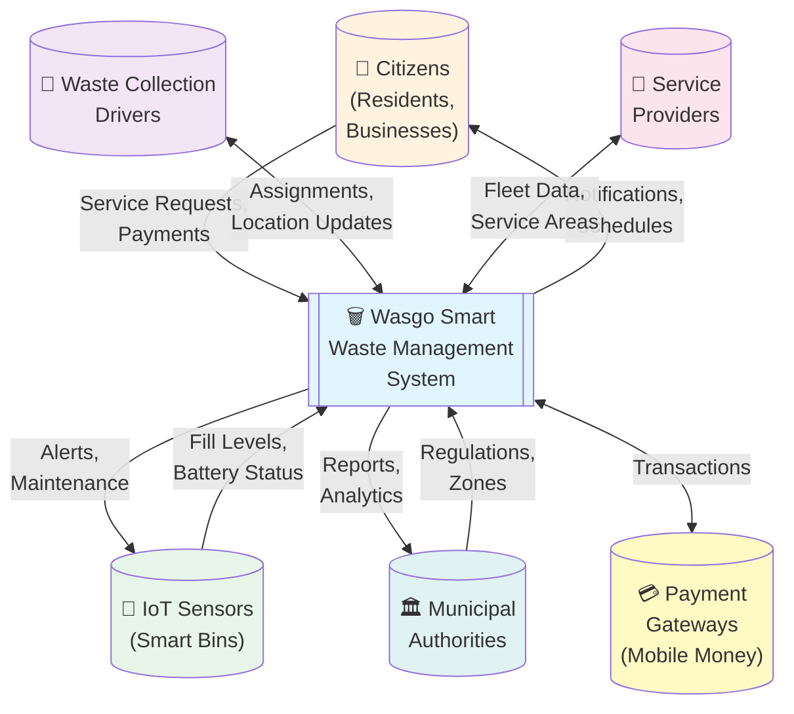
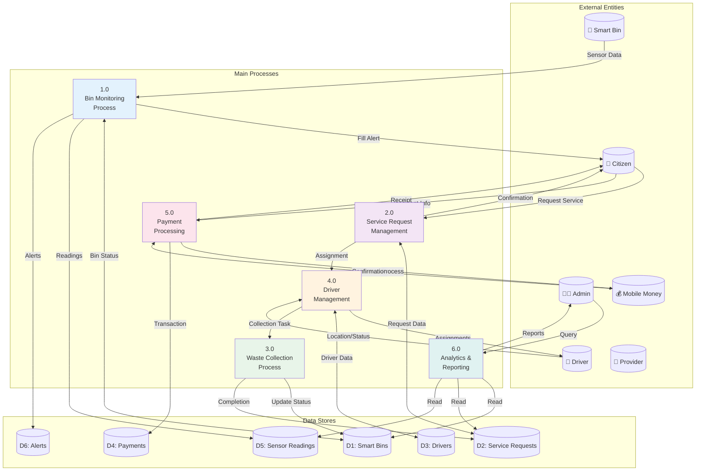
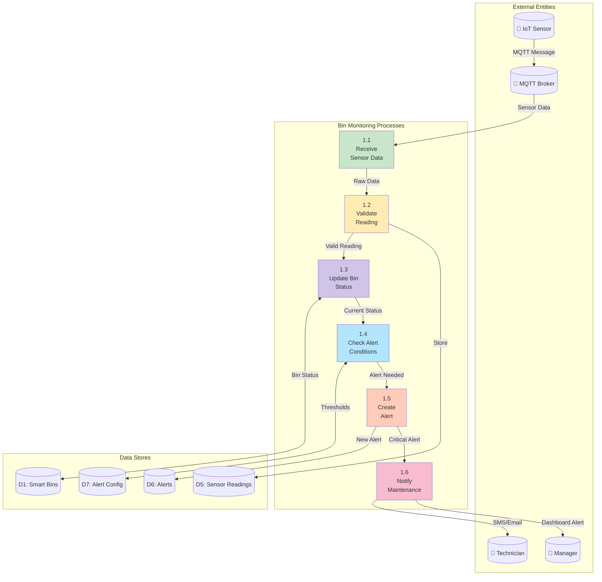
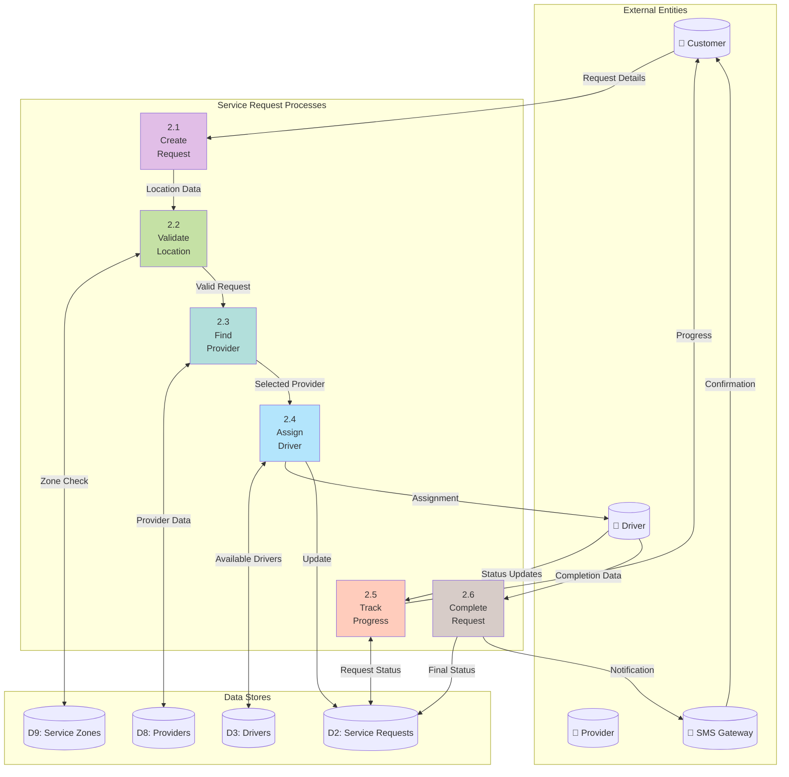
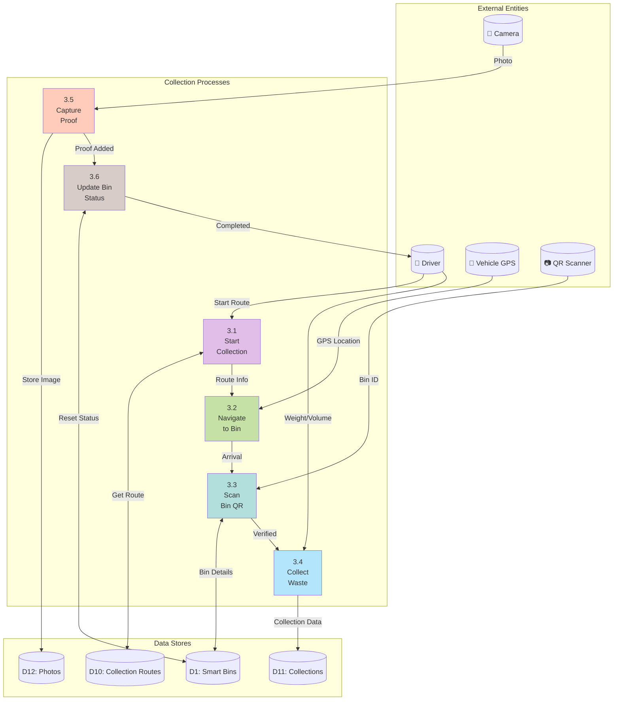
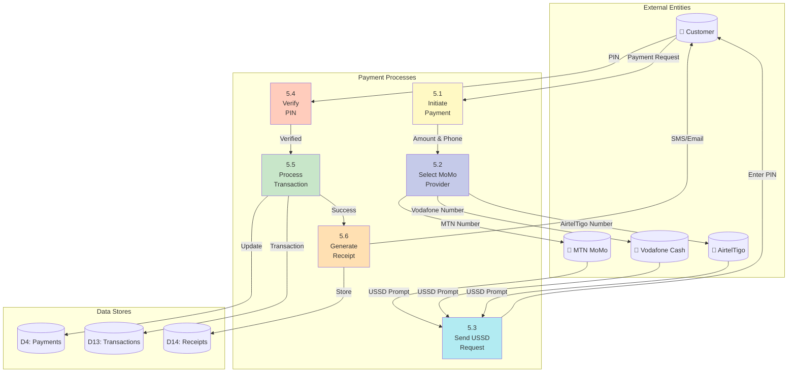

# Wasgo Data Flow Diagrams (DFD)

## Overview
This document contains Data Flow Diagrams at different levels showing how data moves through the Wasgo Smart Waste Management System in Ghana.

## Level 0 - Context Diagram

## Level 1 - Main System Processes

## Level 2 - Bin Monitoring Process

## Level 2 - Service Request Management

## Level 2 - Waste Collection Process

## Level 2 - Payment Processing

## Data Dictionary

### Primary Data Stores

| Data Store | Description | Key Attributes |
|------------|-------------|----------------|
| D1: Smart Bins | IoT-enabled waste bins | bin_id, location, capacity, fill_level, sensor_id |
| D2: Service Requests | Customer service requests | request_id, customer_id, type, status, location |
| D3: Drivers | Driver information | driver_id, name, license, vehicle_id, status |
| D4: Payments | Payment transactions | payment_id, amount, method, status, reference |
| D5: Sensor Readings | IoT sensor data | reading_id, sensor_id, timestamp, values |
| D6: Alerts | System alerts | alert_id, type, severity, bin_id, status |
| D7: Alert Config | Alert thresholds | config_id, alert_type, threshold, action |
| D8: Providers | Service providers | provider_id, name, service_areas, fleet_size |
| D9: Service Zones | Geographic zones | zone_id, boundary, provider_id, frequency |
| D10: Collection Routes | Planned routes | route_id, driver_id, bins[], schedule |
| D11: Collections | Completed collections | collection_id, bin_id, timestamp, weight |
| D12: Photos | Media storage | photo_id, url, type, reference_id |
| D13: Transactions | Payment records | trans_id, provider, reference, status |
| D14: Receipts | Payment receipts | receipt_id, payment_id, url, sent_date |

### Data Flow Types

| Flow Type | Description | Format | Example |
|-----------|-------------|--------|---------|
| Sensor Data | IoT readings | JSON/MQTT | `{"fill_level": 85, "temp": 28}` |
| Location Data | GPS coordinates | GeoJSON | `{"lat": 5.6037, "lng": -0.1870}` |
| Service Request | Collection request | JSON | Request details with location |
| Payment Data | Mobile money | JSON | Transaction with phone number |
| Alert Message | System alerts | JSON/SMS | Alert with severity and action |
| Driver Update | Location/status | JSON | Real-time driver position |

## Data Flow Security Considerations

### Input Validation
- Validate all GPS coordinates
- Sanitize customer inputs
- Verify sensor data ranges
- Validate phone numbers for Mobile Money
- Check file uploads for photos

### Data Transmission
- MQTT over TLS for IoT data
- HTTPS for all API calls
- Encrypted mobile money transactions
- JWT tokens for authentication
- API rate limiting

### Data Storage
- Encrypted sensitive data (payments)
- PostGIS for spatial data
- S3 for media files
- Redis for real-time data
- Regular backups to cloud

### Data Access
- Role-based access (Admin, Driver, Customer)
- API authentication required
- Audit logging for all operations
- Data retention policies
- GDPR compliance

## Performance Optimization

### Caching Strategy
1. **Redis Cache**
   - Driver locations (30 second TTL)
   - Bin status (5 minute TTL)
   - Service areas (1 hour TTL)

2. **Database Optimization**
   - Spatial indexes for location queries
   - Time-series partitioning for sensor data
   - Read replicas for analytics

3. **Data Aggregation**
   - Hourly sensor reading summaries
   - Daily collection statistics
   - Monthly environmental reports

### Real-time Data Flow
- WebSocket for dashboard updates
- MQTT for sensor streaming
- Push notifications for alerts
- SMS for critical notifications

## Ghana-Specific Considerations

### Mobile Money Integration
- MTN Mobile Money
- Vodafone Cash
- AirtelTigo Money
- USSD fallback for feature phones

### Location Services
- Ghana Post GPS integration
- Local area names in Twi/Ga
- Offline maps for poor connectivity

### Network Optimization
- Data compression for slow networks
- Offline mode for drivers
- SMS fallback for notifications
- USSD support for payments