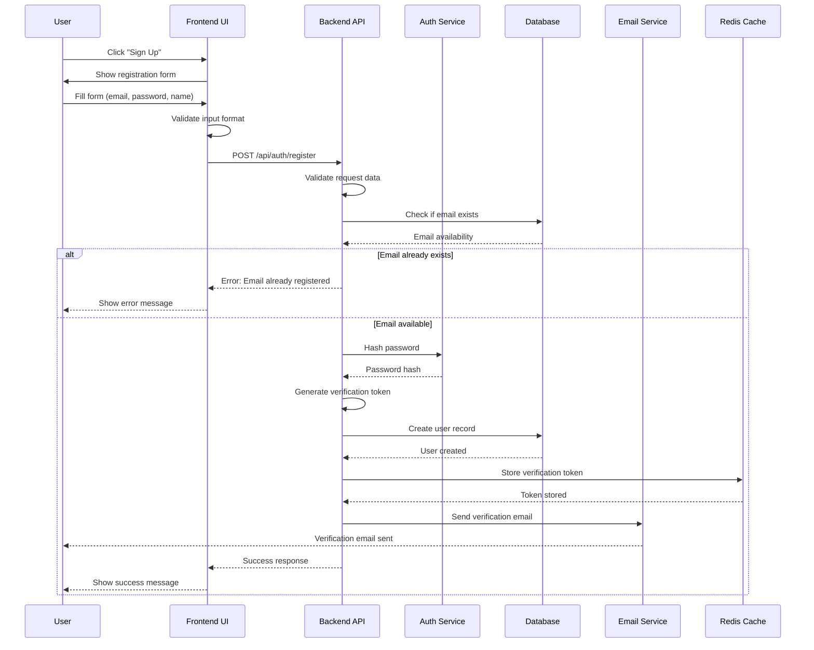
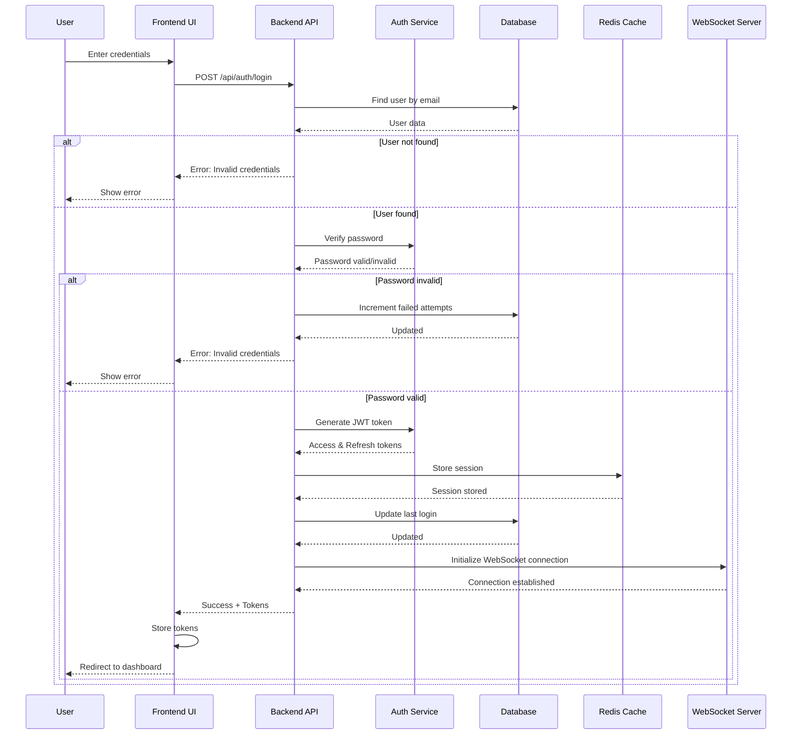
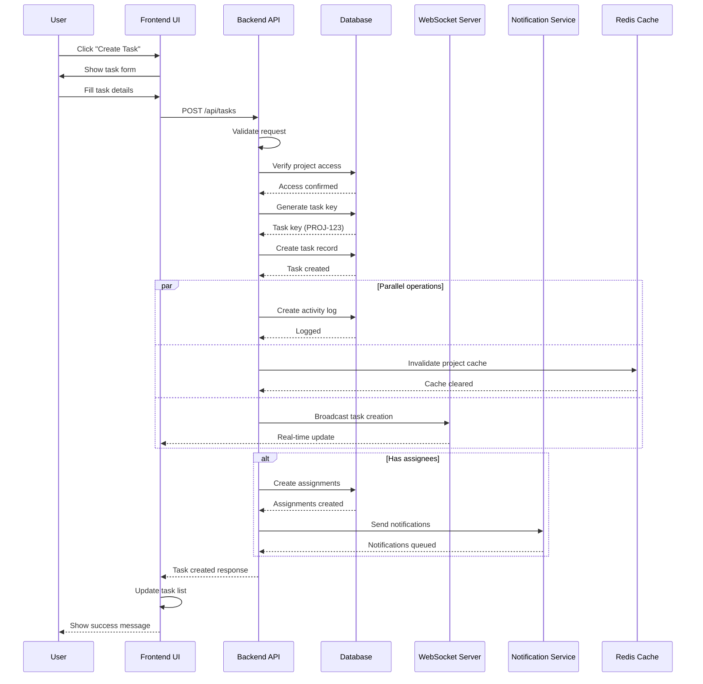
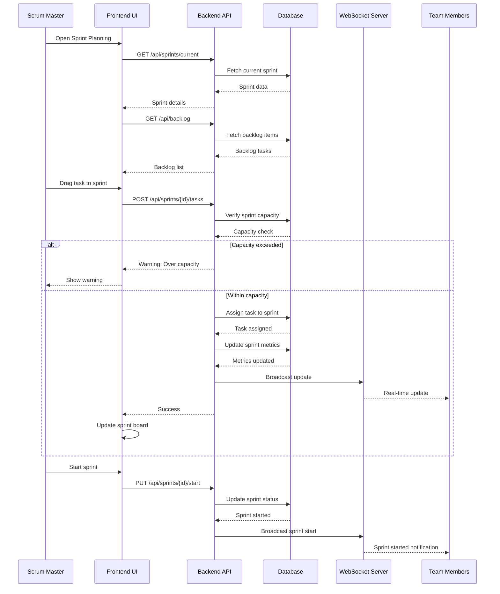
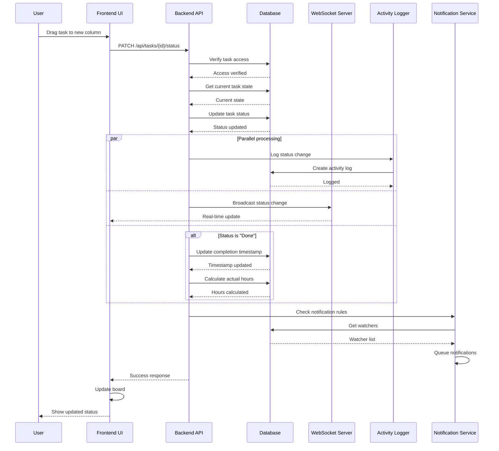
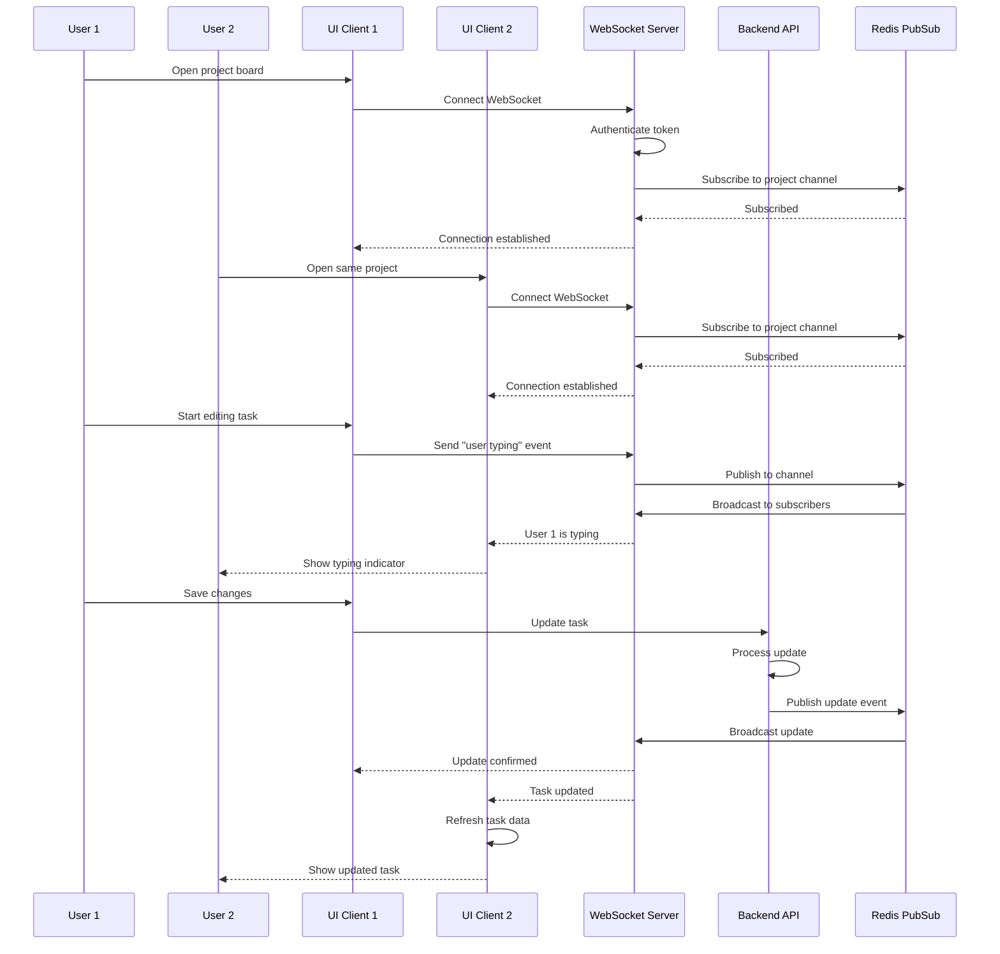
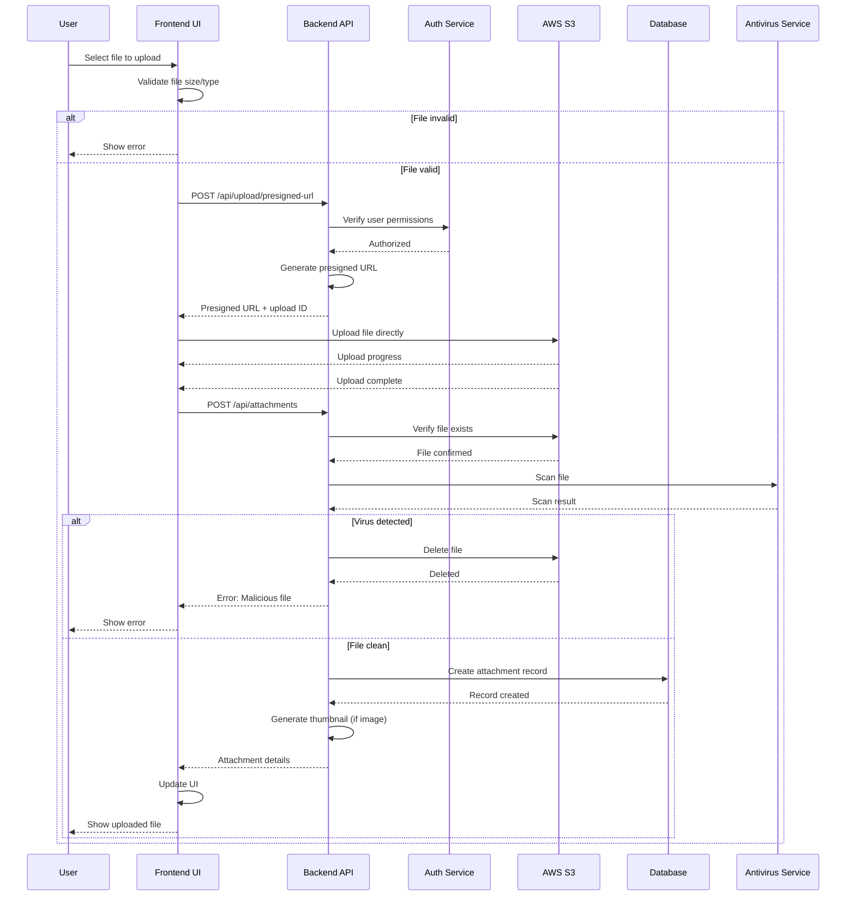
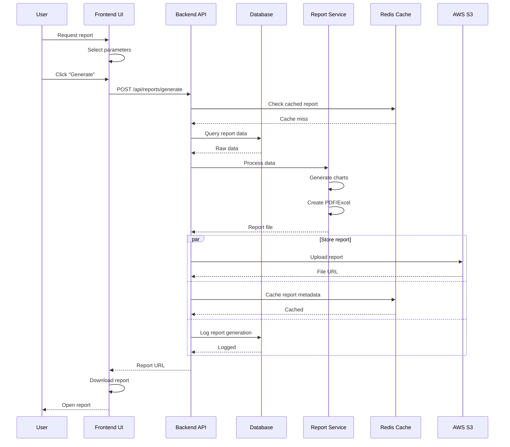
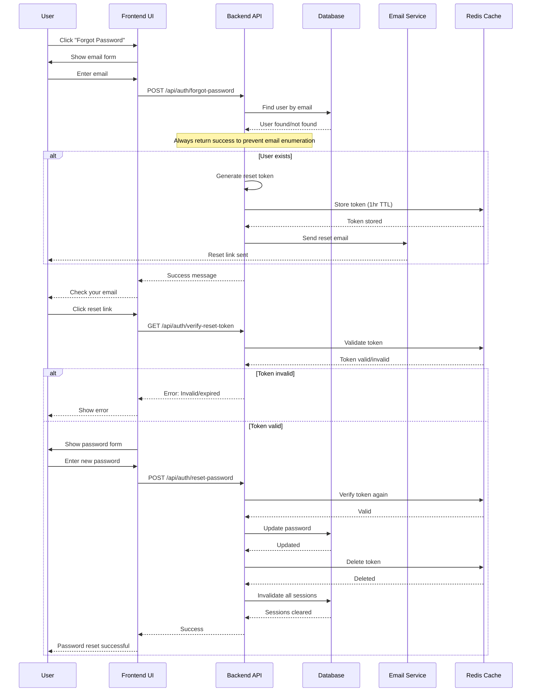
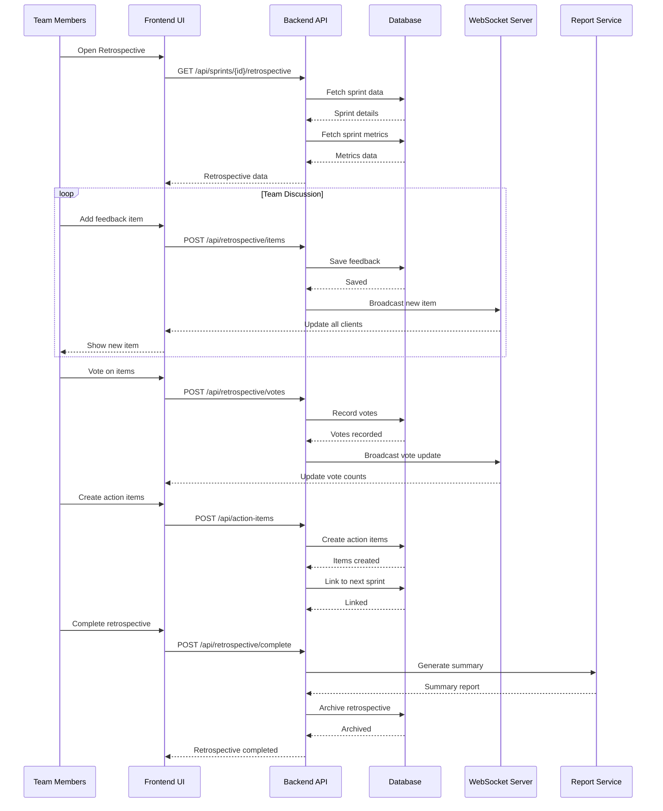

# Sequence Diagrams

## Overview
This document contains sequence diagrams for the key processes in the Task Management System. Each diagram illustrates the interaction between different system components and actors.

## 1. User Registration Process

## 2. User Login Process

## 3. Create Task Process

## 4. Sprint Planning Process

## 5. Task Status Update Process

## 6. Real-time Collaboration Flow

## 7. File Upload Process

## 8. Report Generation Process

## 9. Password Reset Process

## 10. Sprint Retrospective Process

## Component Interaction Summary

### Key Components:
1. **Frontend UI**: React-based SPA handling user interactions
2. **Backend API**: Node.js/Express REST API
3. **Database**: PostgreSQL for persistent storage
4. **Redis**: Caching and session management
5. **WebSocket Server**: Real-time communication
6. **Email Service**: SendGrid for transactional emails
7. **AWS S3**: File storage
8. **Notification Service**: Push and email notifications
9. **Report Service**: Report generation engine
10. **Auth Service**: Authentication and authorization

### Communication Patterns:
- **Synchronous**: REST API calls for CRUD operations
- **Asynchronous**: WebSocket for real-time updates
- **Event-driven**: Redis PubSub for distributed events
- **Batch Processing**: Background jobs for reports and notifications

### Security Measures:
- JWT token validation on every request
- Rate limiting on sensitive endpoints
- Input validation and sanitization
- SQL injection prevention
- XSS protection
- CORS configuration
- File upload scanning

### Performance Optimizations:
- Redis caching for frequently accessed data
- Database connection pooling
- Lazy loading of resources
- Pagination for large datasets
- CDN for static assets
- Gzip compression
- WebSocket connection pooling