# Wasgo Sequence Diagrams

## Overview
This document contains sequence diagrams for the key processes in the Wasgo Smart Waste Management System. Each diagram illustrates the interaction between different system components and actors in waste collection operations.

## Main System Overview - Complete Waste Management Process

```mermaid
sequenceDiagram
    participant Citizen as Citizen
    participant SmartBin as Smart Bin
    participant IoTSensor as IoT Sensor
    participant System as Wasgo System
    participant Admin as Administrator
    participant Provider as Service Provider
    participant Driver as Driver
    participant Vehicle as Collection Vehicle
    participant Payment as Payment Gateway

    Note over Citizen,Payment: Daily Waste Management Cycle
    
    %% Phase 1: Waste Disposal & Monitoring
    rect rgb(255, 255, 255)
        Note over Citizen,IoTSensor: 1. Waste Disposal & Monitoring
        Citizen->>SmartBin: Dispose waste
        SmartBin->>IoTSensor: Detect fill level change
        IoTSensor->>System: Send sensor data (MQTT)
        System->>System: Update bin status
        
        alt Fill level > 80%
            System->>Admin: Alert: Bin nearly full
            System->>Provider: Notify for collection
        end
    end
    
    %% Phase 2: Collection Planning
    rect rgb(255, 255, 255)
        Note over System,Provider: 2. Collection Planning & Assignment
        Provider->>System: Check pending collections
        System-->>Provider: List of full bins & requests
        Provider->>System: Create collection schedule
        System->>Driver: Assign collection task
        Driver->>System: Accept assignment
        System->>Citizen: SMS: Collection scheduled
    end
    
    %% Phase 3: Service Requests
    rect rgb(255, 255, 255)
        Note over Citizen,System: 3. On-Demand Service Requests
        opt Special Collection Needed
            Citizen->>System: Create service request
            System->>System: Validate location & service
            System->>Provider: New service request
            Provider->>System: Accept & quote price
            System->>Citizen: Confirmation & price
            Citizen->>Payment: Initiate payment
            Payment-->>System: Payment confirmed
            System->>Driver: Assign special pickup
        end
    end
    
    %% Phase 4: Collection Execution
    rect rgb(255, 255, 255)
        Note over Driver,Vehicle: 4. Collection Execution
        Driver->>System: Start shift check-in
        Driver->>Vehicle: Begin route
        
        loop For each collection point
            Vehicle->>System: Update GPS location
            Driver->>SmartBin: Arrive at bin
            Driver->>System: Scan QR code
            System-->>Driver: Bin details
            Driver->>SmartBin: Collect waste
            Driver->>System: Mark as collected
            System->>IoTSensor: Reset fill level
            System->>Citizen: Notify collection done
        end
        
        Driver->>System: End shift check-out
    end
    
    %% Phase 5: Analytics & Reporting
    rect rgb(255, 255, 255)
        Note over System,Admin: 5. Analytics & Reporting
        System->>System: Aggregate daily data
        System->>Admin: Generate reports
        Admin->>System: View dashboards
        System-->>Admin: Performance metrics
        
        opt Monthly reporting
            System->>Provider: Monthly invoice
            Provider->>Payment: Process payment
            System->>Admin: Environmental impact report
        end
    end
    
    %% Phase 6: Maintenance
    rect rgb(255, 255, 255)
        Note over IoTSensor,System: 6. System Maintenance
        alt Sensor battery low
            IoTSensor->>System: Battery alert
            System->>Admin: Schedule maintenance
            Admin->>Provider: Assign technician
        else Bin damage reported
            Citizen->>System: Report issue
            System->>Admin: Create maintenance ticket
        end
    end
```

## 1. Smart Bin Sensor Data Upload Process

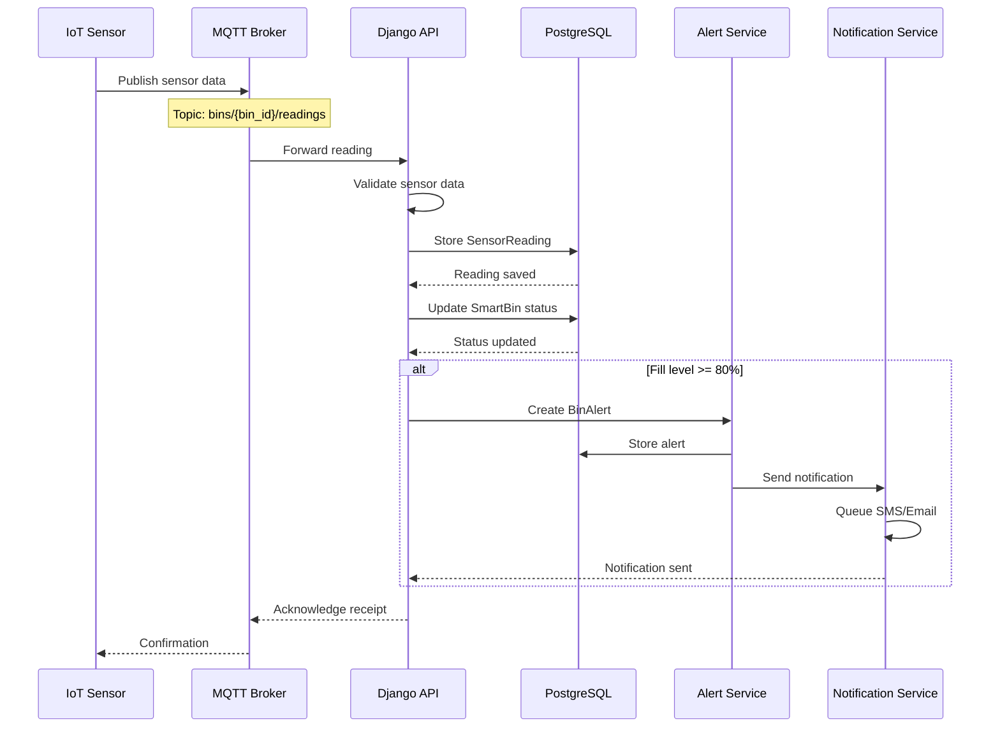

## 2. Service Request Creation Process

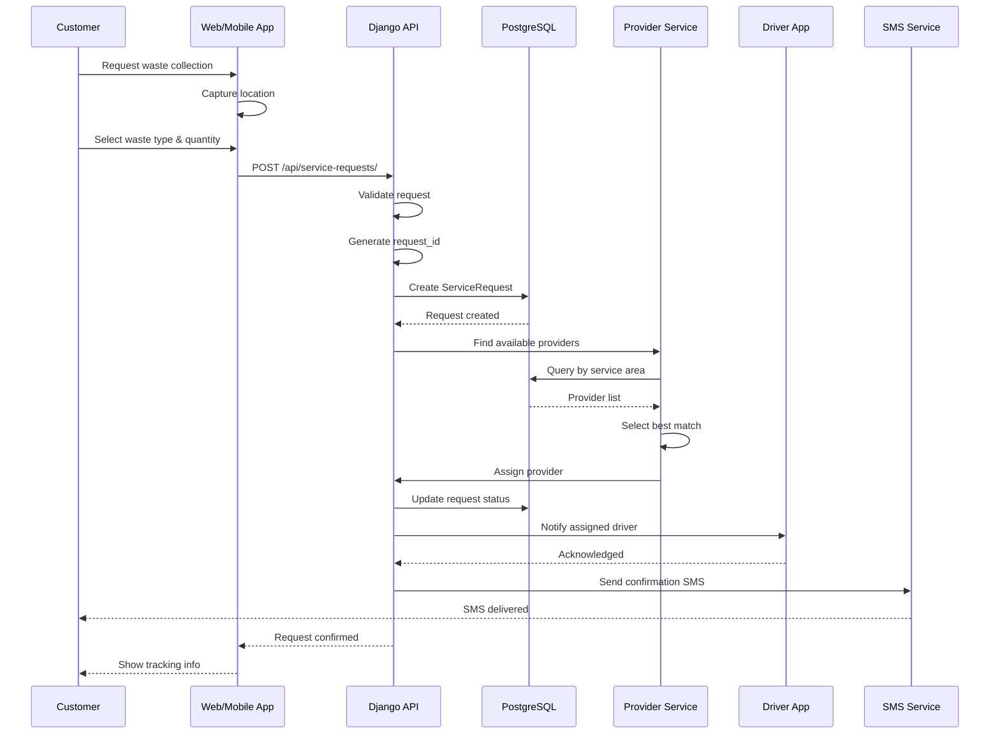

## 3. Driver Check-in and Assignment Process

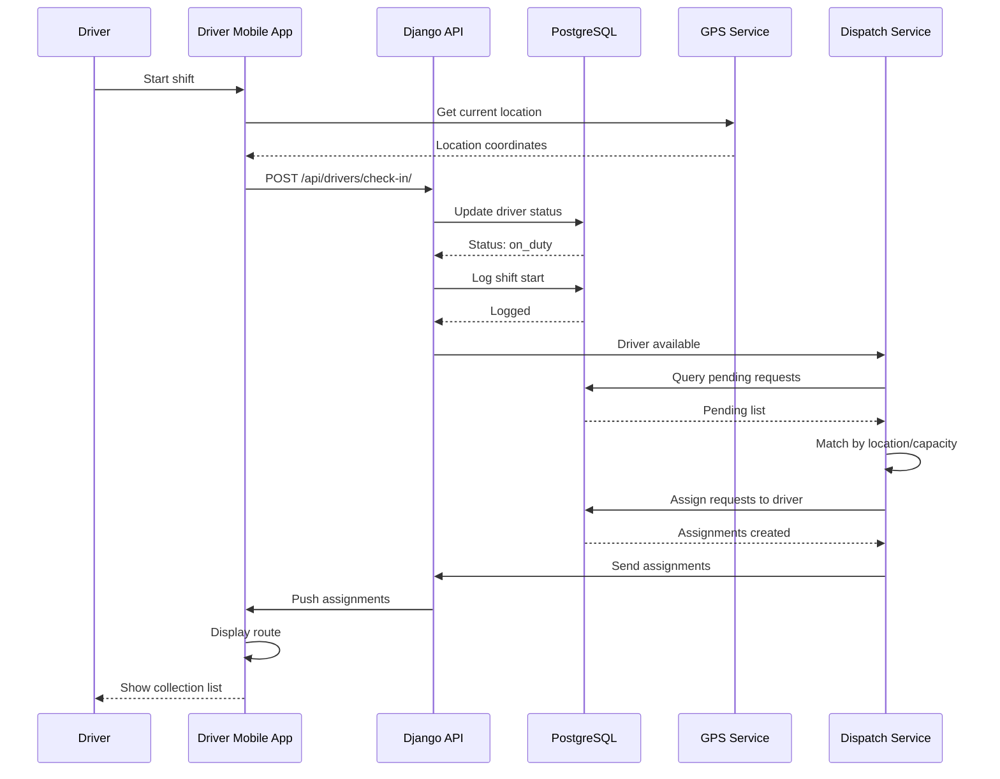

## 4. Bin Collection Process

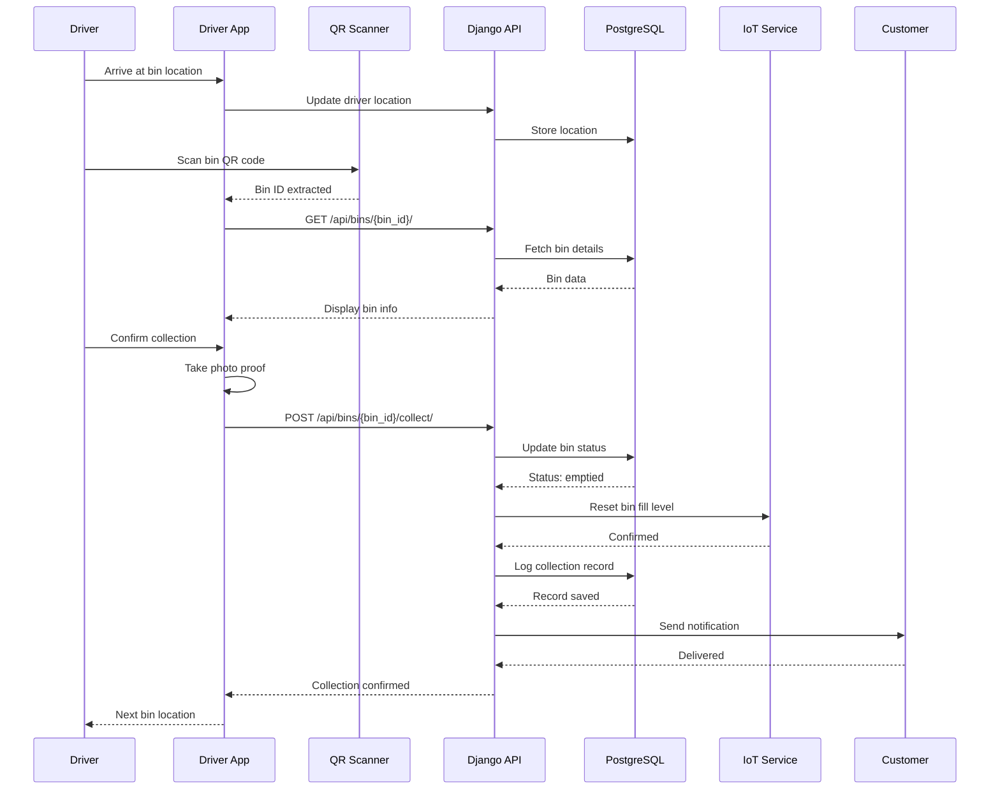

## 5. Real-time Vehicle Tracking Process

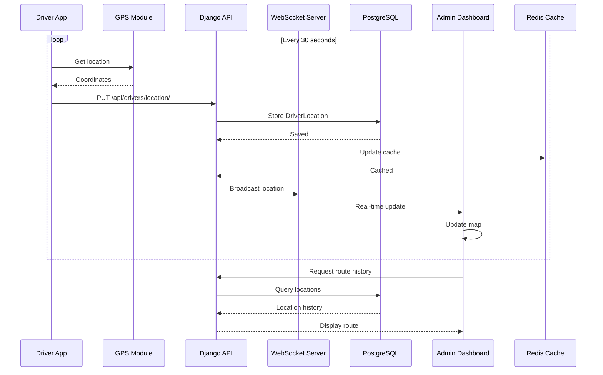

## 6. Payment Processing (Mobile Money)

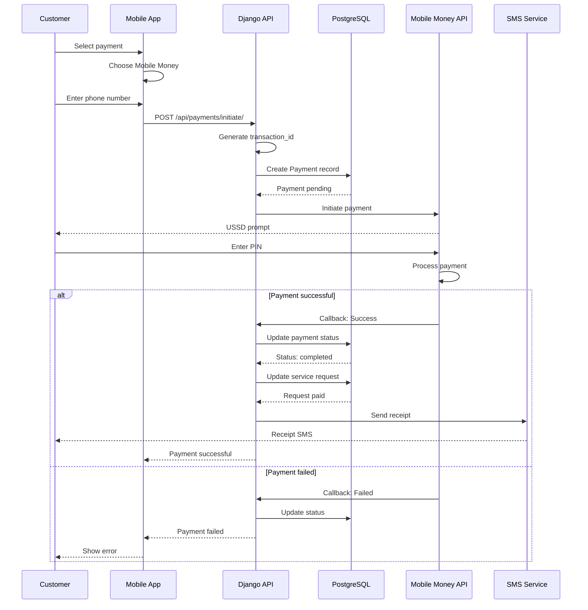

## 7. Sensor Alert and Maintenance Process

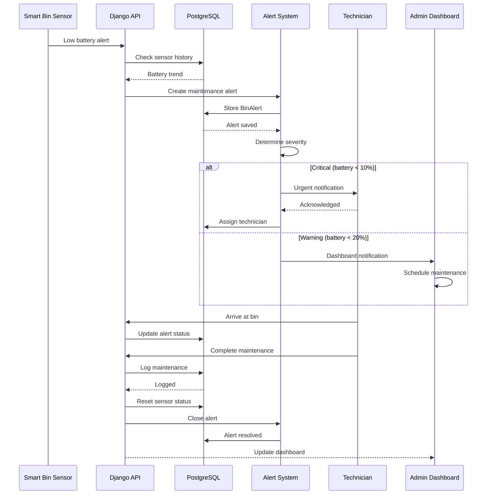

## 8. Bulk Waste Collection Request

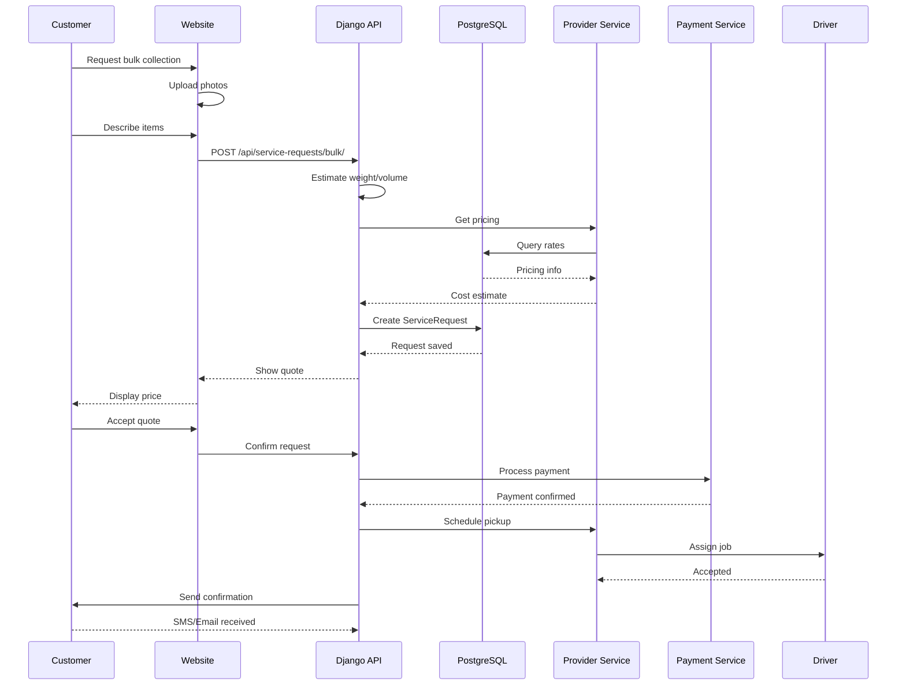

## 9. Environmental Report Generation

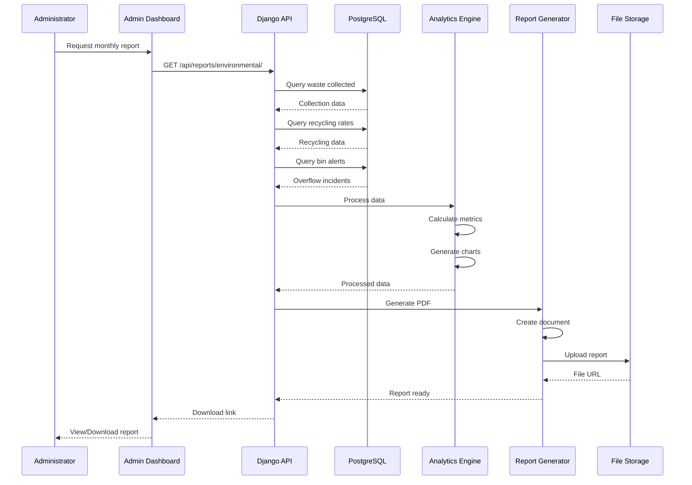

## 10. Zone Coverage Analysis

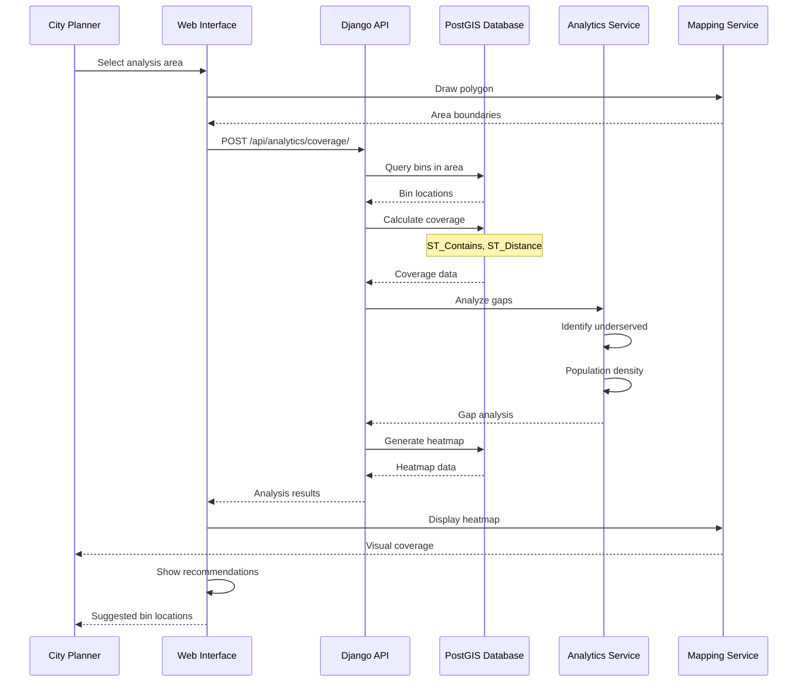

## Component Interaction Summary

### Key Components:
1. **Django Backend**: Core API and business logic
2. **PostgreSQL/PostGIS**: Spatial database
3. **MQTT Broker**: IoT communication
4. **Redis**: Caching and real-time data
5. **WebSocket Server**: Live updates
6. **Mobile Apps**: Driver and customer apps
7. **SMS Gateway**: Notifications (Twilio/Africa's Talking)
8. **Mobile Money API**: Payment processing
9. **File Storage**: AWS S3 or similar
10. **Analytics Engine**: Data processing

### Communication Patterns:
- **REST API**: Standard CRUD operations
- **MQTT**: IoT sensor data streaming
- **WebSocket**: Real-time dashboard updates
- **Webhooks**: Payment callbacks
- **Background Jobs**: Report generation (Celery)

### Security Measures:
- JWT authentication for API access
- API key validation for IoT devices
- SSL/TLS for all communications
- Input validation and sanitization
- Rate limiting on public endpoints
- Audit logging for all operations

### Ghana-Specific Integrations:
- Mobile Money providers (MTN, Vodafone, AirtelTigo)
- SMS gateways for local carriers
- Ghana Post GPS addressing system
- Local language support (Twi, Ga)
- DVLA vehicle registration validation