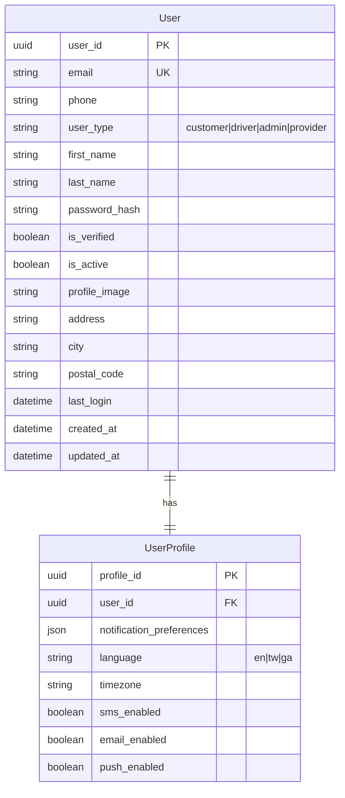
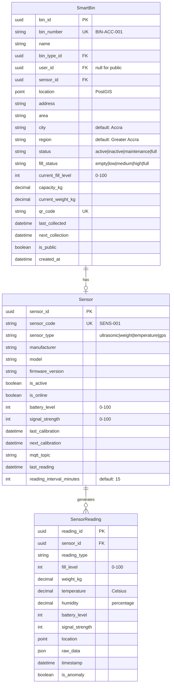
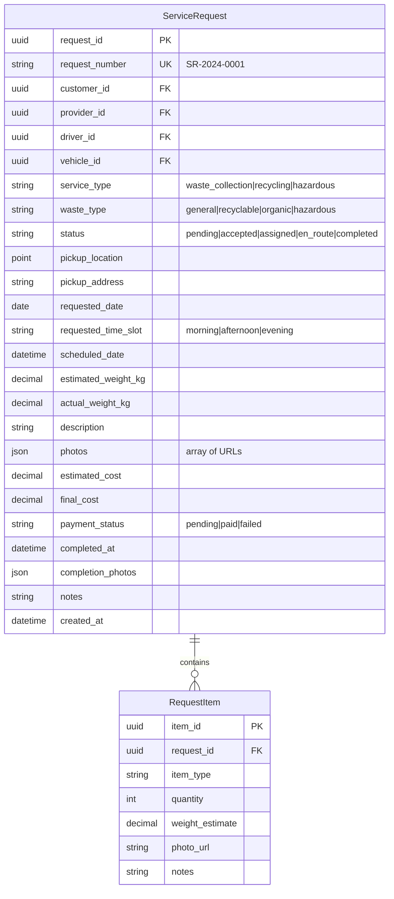
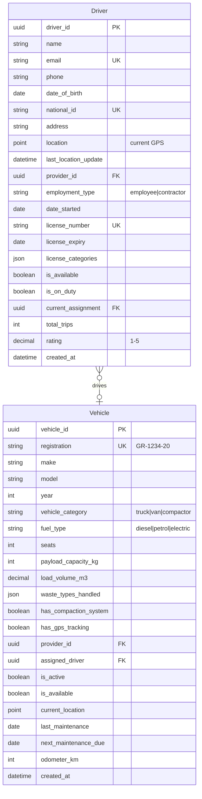
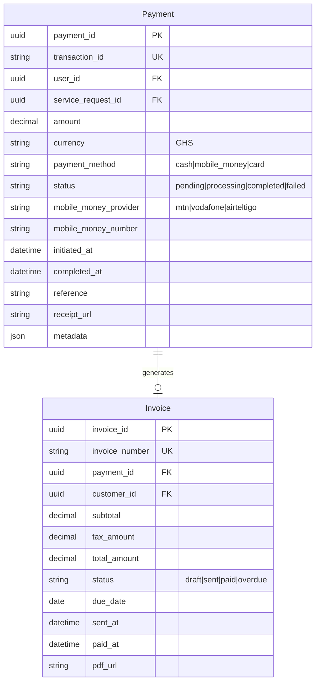

# Wasgo Entity Relationship Diagram (ERD)

## Database Schema Overview
Wasgo uses PostgreSQL with PostGIS extension for geospatial capabilities. The Django backend implements a comprehensive data model for smart waste management operations in Ghana.

## Complete Entity Relationship Diagram

```mermaid
erDiagram
    %% User Management Entities
    User {
        uuid user_id PK
        string email UK
        string phone
        string user_type
        string first_name
        string last_name
        boolean is_verified
        datetime created_at
        datetime updated_at
    }
    
    %% Waste Bin Management Entities
    BinType {
        int bin_type_id PK
        string name UK
        string description
        string color_code
        int capacity_liters
        string icon
    }
    
    SmartBin {
        uuid bin_id PK
        string bin_number UK
        string name
        point location
        string address
        string area
        string city
        string status
        string fill_status
        int current_fill_level
        decimal capacity_kg
        decimal current_weight_kg
        datetime last_collected
        datetime next_collection
        datetime created_at
    }
    
    Sensor {
        uuid sensor_id PK
        string sensor_code UK
        string sensor_type
        string manufacturer
        string model
        boolean is_active
        boolean is_online
        int battery_level
        int signal_strength
        datetime last_reading
        string mqtt_topic
    }
    
    SensorReading {
        uuid reading_id PK
        uuid sensor_id FK
        int fill_level
        decimal weight_kg
        decimal temperature
        decimal humidity
        int battery_level
        point location
        datetime timestamp
        json raw_data
    }
    
    BinAlert {
        uuid alert_id PK
        uuid bin_id FK
        string alert_type
        string severity
        string message
        boolean is_resolved
        datetime created_at
        datetime resolved_at
    }
    
    %% Service Request Management
    ServiceRequest {
        uuid request_id PK
        string request_number UK
        uuid customer_id FK
        string service_type
        string waste_type
        point pickup_location
        string pickup_address
        date requested_date
        string requested_time_slot
        string status
        decimal estimated_weight_kg
        decimal estimated_cost
        decimal final_cost
        datetime completed_at
        string payment_status
    }
    
    %% Driver and Vehicle Management
    Driver {
        uuid driver_id PK
        string name
        string email UK
        string phone
        string license_number UK
        date license_expiry
        uuid provider_id FK
        string employment_type
        boolean is_available
        boolean is_on_duty
        point current_location
        decimal rating
        datetime created_at
    }
    
    Vehicle {
        uuid vehicle_id PK
        string registration UK
        string make
        string model
        int year
        string vehicle_category
        string fuel_type
        int payload_capacity_kg
        decimal load_volume_m3
        boolean has_gps_tracking
        boolean is_active
        point current_location
        int odometer_km
    }
    
    DriverLocation {
        uuid location_id PK
        uuid driver_id FK
        point location
        decimal speed_kmh
        int heading
        datetime timestamp
        boolean is_moving
        int battery_level
    }
    
    %% Provider Management
    ServiceProvider {
        uuid provider_id PK
        string company_name
        string registration_number UK
        string email
        string phone
        point headquarters_location
        string headquarters_address
        json service_areas
        int fleet_size
        int driver_count
        boolean is_active
        decimal rating
    }
    
    %% Collection Management
    CollectionSchedule {
        uuid schedule_id PK
        uuid zone_id FK
        string day_of_week
        string time_slot
        string frequency
        boolean is_active
        datetime created_at
    }
    
    CollectionAssignment {
        uuid assignment_id PK
        uuid driver_id FK
        uuid zone_id FK
        date assigned_date
        datetime start_time
        datetime end_time
        string status
        int total_bins_collected
        string notes
    }
    
    CollectionRecord {
        uuid record_id PK
        uuid assignment_id FK
        uuid bin_id FK
        datetime collected_at
        decimal weight_kg
        int fill_level_before
        string photo_proof
        string notes
    }
    
    %% Zone Management
    Zone {
        uuid zone_id PK
        string zone_name
        string zone_code UK
        polygon boundary
        string zone_type
        uuid provider_id FK
        int population_estimate
        decimal area_sq_km
        int total_bins
    }
    
    %% Payment Management
    Payment {
        uuid payment_id PK
        string transaction_id UK
        uuid user_id FK
        uuid service_request_id FK
        decimal amount
        string currency
        string payment_method
        string status
        string mobile_money_provider
        string mobile_money_number
        datetime initiated_at
        datetime completed_at
        string reference
    }
    
    %% Notification Management
    Notification {
        uuid notification_id PK
        uuid user_id FK
        string notification_type
        string title
        string message
        json channels
        boolean is_sent
        boolean is_read
        datetime sent_at
        datetime read_at
        json data
    }
    
    %% Relationships
    User ||--o{ ServiceRequest : creates
    User ||--o{ Payment : makes
    User ||--o{ Notification : receives
    User ||--o{ SmartBin : owns
    
    SmartBin }o--|| BinType : has_type
    SmartBin ||--o| Sensor : equipped_with
    SmartBin ||--o{ BinAlert : generates
    SmartBin ||--o{ CollectionRecord : collected_in
    SmartBin }o--|| Zone : located_in
    
    Sensor ||--o{ SensorReading : produces
    
    ServiceRequest }o--|| ServiceProvider : assigned_to
    ServiceRequest }o--o| Driver : handled_by
    ServiceRequest }o--o| Vehicle : uses
    ServiceRequest ||--o| Payment : requires
    
    Driver }o--|| ServiceProvider : works_for
    Driver ||--o{ DriverLocation : tracks_location
    Driver ||--o{ CollectionAssignment : performs
    Driver }o--o| Vehicle : drives
    
    Vehicle }o--|| ServiceProvider : owned_by
    
    ServiceProvider ||--o{ Driver : employs
    ServiceProvider ||--o{ Vehicle : owns
    ServiceProvider ||--o{ Zone : services
    
    Zone ||--o{ SmartBin : contains
    Zone ||--o{ CollectionSchedule : has_schedule
    Zone ||--o{ CollectionAssignment : assigns
    
    CollectionAssignment ||--o{ CollectionRecord : includes
    
    Payment }o--|| ServiceRequest : pays_for
    
    Notification }o--o| SmartBin : about_bin
    Notification }o--o| ServiceRequest : about_request
```



## Entity Groups

### 1. Core User & Authentication


### 2. Smart Bin & IoT System


### 3. Service Request System


### 4. Driver & Vehicle Fleet


### 5. Payment & Billing


## Key Database Indexes

### Geospatial Indexes (PostGIS)
```sql
-- Spatial indexes for location-based queries
CREATE INDEX idx_smartbin_location ON smartbin USING GIST(location);
CREATE INDEX idx_servicerequest_location ON servicerequest USING GIST(pickup_location);
CREATE INDEX idx_driver_location ON driver USING GIST(location);
CREATE INDEX idx_vehicle_location ON vehicle USING GIST(current_location);
CREATE INDEX idx_zone_boundary ON zone USING GIST(boundary);
CREATE INDEX idx_provider_hq ON serviceprovider USING GIST(headquarters_location);
```

### Performance Indexes
```sql
-- Frequently queried fields
CREATE INDEX idx_smartbin_status ON smartbin(status) WHERE status != 'inactive';
CREATE INDEX idx_smartbin_fill_level ON smartbin(current_fill_level) WHERE current_fill_level > 70;
CREATE INDEX idx_servicerequest_status ON servicerequest(status) WHERE status NOT IN ('completed', 'cancelled');
CREATE INDEX idx_driver_available ON driver(is_available, is_on_duty) WHERE is_available = true;
CREATE INDEX idx_vehicle_available ON vehicle(is_available, is_active) WHERE is_active = true;
CREATE INDEX idx_payment_status ON payment(status) WHERE status = 'pending';
CREATE INDEX idx_sensorreading_timestamp ON sensorreading(timestamp DESC);
CREATE INDEX idx_binalert_unresolved ON binalert(is_resolved) WHERE is_resolved = false;
```

### Foreign Key Indexes
```sql
-- Automatic FK indexes
CREATE INDEX idx_smartbin_user ON smartbin(user_id);
CREATE INDEX idx_smartbin_bintype ON smartbin(bin_type_id);
CREATE INDEX idx_smartbin_sensor ON smartbin(sensor_id);
CREATE INDEX idx_sensorreading_sensor ON sensorreading(sensor_id);
CREATE INDEX idx_servicerequest_customer ON servicerequest(customer_id);
CREATE INDEX idx_driver_provider ON driver(provider_id);
CREATE INDEX idx_vehicle_provider ON vehicle(provider_id);
CREATE INDEX idx_payment_user ON payment(user_id);
CREATE INDEX idx_notification_user ON notification(user_id);
```

## Data Integrity Constraints

### Check Constraints
```sql
-- Value range constraints
ALTER TABLE smartbin ADD CONSTRAINT chk_fill_level 
    CHECK (current_fill_level >= 0 AND current_fill_level <= 100);

ALTER TABLE sensor ADD CONSTRAINT chk_battery_level 
    CHECK (battery_level >= 0 AND battery_level <= 100);

ALTER TABLE driver ADD CONSTRAINT chk_rating 
    CHECK (rating >= 0 AND rating <= 5);

ALTER TABLE payment ADD CONSTRAINT chk_amount 
    CHECK (amount > 0);

ALTER TABLE vehicle ADD CONSTRAINT chk_year 
    CHECK (year >= 1990 AND year <= EXTRACT(YEAR FROM CURRENT_DATE) + 1);
```

### Unique Constraints
```sql
-- Business rules
ALTER TABLE smartbin ADD CONSTRAINT uk_bin_sensor 
    UNIQUE (sensor_id) WHERE sensor_id IS NOT NULL;

ALTER TABLE driver ADD CONSTRAINT uk_driver_user 
    UNIQUE (user_id) WHERE user_id IS NOT NULL;

ALTER TABLE vehicle ADD CONSTRAINT uk_vehicle_driver 
    UNIQUE (assigned_driver) WHERE assigned_driver IS NOT NULL;
```

### Triggers
```sql
-- Auto-update bin status based on fill level
CREATE OR REPLACE FUNCTION update_bin_status()
RETURNS TRIGGER AS $$
BEGIN
    IF NEW.current_fill_level >= 80 THEN
        NEW.fill_status = 'full';
        NEW.status = 'full';
    ELSIF NEW.current_fill_level >= 60 THEN
        NEW.fill_status = 'high';
    ELSIF NEW.current_fill_level >= 40 THEN
        NEW.fill_status = 'medium';
    ELSIF NEW.current_fill_level >= 20 THEN
        NEW.fill_status = 'low';
    ELSE
        NEW.fill_status = 'empty';
    END IF;
    RETURN NEW;
END;
$$ LANGUAGE plpgsql;

CREATE TRIGGER trigger_update_bin_status
    BEFORE INSERT OR UPDATE OF current_fill_level ON smartbin
    FOR EACH ROW EXECUTE FUNCTION update_bin_status();
```

## PostGIS Spatial Queries Examples

### Find Nearest Bins
```sql
-- Find bins within 1km radius
SELECT 
    bin_number,
    name,
    current_fill_level,
    ST_Distance(location, ST_MakePoint(%s, %s)::geography) as distance_meters
FROM smartbin
WHERE ST_DWithin(location, ST_MakePoint(%s, %s)::geography, 1000)
    AND status = 'active'
ORDER BY distance_meters;
```

### Zone-based Queries
```sql
-- Get all bins in a zone
SELECT b.* 
FROM smartbin b
JOIN zone z ON ST_Contains(z.boundary, b.location)
WHERE z.zone_id = %s;

-- Count bins by zone
SELECT 
    z.zone_name,
    COUNT(b.bin_id) as bin_count,
    AVG(b.current_fill_level) as avg_fill_level
FROM zone z
LEFT JOIN smartbin b ON ST_Contains(z.boundary, b.location)
GROUP BY z.zone_id, z.zone_name;
```

### Service Area Coverage
```sql
-- Check if location is in service area
SELECT sp.* 
FROM serviceprovider sp
WHERE ST_Contains(
    ST_GeomFromGeoJSON(sp.service_areas->0),
    ST_MakePoint(%s, %s)
);
```

### Driver Route Tracking
```sql
-- Get driver's route for the day
SELECT 
    ST_MakeLine(location ORDER BY timestamp) as route,
    SUM(ST_Distance(
        location,
        LAG(location) OVER (ORDER BY timestamp)
    )) as total_distance
FROM driverlocation
WHERE driver_id = %s
    AND DATE(timestamp) = CURRENT_DATE;
```