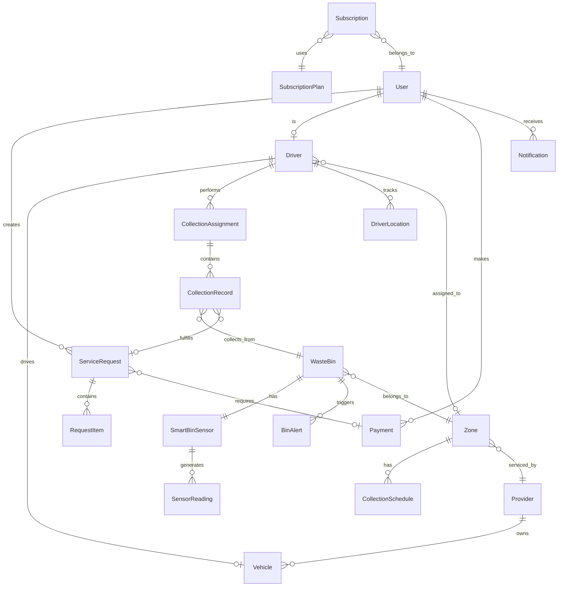

# Wasgo Entity Relationship Diagram (ERD)

## Database Schema Overview
Wasgo uses PostgreSQL with PostGIS extension for geospatial capabilities. The Django backend implements a comprehensive data model for waste management operations.

## Core Django Apps and Their Models

### 1. Authentication & User Management

```python
# User App Models
class User(AbstractUser):
    user_id = UUIDField(primary_key=True)
    email = EmailField(unique=True)
    phone = CharField(max_length=20)
    user_type = CharField(choices=['citizen', 'driver', 'admin', 'provider'])
    is_verified = BooleanField(default=False)
    profile_image = ImageField()
    address = TextField()
    city = CharField(max_length=100)
    postal_code = CharField(max_length=10)
    created_at = DateTimeField(auto_now_add=True)
    updated_at = DateTimeField(auto_now=True)

class UserProfile:
    user = OneToOneField(User)
    notification_preferences = JSONField()
    language = CharField(choices=['en', 'tw', 'ga'])
    location = PointField()  # PostGIS
```

### 2. WasteBin Management

```python
class WasteBin:
    bin_id = UUIDField(primary_key=True)
    bin_code = CharField(unique=True)  # e.g., "ACC-001"
    bin_type = CharField(choices=['general', 'recycling', 'organic', 'hazardous'])
    capacity_liters = IntegerField()
    location = PointField()  # PostGIS point
    address = TextField()
    zone = ForeignKey('Zone')
    qr_code = CharField(unique=True)
    installation_date = DateField()
    last_maintenance = DateTimeField()
    status = CharField(choices=['active', 'maintenance', 'damaged', 'removed'])
    created_at = DateTimeField(auto_now_add=True)

class SmartBinSensor:
    sensor_id = UUIDField(primary_key=True)
    bin = OneToOneField(WasteBin)
    sensor_type = CharField(choices=['ultrasonic', 'weight', 'temperature', 'gps'])
    manufacturer = CharField(max_length=100)
    model_number = CharField(max_length=50)
    installation_date = DateTimeField()
    last_calibration = DateTimeField()
    battery_type = CharField(max_length=50)
    is_active = BooleanField(default=True)

class SensorReading:
    reading_id = UUIDField(primary_key=True)
    sensor = ForeignKey(SmartBinSensor)
    fill_level = IntegerField()  # 0-100%
    weight_kg = DecimalField(max_digits=10, decimal_places=2)
    temperature = DecimalField(max_digits=5, decimal_places=2)
    humidity = DecimalField(max_digits=5, decimal_places=2)
    battery_level = IntegerField()  # 0-100%
    signal_strength = IntegerField()  # 0-100%
    timestamp = DateTimeField()
    location = PointField()  # Current GPS position
    
class BinAlert:
    alert_id = UUIDField(primary_key=True)
    bin = ForeignKey(WasteBin)
    alert_type = CharField(choices=['overflow', 'damage', 'vandalism', 'offline'])
    severity = CharField(choices=['low', 'medium', 'high', 'critical'])
    message = TextField()
    created_at = DateTimeField(auto_now_add=True)
    resolved_at = DateTimeField(null=True)
    resolved_by = ForeignKey(User, null=True)
```

### 3. Service Request Management

```python
class ServiceRequest:
    request_id = UUIDField(primary_key=True)
    request_number = CharField(unique=True)  # e.g., "SR-2024-0001"
    customer = ForeignKey(User)
    service_type = CharField(choices=['regular', 'bulk', 'recycling', 'hazardous'])
    location = PointField()
    address = TextField()
    description = TextField()
    preferred_date = DateField()
    preferred_time_slot = CharField(choices=['morning', 'afternoon', 'evening'])
    status = CharField(choices=['pending', 'assigned', 'in_progress', 'completed', 'cancelled'])
    priority = CharField(choices=['low', 'medium', 'high', 'urgent'])
    assigned_driver = ForeignKey('Driver', null=True)
    created_at = DateTimeField(auto_now_add=True)
    completed_at = DateTimeField(null=True)

class RequestItem:
    item_id = UUIDField(primary_key=True)
    request = ForeignKey(ServiceRequest)
    item_type = CharField(max_length=100)
    quantity = IntegerField()
    weight_estimate = DecimalField(max_digits=10, decimal_places=2)
    photo = ImageField()
    notes = TextField()
```

### 4. Vehicle & Driver Management

```python
class Vehicle:
    vehicle_id = UUIDField(primary_key=True)
    registration_number = CharField(unique=True)
    vehicle_type = CharField(choices=['truck', 'van', 'compactor', 'tipper'])
    capacity_tons = DecimalField(max_digits=5, decimal_places=2)
    fuel_type = CharField(choices=['diesel', 'petrol', 'electric', 'hybrid'])
    gps_device_id = CharField(unique=True)
    current_location = PointField()
    status = CharField(choices=['available', 'on_duty', 'maintenance', 'offline'])
    last_maintenance = DateField()
    next_maintenance_due = DateField()
    
class Driver:
    driver_id = UUIDField(primary_key=True)
    user = OneToOneField(User)
    license_number = CharField(unique=True)
    license_expiry = DateField()
    vehicle = ForeignKey(Vehicle, null=True)
    assigned_zone = ForeignKey('Zone', null=True)
    status = CharField(choices=['available', 'on_duty', 'break', 'off_duty'])
    shift_start = TimeField()
    shift_end = TimeField()
    total_collections_today = IntegerField(default=0)
    
class DriverLocation:
    location_id = UUIDField(primary_key=True)
    driver = ForeignKey(Driver)
    location = PointField()
    speed_kmh = DecimalField(max_digits=5, decimal_places=2)
    heading = IntegerField()  # 0-360 degrees
    timestamp = DateTimeField()
    is_moving = BooleanField()
```

### 5. Collection Management

```python
class CollectionSchedule:
    schedule_id = UUIDField(primary_key=True)
    zone = ForeignKey('Zone')
    day_of_week = CharField(choices=['monday', 'tuesday', 'wednesday', 'thursday', 'friday', 'saturday', 'sunday'])
    time_slot = CharField(choices=['morning', 'afternoon', 'evening'])
    frequency = CharField(choices=['daily', 'weekly', 'biweekly', 'monthly'])
    is_active = BooleanField(default=True)
    created_at = DateTimeField(auto_now_add=True)

class CollectionAssignment:
    assignment_id = UUIDField(primary_key=True)
    driver = ForeignKey(Driver)
    zone = ForeignKey('Zone')
    assigned_date = DateField()
    bins = ManyToManyField(WasteBin)
    service_requests = ManyToManyField(ServiceRequest)
    start_time = DateTimeField(null=True)
    end_time = DateTimeField(null=True)
    status = CharField(choices=['pending', 'in_progress', 'completed', 'cancelled'])
    total_bins_collected = IntegerField(default=0)
    notes = TextField(null=True)
    
class CollectionRecord:
    record_id = UUIDField(primary_key=True)
    assignment = ForeignKey(CollectionAssignment)
    bin = ForeignKey(WasteBin, null=True)
    service_request = ForeignKey(ServiceRequest, null=True)
    collected_at = DateTimeField()
    weight_kg = DecimalField(max_digits=10, decimal_places=2, null=True)
    fill_level_before = IntegerField(null=True)
    photo_proof = ImageField(null=True)
    notes = TextField(null=True)
```

### 6. Zone Management

```python
class Zone:
    zone_id = UUIDField(primary_key=True)
    zone_name = CharField(max_length=100)
    zone_code = CharField(unique=True)
    city = CharField(max_length=100)
    boundary = PolygonField()  # PostGIS polygon
    zone_type = CharField(choices=['residential', 'commercial', 'industrial', 'mixed'])
    collection_frequency = CharField(choices=['daily', 'weekly', 'biweekly', 'monthly'])
    assigned_provider = ForeignKey('Provider', null=True)
    population_estimate = IntegerField()
    area_sq_km = DecimalField(max_digits=10, decimal_places=2)
    total_bins = IntegerField(default=0)
```

### 7. Provider Management

```python
class Provider:
    provider_id = UUIDField(primary_key=True)
    company_name = CharField(max_length=200)
    registration_number = CharField(unique=True)
    contact_person = CharField(max_length=100)
    email = EmailField()
    phone = CharField(max_length=20)
    address = TextField()
    service_areas = ManyToManyField(Zone)
    fleet_size = IntegerField()
    employee_count = IntegerField()
    rating = DecimalField(max_digits=3, decimal_places=2)
    is_active = BooleanField(default=True)
```

### 8. Payment & Billing

```python
class Payment:
    payment_id = UUIDField(primary_key=True)
    user = ForeignKey(User)
    service_request = ForeignKey(ServiceRequest, null=True)
    subscription = ForeignKey('Subscription', null=True)
    amount = DecimalField(max_digits=10, decimal_places=2)
    currency = CharField(default='GHS')
    payment_method = CharField(choices=['mobile_money', 'card', 'bank_transfer', 'cash'])
    transaction_reference = CharField(unique=True)
    status = CharField(choices=['pending', 'completed', 'failed', 'refunded'])
    payment_date = DateTimeField()
    
class Subscription:
    subscription_id = UUIDField(primary_key=True)
    customer = ForeignKey(User)
    plan = ForeignKey('SubscriptionPlan')
    start_date = DateField()
    end_date = DateField()
    is_active = BooleanField(default=True)
    auto_renew = BooleanField(default=True)
    
class SubscriptionPlan:
    plan_id = UUIDField(primary_key=True)
    plan_name = CharField(max_length=100)
    plan_type = CharField(choices=['residential', 'commercial', 'industrial'])
    collections_per_month = IntegerField()
    price_per_month = DecimalField(max_digits=10, decimal_places=2)
    features = JSONField()
```

### 9. Notification System

```python
class Notification:
    notification_id = UUIDField(primary_key=True)
    user = ForeignKey(User)
    notification_type = CharField(choices=['alert', 'reminder', 'update', 'promotion'])
    title = CharField(max_length=200)
    message = TextField()
    channel = CharField(choices=['push', 'sms', 'email', 'in_app'])
    is_read = BooleanField(default=False)
    sent_at = DateTimeField()
    read_at = DateTimeField(null=True)
    related_object_type = CharField(max_length=50, null=True)
    related_object_id = UUIDField(null=True)
```

### 10. Analytics & Reporting

```python
class CollectionMetric:
    metric_id = UUIDField(primary_key=True)
    date = DateField()
    zone = ForeignKey(Zone)
    total_weight_collected_kg = DecimalField(max_digits=10, decimal_places=2)
    bins_collected = IntegerField()
    collections_completed = IntegerField()
    average_fill_level = DecimalField(max_digits=5, decimal_places=2)
    service_requests_fulfilled = IntegerField()
    
class WasteComposition:
    composition_id = UUIDField(primary_key=True)
    zone = ForeignKey(Zone)
    sample_date = DateField()
    organic_percentage = DecimalField(max_digits=5, decimal_places=2)
    plastic_percentage = DecimalField(max_digits=5, decimal_places=2)
    paper_percentage = DecimalField(max_digits=5, decimal_places=2)
    metal_percentage = DecimalField(max_digits=5, decimal_places=2)
    glass_percentage = DecimalField(max_digits=5, decimal_places=2)
    other_percentage = DecimalField(max_digits=5, decimal_places=2)

class EnvironmentalImpact:
    impact_id = UUIDField(primary_key=True)
    month = DateField()
    zone = ForeignKey(Zone, null=True)
    waste_diverted_kg = DecimalField(max_digits=10, decimal_places=2)
    recycling_rate = DecimalField(max_digits=5, decimal_places=2)
    overflow_incidents = IntegerField()
    illegal_dumping_reports = IntegerField()
    created_at = DateTimeField(auto_now_add=True)
```

## Entity Relationships

### Primary Relationships



## Database Indexes

```sql
-- Geospatial indexes for PostGIS
CREATE INDEX idx_wastebin_location ON wastebin USING GIST(location);
CREATE INDEX idx_zone_boundary ON zone USING GIST(boundary);
CREATE INDEX idx_driverlocation_location ON driverlocation USING GIST(location);

-- Performance indexes
CREATE INDEX idx_sensorreading_timestamp ON sensorreading(timestamp DESC);
CREATE INDEX idx_sensorreading_bin_timestamp ON sensorreading(sensor_id, timestamp DESC);
CREATE INDEX idx_collectionassignment_date ON collectionassignment(assigned_date, status);
CREATE INDEX idx_servicerequest_status ON servicerequest(status) WHERE status != 'completed';
CREATE INDEX idx_binalert_resolved ON binalert(resolved_at) WHERE resolved_at IS NULL;

-- Foreign key indexes
CREATE INDEX idx_sensorreading_sensor ON sensorreading(sensor_id);
CREATE INDEX idx_collectionrecord_assignment ON collectionrecord(assignment_id);
CREATE INDEX idx_notification_user ON notification(user_id);
```

## PostGIS Spatial Queries

```sql
-- Find nearest bins to a location
SELECT bin_id, bin_code, 
       ST_Distance(location, ST_MakePoint(?, ?)::geography) as distance
FROM wastebin
WHERE ST_DWithin(location, ST_MakePoint(?, ?)::geography, 1000)
ORDER BY distance;

-- Check if point is within zone
SELECT zone_id, zone_name
FROM zone
WHERE ST_Contains(boundary, ST_MakePoint(?, ?));

-- Get all bins in a zone
SELECT w.* FROM wastebin w
JOIN zone z ON ST_Contains(z.boundary, w.location)
WHERE z.zone_id = ?;

-- Find bins near driver's current location
SELECT b.*, ST_Distance(b.location, d.location) as distance
FROM wastebin b, driverlocation d
WHERE d.driver_id = ?
AND d.timestamp = (SELECT MAX(timestamp) FROM driverlocation WHERE driver_id = ?)
AND ST_DWithin(b.location, d.location, 500);
```

## Data Integrity Constraints

1. **Check Constraints**
   - Fill level between 0-100%
   - Battery level between 0-100%
   - Ratings between 0-5
   - Percentages sum to 100% in waste composition

2. **Unique Constraints**
   - One sensor per bin
   - One driver per user
   - Unique QR codes for bins
   - Unique transaction references

3. **Foreign Key Constraints**
   - CASCADE on delete for dependent records
   - RESTRICT on critical relationships
   - SET NULL for optional relationships