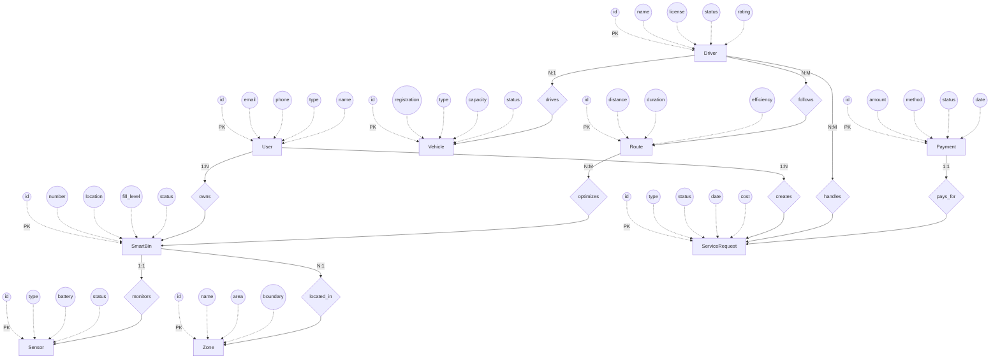
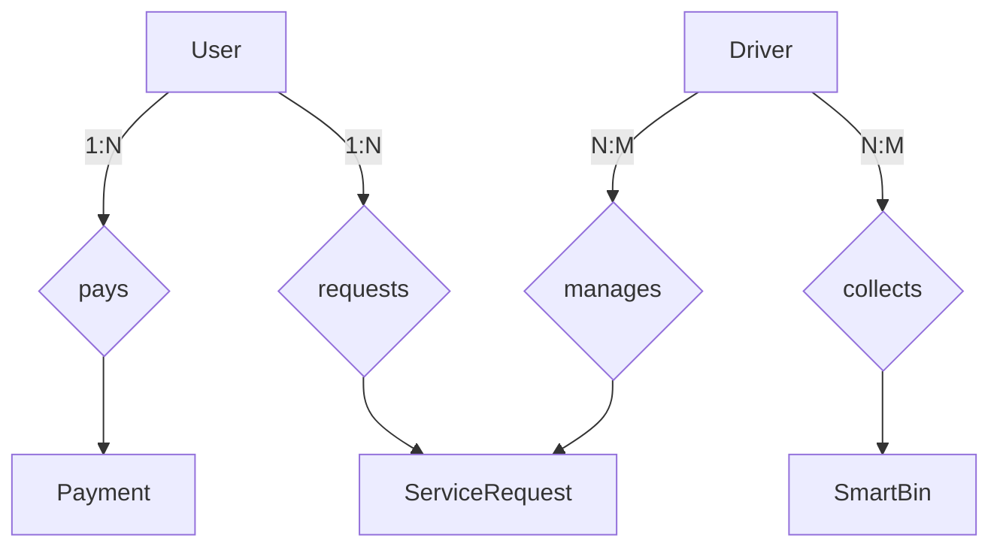
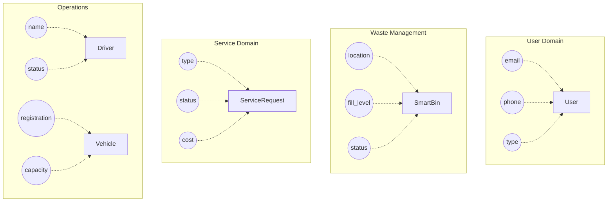
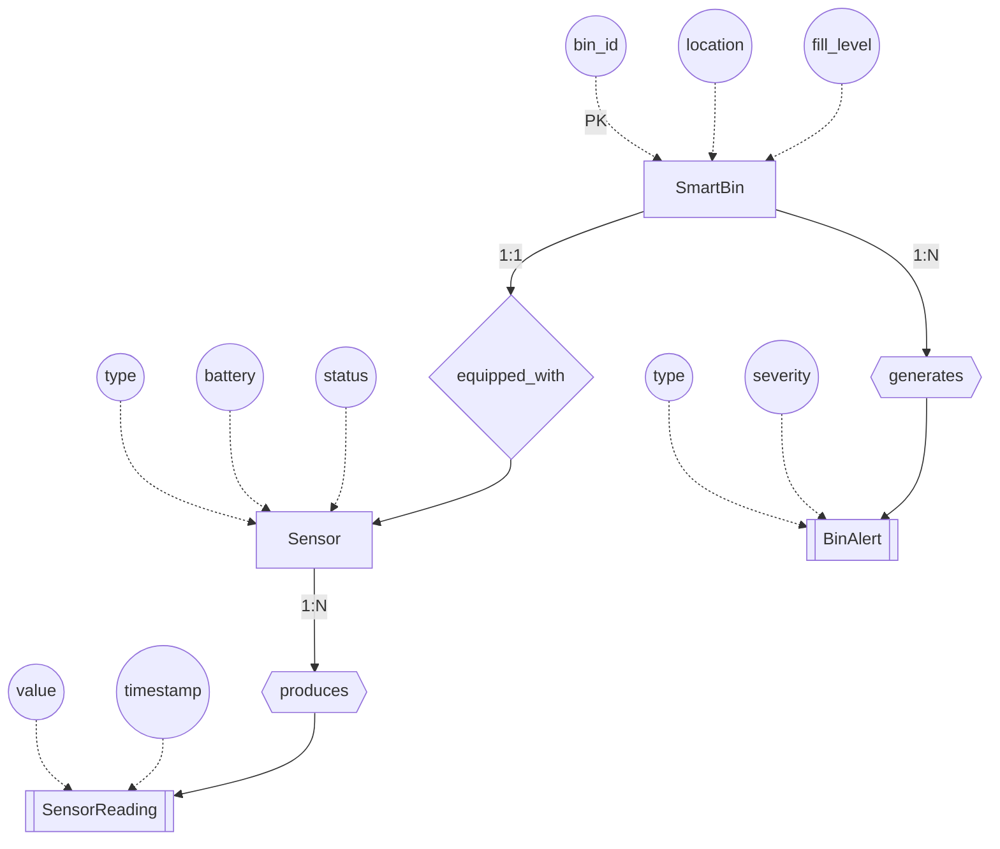
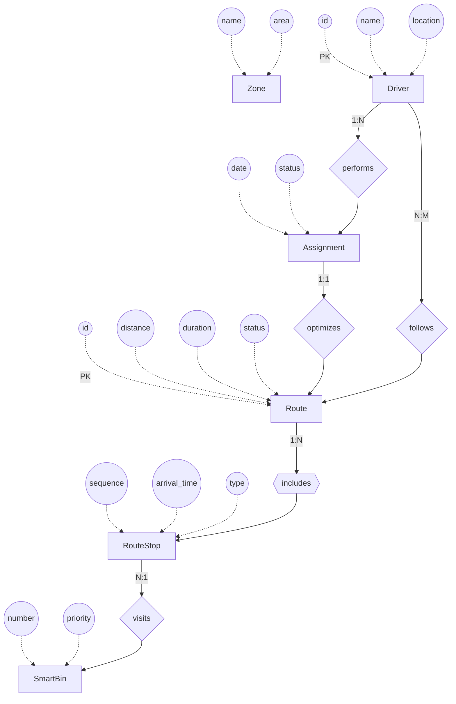
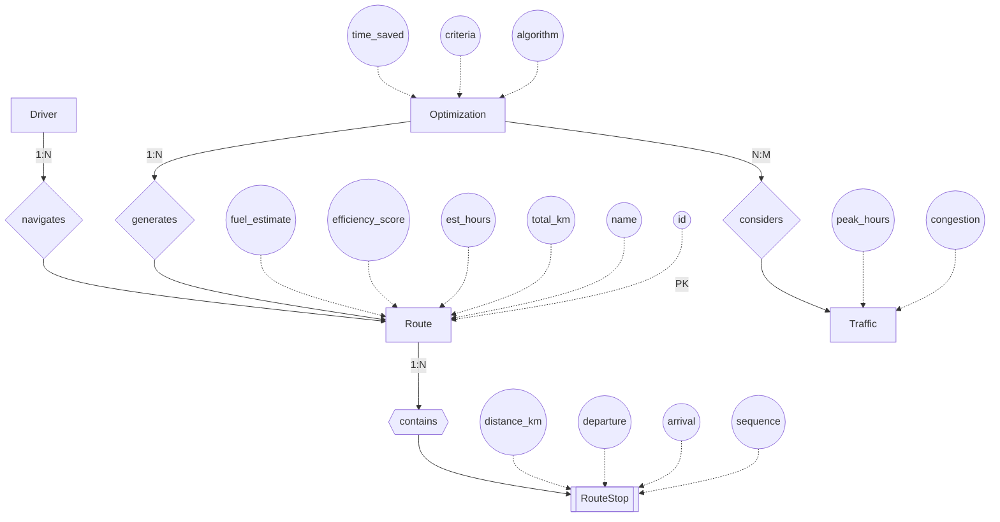
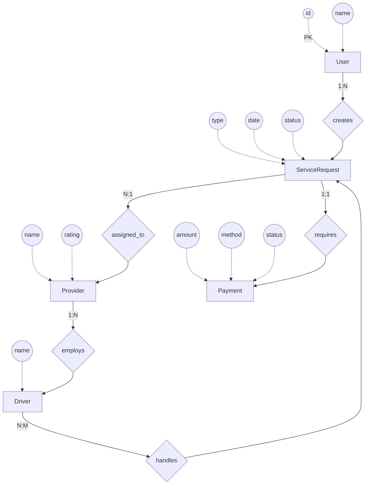
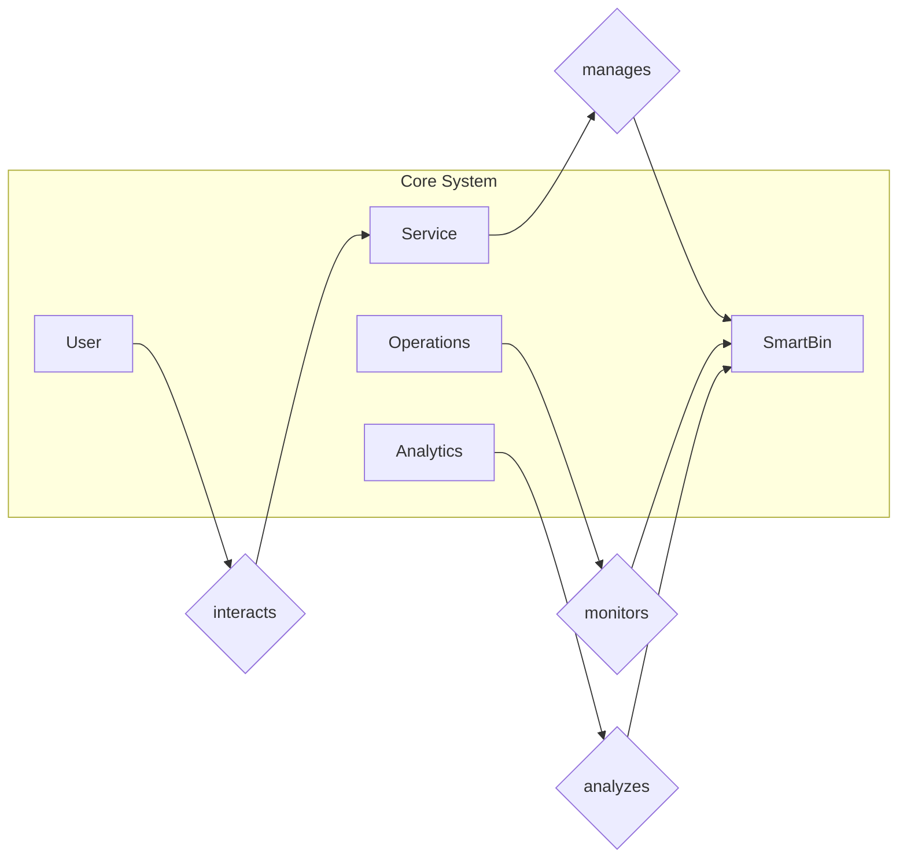
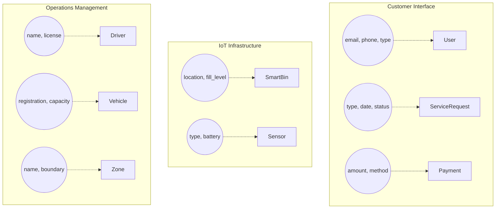
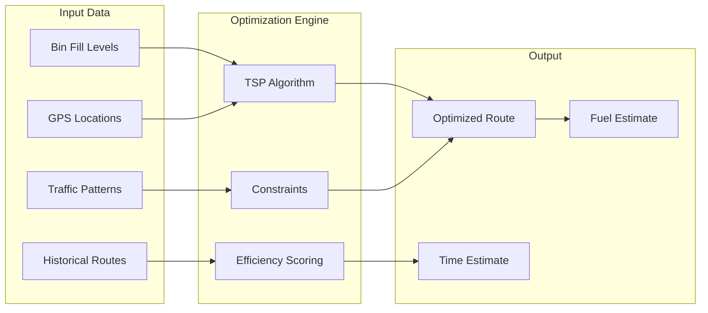

# Wasgo Entity Relationship Diagram (ERD) - High-Level Chen's Notation

## Database Schema Overview
Wasgo uses PostgreSQL with PostGIS extension for geospatial capabilities. The Django backend implements a comprehensive data model for smart waste management operations in Ghana.

## High-Level Conceptual ERD - Chen's Notation

This high-level ERD shows the main entities and their key attributes arranged around them for clarity. Only the most important attributes are displayed to maintain readability.

## Core System Components - Simplified View

## Main Business Entities with Primary Attributes

## IoT and Monitoring Subsystem

## Collection Management & Route Optimization Subsystem

## Route Optimization System

## Service Request and Payment Flow

## System Overview - Highest Level Abstraction

## Entity Groupings by Business Domain

## Chen's Notation Legend for High-Level ERD

| Symbol | Meaning | Example |
|--------|---------|---------|
| `[Entity]` | Entity (Rectangle) | `[User]`, `[SmartBin]` |
| `((attribute))` | Attribute (Oval) | `((email))`, `((fill_level))` |
| `{relationship}` | Relationship (Diamond) | `{owns}`, `{monitors}` |
| `[[Weak Entity]]` | Weak Entity (Double Rectangle) | `[[SensorReading]]` |
| `{{relationship}}` | Identifying Relationship (Double Diamond) | `{{produces}}` |
| `-.->` | Attribute Connection | Links attributes to entities |
| `-->` | Relationship Connection | Links entities via relationships |
| `1:N`, `N:M` | Cardinality | One-to-Many, Many-to-Many |
| `PK` | Primary Key | Unique identifier |

## Key Design Principles

1. **High-Level Abstraction**: Only showing main entities and their key attributes
2. **Attribute Grouping**: Attributes shown as ovals around entities for clarity
3. **Simplified Relationships**: Only critical relationships displayed
4. **Domain Separation**: Entities grouped by business function
5. **Chen's Standard**: Following proper Chen's notation conventions

## Main System Components Summary

| Entity | Purpose | Key Attributes |
|--------|---------|----------------|
| **User** | System users (customers, admins) | id, email, phone, type |
| **SmartBin** | IoT-enabled waste bins | id, location, fill_level, status, priority |
| **Sensor** | IoT monitoring devices | type, battery, status |
| **ServiceRequest** | Waste collection requests | type, date, status, cost |
| **Driver** | Collection personnel | name, license, status, rating, location |
| **Vehicle** | Collection trucks | registration, type, capacity |
| **Payment** | Transaction records | amount, method, status |
| **Zone** | Geographic areas | name, area, boundary |
| **Route** | Optimized collection paths | id, distance, duration, efficiency |
| **RouteStop** | Individual stops on route | sequence, arrival_time, bin_id |
| **RouteOptimization** | Route planning engine | algorithm, criteria, time_saved |

## Route Optimization Architecture

### Route Optimization Features

1. **Dynamic Route Planning**
   - Real-time route calculation based on bin fill levels
   - Priority-based collection (critical bins first)
   - Multi-vehicle route coordination
   - Time window constraints

2. **Optimization Algorithms**
   - Traveling Salesman Problem (TSP) solver
   - Vehicle Routing Problem (VRP) with capacity constraints
   - Genetic algorithms for large-scale optimization
   - Machine learning for pattern prediction

3. **Constraints & Factors**
   - Vehicle capacity limits
   - Driver working hours
   - Traffic congestion patterns
   - Road restrictions (weight limits, one-way streets)
   - Fuel efficiency optimization
   - Emergency collection priorities

4. **Route Tracking & Monitoring**
   - Real-time GPS tracking
   - Route deviation alerts
   - Performance metrics (actual vs planned)
   - Historical route analysis

## Database Implementation Notes

The high-level ERD translates to approximately 20-25 main tables in PostgreSQL with PostGIS extensions for spatial data. The route optimization system adds:
- `routes` table for planned collection routes
- `route_stops` for individual waypoints
- `route_optimizations` for optimization history
- `traffic_patterns` for traffic data
- Spatial indexes for efficient geographic queries
- Junction tables for many-to-many relationships
- Audit tables for tracking changes