# Wasgo Entity Relationship Diagram (ERD) - Chen's Notation

## Database Schema Overview
Wasgo uses PostgreSQL with PostGIS extension for geospatial capabilities. The Django backend implements a comprehensive data model for smart waste management operations in Ghana.

## Complete Entity Relationship Diagram - Chen's Notation

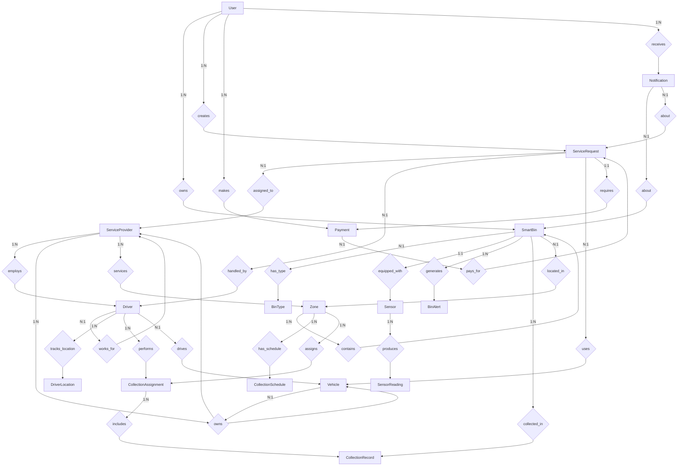

## Detailed Chen's Notation ERD with Attributes

### User Management System

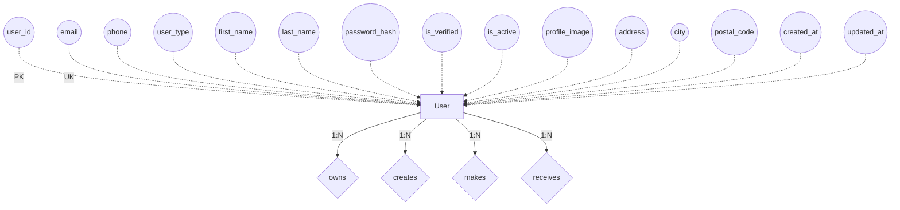

### Smart Bin & IoT System

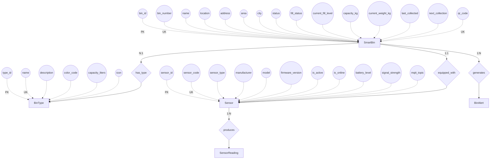

### Service Request System

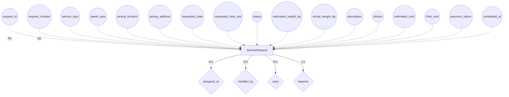

### Driver & Vehicle System

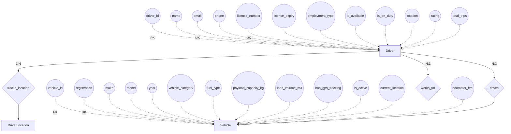

### Payment System

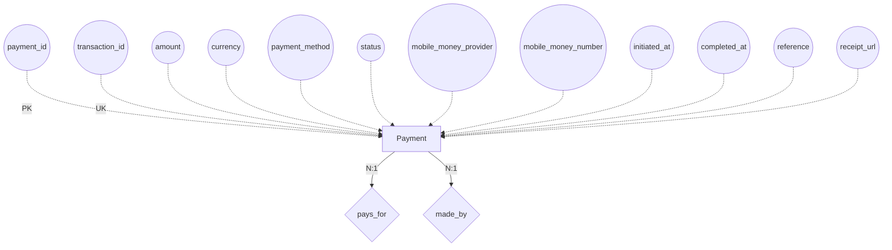

## Cardinality and Participation Constraints

### Notation Legend
- **1:1** - One-to-One relationship
- **1:N** - One-to-Many relationship
- **M:N** - Many-to-Many relationship
- **Total Participation** (double line): Entity must participate in relationship
- **Partial Participation** (single line): Entity may or may not participate

### Key Relationships with Cardinality

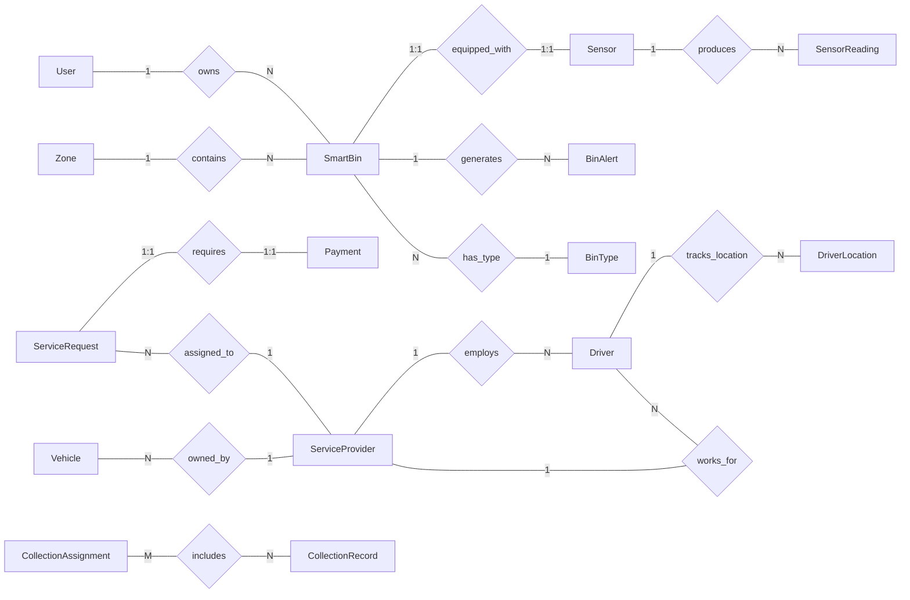

## Weak Entities

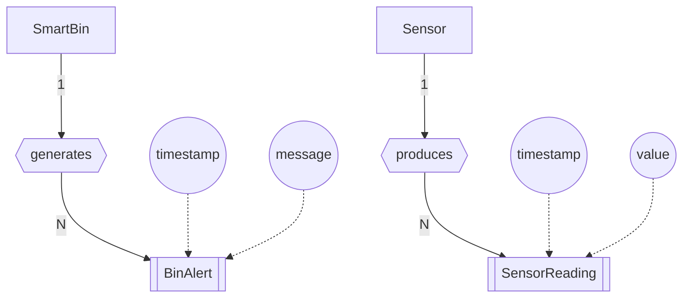

## Specialization/Generalization Hierarchy

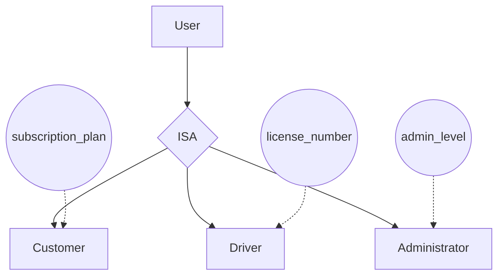

## Multi-valued Attributes

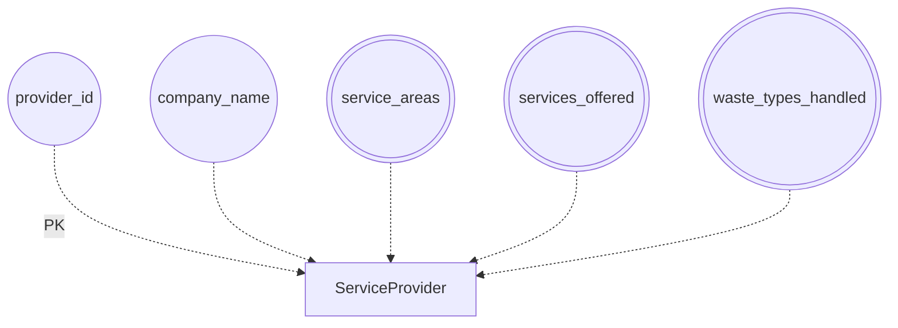

## Composite Attributes

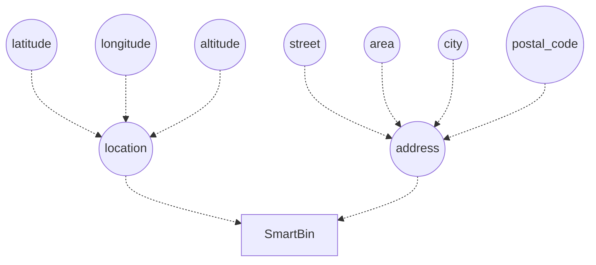

## Derived Attributes

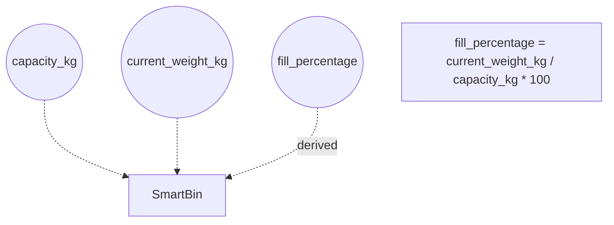

## Complete Chen's ERD Legend

| Symbol | Meaning |
|--------|---------|
| Rectangle `[ ]` | Entity |
| Double Rectangle `[[ ]]` | Weak Entity |
| Diamond `{ }` | Relationship |
| Double Diamond `{{ }}` | Identifying Relationship |
| Oval `( )` | Attribute |
| Double Oval `(( ))` | Multi-valued Attribute |
| Dashed Oval | Derived Attribute |
| Underlined Attribute | Primary Key |
| Triangle | ISA (Generalization) |
| Lines | Participation |
| Double Lines | Total Participation |
| 1, N, M | Cardinality |

## Key Constraints in Chen's Notation

1. **Participation Constraints**
   - Total: Every SmartBin MUST have a BinType
   - Partial: A User MAY own SmartBins

2. **Cardinality Constraints**
   - (1,1): A SmartBin has exactly one Sensor
   - (0,N): A User can create zero or many ServiceRequests
   - (1,N): A Sensor produces at least one SensorReading

3. **Key Constraints**
   - Primary Key: Uniquely identifies entity instances
   - Foreign Key: References another entity
   - Unique Key: Alternative key constraint

## Database Implementation Notes

### PostgreSQL with PostGIS Implementation
```sql
-- Entity tables based on Chen's notation
CREATE TABLE users (
    user_id UUID PRIMARY KEY,
    email VARCHAR(255) UNIQUE NOT NULL,
    phone VARCHAR(20),
    user_type VARCHAR(20) CHECK (user_type IN ('customer', 'driver', 'admin', 'provider')),
    -- other attributes
);

CREATE TABLE smart_bins (
    bin_id UUID PRIMARY KEY,
    bin_number VARCHAR(50) UNIQUE NOT NULL,
    bin_type_id INTEGER REFERENCES bin_types(type_id),
    user_id UUID REFERENCES users(user_id),
    location GEOMETRY(Point, 4326),
    -- other attributes
);

-- Relationship tables for M:N relationships
CREATE TABLE collection_assignments_bins (
    assignment_id UUID REFERENCES collection_assignments(assignment_id),
    bin_id UUID REFERENCES smart_bins(bin_id),
    PRIMARY KEY (assignment_id, bin_id)
);

-- Weak entity with composite key
CREATE TABLE sensor_readings (
    sensor_id UUID REFERENCES sensors(sensor_id),
    timestamp TIMESTAMP,
    fill_level INTEGER,
    -- other attributes
    PRIMARY KEY (sensor_id, timestamp)
);
```