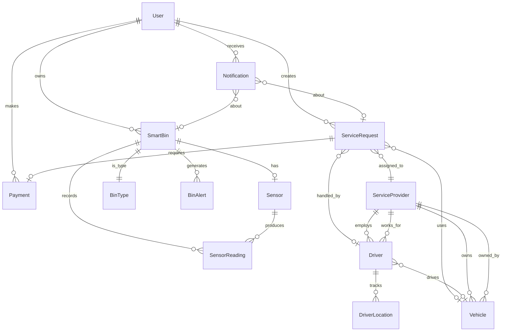

# Wasgo Entity Relationship Diagram (ERD)

## Database Schema Overview
Wasgo uses PostgreSQL with PostGIS extension for geospatial capabilities. The Django backend implements a comprehensive data model for smart waste management operations in Ghana.

## Core Django Apps and Their Models

### 1. User & Authentication Models

```python
# From apps.User.models
class User(AbstractUser):
    user_id = UUIDField(primary_key=True)
    email = EmailField(unique=True)
    phone = CharField(max_length=20)
    user_type = CharField(choices=['customer', 'driver', 'admin', 'provider'])
    is_verified = BooleanField(default=False)
    profile_image = ImageField()
    address = TextField()
    city = CharField(max_length=100)
    postal_code = CharField(max_length=10)
    created_at = DateTimeField(auto_now_add=True)
    updated_at = DateTimeField(auto_now=True)
```

### 2. WasteBin Models (apps.WasteBin)

```python
class BinType(Model):
    """Types of waste bins available"""
    WASTE_TYPES = [
        ('general', 'General Waste'),
        ('recyclable', 'Recyclable'),
        ('organic', 'Organic/Compost'),
        ('hazardous', 'Hazardous'),
        ('electronic', 'E-Waste'),
        ('plastic', 'Plastic Only'),
        ('paper', 'Paper Only'),
        ('glass', 'Glass Only'),
        ('metal', 'Metal Only'),
    ]
    name = CharField(choices=WASTE_TYPES, unique=True)
    description = TextField()
    color_code = CharField(max_length=7)  # Hex color
    icon = CharField(max_length=50)
    capacity_liters = IntegerField(default=240)

class SmartBin(Basemodel):
    """IoT-enabled smart waste bins"""
    STATUS_CHOICES = [
        ('active', 'Active'),
        ('inactive', 'Inactive'),
        ('maintenance', 'Under Maintenance'),
        ('damaged', 'Damaged'),
        ('full', 'Full - Needs Collection'),
        ('offline', 'Offline - No Signal'),
    ]
    
    FILL_STATUS = [
        ('empty', 'Empty (0-20%)'),
        ('low', 'Low (20-40%)'),
        ('medium', 'Medium (40-60%)'),
        ('high', 'High (60-80%)'),
        ('full', 'Full (80-100%)'),
        ('overflow', 'Overflow (>100%)'),
    ]
    
    bin_number = CharField(max_length=50, unique=True)
    name = CharField(max_length=100)
    bin_type = ForeignKey(BinType)
    user = ForeignKey(User, null=True)  # Owner for private bins
    sensor = OneToOneField('Sensor', null=True)
    
    # Location
    location = PointField(srid=4326)  # PostGIS
    address = CharField(max_length=255)
    area = CharField(max_length=100)
    city = CharField(max_length=100, default='Accra')
    region = CharField(max_length=100, default='Greater Accra')
    
    # Status
    status = CharField(choices=STATUS_CHOICES)
    fill_status = CharField(choices=FILL_STATUS)
    current_fill_level = IntegerField(default=0)  # 0-100%
    last_collected = DateTimeField(null=True)
    next_collection = DateTimeField(null=True)
    
    # Capacity
    capacity_kg = DecimalField(max_digits=10, decimal_places=2)
    current_weight_kg = DecimalField(max_digits=10, decimal_places=2)

class Sensor(Basemodel):
    """IoT sensors attached to bins"""
    SENSOR_TYPES = [
        ('ultrasonic', 'Ultrasonic'),
        ('weight', 'Weight Sensor'),
        ('temperature', 'Temperature'),
        ('humidity', 'Humidity'),
        ('gps', 'GPS Tracker'),
        ('camera', 'Camera'),
    ]
    
    sensor_id = CharField(max_length=50, unique=True)
    sensor_type = CharField(choices=SENSOR_TYPES)
    manufacturer = CharField(max_length=100)
    model = CharField(max_length=100)
    firmware_version = CharField(max_length=50)
    
    # Status
    is_active = BooleanField(default=True)
    is_online = BooleanField(default=False)
    battery_level = IntegerField(default=100)  # 0-100%
    signal_strength = IntegerField(default=0)  # 0-100%
    
    # Calibration
    last_calibration = DateTimeField(null=True)
    next_calibration = DateTimeField(null=True)
    
    # Communication
    mqtt_topic = CharField(max_length=255)
    last_reading = DateTimeField(null=True)
    reading_interval_minutes = IntegerField(default=15)

class SensorReading(Basemodel):
    """Sensor data readings"""
    sensor = ForeignKey(Sensor)
    reading_type = CharField(max_length=50)
    
    # Measurements
    fill_level = IntegerField(null=True)  # 0-100%
    weight_kg = DecimalField(max_digits=10, decimal_places=2, null=True)
    temperature = DecimalField(max_digits=5, decimal_places=2, null=True)
    humidity = DecimalField(max_digits=5, decimal_places=2, null=True)
    battery_level = IntegerField(null=True)
    signal_strength = IntegerField(null=True)
    
    # Location (for GPS readings)
    location = PointField(null=True)
    
    # Metadata
    raw_data = JSONField()
    timestamp = DateTimeField()
    is_anomaly = BooleanField(default=False)

class BinAlert(Basemodel):
    """Alerts generated from bins"""
    ALERT_TYPES = [
        ('overflow', 'Bin Overflow'),
        ('high_fill', 'High Fill Level'),
        ('sensor_offline', 'Sensor Offline'),
        ('low_battery', 'Low Battery'),
        ('maintenance', 'Maintenance Required'),
        ('vandalism', 'Possible Vandalism'),
    ]
    
    bin = ForeignKey(SmartBin)
    alert_type = CharField(choices=ALERT_TYPES)
    severity = CharField(choices=[('low', 'Low'), ('medium', 'Medium'), ('high', 'High'), ('critical', 'Critical')])
    message = TextField()
    is_resolved = BooleanField(default=False)
    resolved_at = DateTimeField(null=True)
    resolved_by = ForeignKey(User, null=True)
```

### 3. ServiceRequest Models (apps.ServiceRequest)

```python
class ServiceRequest(Basemodel):
    """Service requests for waste collection"""
    SERVICE_TYPE_CHOICES = [
        ('general', 'General Service'),
        ('waste_collection', 'Waste Collection'),
        ('recycling', 'Recycling Service'),
        ('hazardous_waste', 'Hazardous Waste Disposal'),
        ('bin_maintenance', 'Bin Maintenance'),
        ('bulk_waste', 'Bulk Waste Collection'),
    ]
    
    STATUS_CHOICES = [
        ('pending', 'Pending'),
        ('accepted', 'Accepted by Provider'),
        ('assigned', 'Assigned to Driver'),
        ('en_route', 'Driver En Route'),
        ('arrived', 'Driver Arrived'),
        ('in_progress', 'In Progress'),
        ('completed', 'Completed'),
        ('cancelled', 'Cancelled'),
    ]
    
    WASTE_TYPES = [
        ('general', 'General Waste'),
        ('recyclable', 'Recyclable'),
        ('organic', 'Organic/Compost'),
        ('hazardous', 'Hazardous Waste'),
        ('electronic', 'E-Waste'),
        ('construction', 'Construction Debris'),
    ]
    
    # Core fields
    request_id = CharField(max_length=50, unique=True)
    customer = ForeignKey(User)
    service_type = CharField(choices=SERVICE_TYPE_CHOICES)
    status = FSMField(default='pending', choices=STATUS_CHOICES)
    
    # Location
    pickup_location = PointField()
    pickup_address = TextField()
    
    # Scheduling
    requested_date = DateField()
    requested_time_slot = CharField(choices=[('morning', 'Morning'), ('afternoon', 'Afternoon'), ('evening', 'Evening')])
    scheduled_date = DateTimeField(null=True)
    
    # Waste details
    waste_type = CharField(choices=WASTE_TYPES)
    estimated_weight_kg = DecimalField(max_digits=10, decimal_places=2)
    description = TextField()
    photos = JSONField(default=list)
    
    # Assignment
    provider = ForeignKey('Provider.ServiceProvider', null=True)
    driver = ForeignKey('Driver.Driver', null=True)
    vehicle = ForeignKey('Vehicle.Vehicle', null=True)
    
    # Completion
    completed_at = DateTimeField(null=True)
    actual_weight_kg = DecimalField(max_digits=10, decimal_places=2, null=True)
    completion_photos = JSONField(default=list)
    
    # Pricing
    estimated_cost = DecimalField(max_digits=10, decimal_places=2)
    final_cost = DecimalField(max_digits=10, decimal_places=2, null=True)
    payment_status = CharField(choices=[('pending', 'Pending'), ('paid', 'Paid'), ('failed', 'Failed')])
```

### 4. Driver Models (apps.Driver)

```python
class Driver(Basemodel):
    """Driver profiles"""
    # Basic info
    name = CharField(max_length=255)
    email = EmailField(unique=True)
    phone_number = CharField(max_length=20)
    date_of_birth = DateField(null=True)
    national_id = CharField(max_length=20, unique=True)
    address = TextField()
    
    # Current location
    location = PointField(null=True)
    last_location_update = DateTimeField(null=True)
    
    # Employment
    provider = ForeignKey('Provider.ServiceProvider', null=True)
    employment_type = CharField(choices=[
        ('employee', 'Employee'),
        ('contractor', 'Contractor'),
    ])
    date_started = DateField()
    
    # License
    license_number = CharField(max_length=20)
    license_expiry = DateField()
    license_categories = JSONField(default=list)
    
    # Status
    is_available = BooleanField(default=True)
    is_on_duty = BooleanField(default=False)
    current_assignment = ForeignKey(ServiceRequest, null=True)
    
    # Performance
    total_trips = IntegerField(default=0)
    rating = DecimalField(max_digits=3, decimal_places=2, default=5.0)

class DriverLocation(Basemodel):
    """Real-time driver location tracking"""
    driver = ForeignKey(Driver)
    location = PointField()
    speed_kmh = DecimalField(max_digits=5, decimal_places=2)
    heading = IntegerField()  # 0-360 degrees
    timestamp = DateTimeField()
    is_moving = BooleanField()
    battery_level = IntegerField()  # Mobile device battery
```

### 5. Vehicle Models (apps.Vehicle)

```python
class Vehicle(Basemodel):
    """Fleet vehicles"""
    VEHICLE_CATEGORIES = [
        ('van', 'Van'),
        ('truck', 'Truck'),
        ('waste_collection', 'Waste Collection Vehicle'),
        ('recycling_truck', 'Recycling Truck'),
        ('compactor', 'Waste Compactor'),
    ]
    
    FUEL_TYPES = [
        ('diesel', 'Diesel'),
        ('petrol', 'Petrol'),
        ('electric', 'Electric'),
        ('hybrid', 'Hybrid'),
    ]
    
    # Identity
    registration = CharField(max_length=10, unique=True)
    make = CharField(max_length=50)
    model = CharField(max_length=50)
    year = PositiveIntegerField()
    
    # Specifications
    vehicle_category = CharField(choices=VEHICLE_CATEGORIES)
    fuel_type = CharField(choices=FUEL_TYPES)
    payload_capacity_kg = PositiveIntegerField()
    load_volume_m3 = DecimalField(max_digits=5, decimal_places=2)
    
    # Waste collection specific
    waste_types_handled = JSONField(default=list)
    has_compaction_system = BooleanField(default=False)
    has_gps_tracking = BooleanField(default=True)
    
    # Assignment
    provider = ForeignKey('Provider.ServiceProvider')
    assigned_driver = ForeignKey(Driver, null=True)
    
    # Status
    is_active = BooleanField(default=True)
    is_available = BooleanField(default=True)
    current_location = PointField(null=True)
    
    # Maintenance
    last_maintenance = DateField(null=True)
    next_maintenance_due = DateField(null=True)
    odometer_km = IntegerField(default=0)
```

### 6. Provider Models (apps.Provider)

```python
class ServiceProvider(Basemodel):
    """Waste management service providers"""
    # Company info
    company_name = CharField(max_length=255)
    registration_number = CharField(max_length=50, unique=True)
    tax_id = CharField(max_length=50)
    
    # Contact
    contact_person = CharField(max_length=100)
    email = EmailField()
    phone = CharField(max_length=20)
    website = URLField(null=True)
    
    # Location
    headquarters_location = PointField()
    headquarters_address = TextField()
    service_areas = JSONField(default=list)  # List of polygons
    
    # Services
    services_offered = JSONField(default=list)
    waste_types_handled = JSONField(default=list)
    
    # Capacity
    fleet_size = IntegerField(default=0)
    driver_count = IntegerField(default=0)
    daily_capacity_tons = DecimalField(max_digits=10, decimal_places=2)
    
    # Status
    is_active = BooleanField(default=True)
    is_verified = BooleanField(default=False)
    rating = DecimalField(max_digits=3, decimal_places=2, default=5.0)
```

### 7. Payment Models (apps.Payment)

```python
class Payment(Basemodel):
    """Payment transactions"""
    PAYMENT_METHODS = [
        ('cash', 'Cash'),
        ('mobile_money', 'Mobile Money'),
        ('card', 'Credit/Debit Card'),
        ('bank_transfer', 'Bank Transfer'),
    ]
    
    STATUS_CHOICES = [
        ('pending', 'Pending'),
        ('processing', 'Processing'),
        ('completed', 'Completed'),
        ('failed', 'Failed'),
        ('refunded', 'Refunded'),
    ]
    
    # Transaction details
    transaction_id = CharField(max_length=100, unique=True)
    user = ForeignKey(User)
    service_request = ForeignKey(ServiceRequest, null=True)
    
    # Amount
    amount = DecimalField(max_digits=10, decimal_places=2)
    currency = CharField(max_length=3, default='GHS')
    
    # Payment info
    payment_method = CharField(choices=PAYMENT_METHODS)
    status = CharField(choices=STATUS_CHOICES)
    
    # Mobile money specific
    mobile_money_provider = CharField(max_length=50, null=True)
    mobile_money_number = CharField(max_length=20, null=True)
    
    # Timestamps
    initiated_at = DateTimeField(auto_now_add=True)
    completed_at = DateTimeField(null=True)
    
    # Reference
    reference = CharField(max_length=255)
    receipt_url = URLField(null=True)
```

### 8. Notification Models (apps.Notification)

```python
class Notification(Basemodel):
    """Multi-channel notifications"""
    NOTIFICATION_TYPES = [
        ('bin_full', 'Bin Full Alert'),
        ('collection_reminder', 'Collection Reminder'),
        ('service_update', 'Service Update'),
        ('payment_reminder', 'Payment Reminder'),
        ('driver_arrival', 'Driver Arrival'),
    ]
    
    CHANNELS = [
        ('sms', 'SMS'),
        ('email', 'Email'),
        ('push', 'Push Notification'),
        ('in_app', 'In-App'),
    ]
    
    # Recipient
    user = ForeignKey(User)
    
    # Content
    notification_type = CharField(choices=NOTIFICATION_TYPES)
    title = CharField(max_length=255)
    message = TextField()
    data = JSONField(default=dict)
    
    # Delivery
    channels = JSONField(default=list)  # List of channels
    is_sent = BooleanField(default=False)
    sent_at = DateTimeField(null=True)
    is_read = BooleanField(default=False)
    read_at = DateTimeField(null=True)
    
    # Related objects
    related_bin = ForeignKey(SmartBin, null=True)
    related_request = ForeignKey(ServiceRequest, null=True)
```

## Entity Relationships Diagram



## Key Database Indexes

```sql
-- Geospatial indexes for PostGIS
CREATE INDEX idx_smartbin_location ON smartbin USING GIST(location);
CREATE INDEX idx_servicerequest_location ON servicerequest USING GIST(pickup_location);
CREATE INDEX idx_driver_location ON driver USING GIST(location);
CREATE INDEX idx_vehicle_location ON vehicle USING GIST(current_location);

-- Performance indexes
CREATE INDEX idx_sensorreading_timestamp ON sensorreading(timestamp DESC);
CREATE INDEX idx_binalert_unresolved ON binalert(is_resolved) WHERE is_resolved = false;
CREATE INDEX idx_servicerequest_status ON servicerequest(status) WHERE status != 'completed';
CREATE INDEX idx_driver_available ON driver(is_available, is_on_duty);
CREATE INDEX idx_notification_unread ON notification(user_id, is_read) WHERE is_read = false;
```

## PostGIS Spatial Queries Examples

```sql
-- Find nearest bins to a location
SELECT bin_number, name, 
       ST_Distance(location, ST_MakePoint(%s, %s)::geography) as distance
FROM wastebin_smartbin
WHERE ST_DWithin(location, ST_MakePoint(%s, %s)::geography, 1000)
ORDER BY distance;

-- Find all service requests in a provider's service area
SELECT sr.* 
FROM servicerequest_servicerequest sr, provider_serviceprovider sp
WHERE sp.id = %s
AND ST_Contains(sp.service_area, sr.pickup_location);

-- Track driver movement
SELECT ST_MakeLine(location ORDER BY timestamp) as route
FROM driver_driverlocation
WHERE driver_id = %s
AND timestamp >= %s;
```