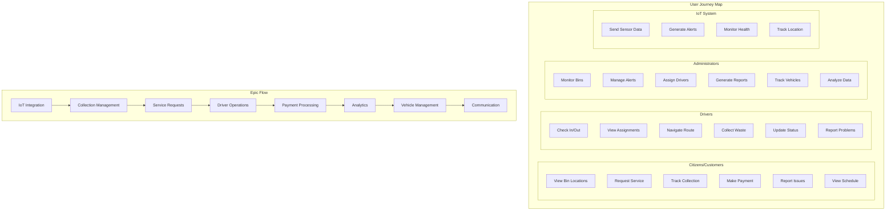
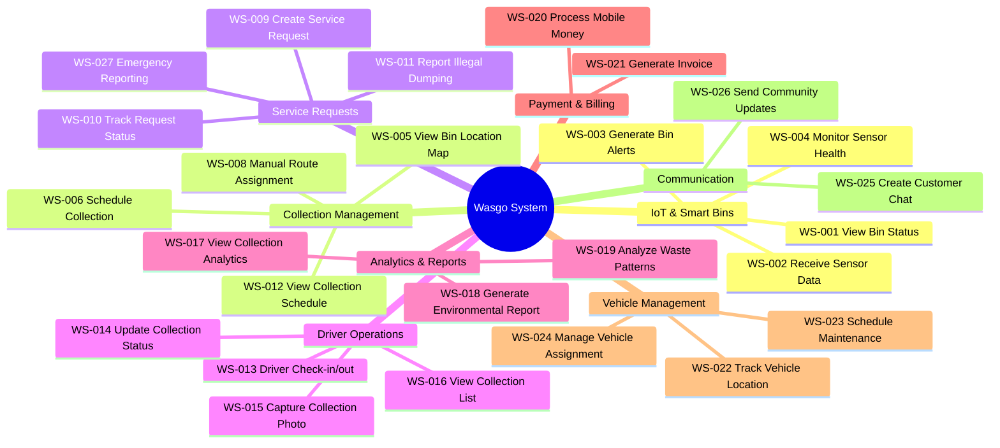
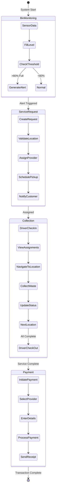
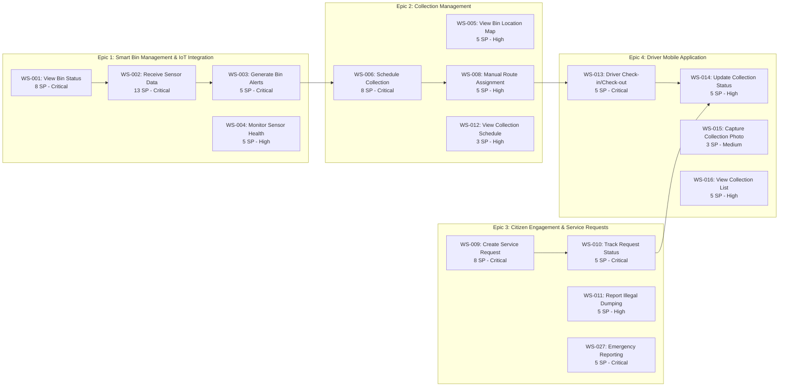
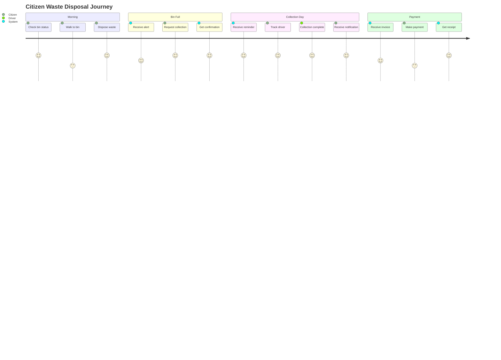
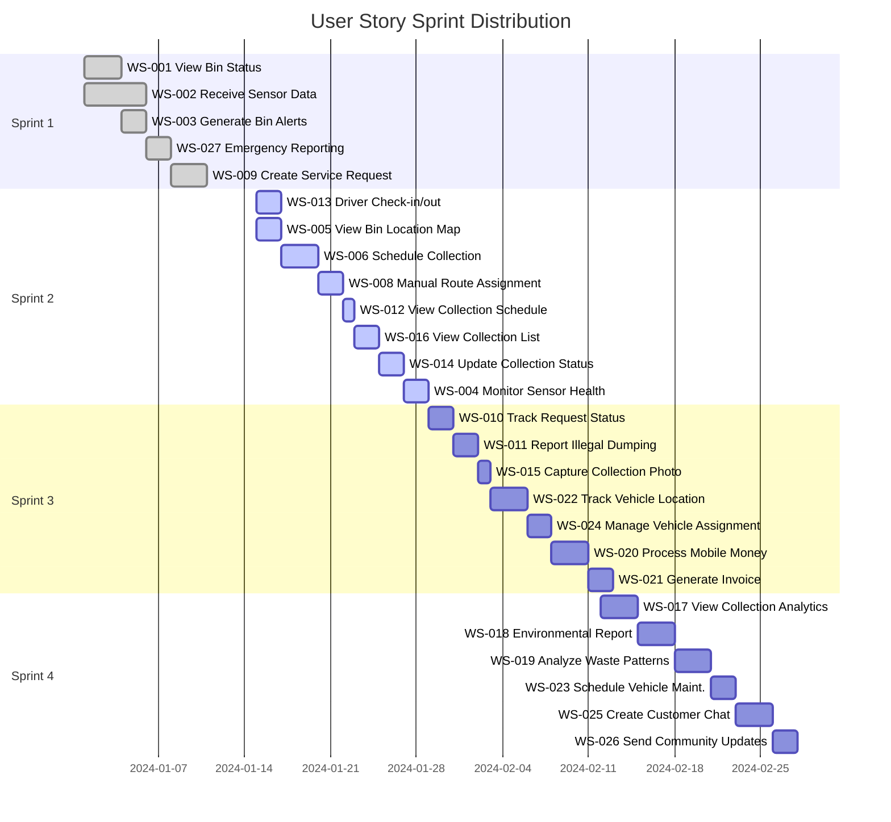
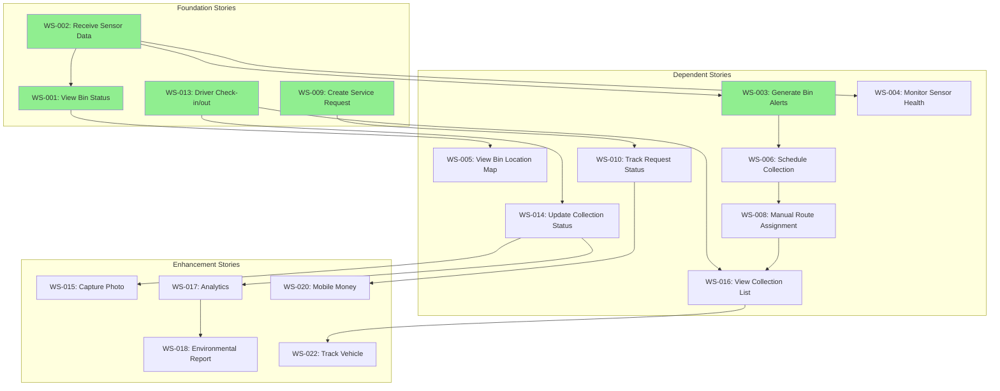
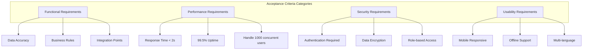

# Wasgo User Stories

## User Story Map Diagram

## User Story Hierarchy Diagram

## User Story Flow Diagram

## Epic and User Story Breakdown Diagram

## User Persona Journey Map

## Sprint Planning Story Map

## User Story Dependencies Network

## User Story Acceptance Criteria Summary

## User Stories

## Epic 1: Smart Bin Management & IoT Integration

### WS-001: Deploy Smart Bin
**As a** system administrator  
**I want to** register and deploy a new smart bin  
**So that** I can monitor waste levels in real-time

**Acceptance Criteria:**
- Admin can register bin with unique ID and sensor configuration
- GPS location is set and validated
- Sensor calibration is completed
- Bin appears on system map within 1 minute
- Initial sensor readings are received
- QR code is generated for bin identification

**Story Points:** 8  
**Priority:** Critical  
**Sprint:** 1

---

### WS-002: Monitor Bin Fill Level
**As a** waste management operator  
**I want to** see real-time fill levels of all bins  
**So that** I can schedule collections effectively

**Acceptance Criteria:**
- Dashboard shows fill percentage (0-100%)
- Color coding: Green (0-60%), Yellow (60-80%), Red (80-100%)
- Updates every 15 minutes or on significant change
- Historical fill data available for last 30 days
- Alert triggered when bin reaches 80% capacity
- Predictive fill time estimation shown

**Story Points:** 5  
**Priority:** Critical  
**Sprint:** 1

---

### WS-003: Receive Overflow Alerts
**As a** dispatch manager  
**I want to** receive immediate alerts for overflowing bins  
**So that** I can dispatch emergency collection

**Acceptance Criteria:**
- Alert sent when fill level >= 95%
- SMS and push notification within 30 seconds
- Alert includes bin location and nearest available driver
- One-click dispatch option
- Alert history logged
- Escalation if not addressed within 1 hour

**Story Points:** 5  
**Priority:** High  
**Sprint:** 1

---

### WS-004: Track Sensor Health
**As a** maintenance technician  
**I want to** monitor sensor battery and connectivity  
**So that** I can perform preventive maintenance

**Acceptance Criteria:**
- Battery level displayed (0-100%)
- Signal strength indicator
- Alert when battery < 20%
- Offline status if no data for 1 hour
- Maintenance schedule recommendations
- Sensor diagnostic report available

**Story Points:** 3  
**Priority:** High  
**Sprint:** 2

---

### WS-005: View Bin Location Map
**As a** operations manager  
**I want to** see all bins on a map  
**So that** I can manage collection areas

**Acceptance Criteria:**
- Interactive map with all bin locations
- Bins colored by fill level status
- Click for detailed bin information
- Filter by zone, type, or status
- Cluster view for dense areas
- Search by bin ID or address

**Story Points:** 5  
**Priority:** High  
**Sprint:** 2

---

## Epic 2: Collection Management

### WS-006: Schedule Collection
**As a** dispatch manager  
**I want to** schedule waste collections  
**So that** bins are emptied regularly

**Acceptance Criteria:**
- Create collection schedules by zone
- Assign drivers to collection areas
- Set recurring collection patterns
- Handle special collection requests
- Calendar view of schedules
- Notification to drivers

**Story Points:** 8  
**Priority:** Critical  
**Sprint:** 2

---

### WS-007: Track Collection Progress
**As a** operations manager  
**I want to** track real-time collection progress  
**So that** I can monitor service delivery

**Acceptance Criteria:**
- Live map shows driver location
- Bins collected marked as complete
- Progress percentage displayed
- Delays flagged automatically
- Collection confirmation photos required
- Performance metrics updated real-time

**Story Points:** 8  
**Priority:** High  
**Sprint:** 3

---

### WS-008: Manual Route Assignment
**As a** dispatch manager  
**I want to** manually assign collection areas to drivers  
**So that** all zones are covered

**Acceptance Criteria:**
- Assign zones or specific bins to drivers
- View driver availability and capacity
- Balance workload across drivers
- Handle driver absences/replacements
- Send route details to driver app
- Track assignment history

**Story Points:** 5  
**Priority:** High  
**Sprint:** 2

---

## Epic 3: Citizen Engagement & Service Requests

### WS-009: Report Waste Issue
**As a** citizen  
**I want to** report illegal dumping or overflowing bins  
**So that** the area can be cleaned promptly

**Acceptance Criteria:**
- User can submit report via web/mobile
- Photo upload required
- GPS location auto-captured or manually set
- Issue categorization (overflow, illegal dump, damaged bin)
- Ticket number generated
- Estimated response time provided

**Story Points:** 5  
**Priority:** High  
**Sprint:** 1

---

### WS-010: Request Bulk Waste Collection
**As a** resident  
**I want to** schedule bulk waste pickup  
**So that** large items are disposed properly

**Acceptance Criteria:**
- User selects pickup date and time window
- Item types and quantities specified
- Photo upload for verification
- Price quote generated
- Payment options available
- Confirmation email/SMS sent

**Story Points:** 8  
**Priority:** Medium  
**Sprint:** 3

---

### WS-011: Find Nearest Recycling Point
**As a** environmentally conscious citizen  
**I want to** find the nearest recycling facility  
**So that** I can dispose of recyclables properly

**Acceptance Criteria:**
- Map shows recycling points within 5km
- Filter by material type (plastic, glass, paper, e-waste)
- Operating hours displayed
- Directions provided
- User reviews and ratings shown
- Accepted materials list available

**Story Points:** 5  
**Priority:** Medium  
**Sprint:** 4

---

### WS-012: View Collection Schedule
**As a** resident  
**I want to** view waste collection schedule for my area  
**So that** I can prepare bins on time

**Acceptance Criteria:**
- Enter address or use GPS location
- Show next collection date/time
- Display collection frequency
- Holiday schedule adjustments
- Subscribe to reminders
- Download calendar

**Story Points:** 3  
**Priority:** High  
**Sprint:** 2

---

## Epic 4: Driver Mobile Application

### WS-013: Driver Check-in/Check-out
**As a** waste collection driver  
**I want to** check in when starting my shift  
**So that** my work hours are tracked

**Acceptance Criteria:**
- One-tap check-in with GPS verification
- Vehicle inspection checklist
- View assigned collection area
- Break time tracking
- End-of-shift summary
- Overtime calculation

**Story Points:** 5  
**Priority:** High  
**Sprint:** 2

---

### WS-014: Scan Bin QR Code
**As a** driver  
**I want to** scan bin QR codes  
**So that** collection is verified

**Acceptance Criteria:**
- QR scanner in mobile app
- Bin details displayed upon scan
- Collection confirmed with timestamp
- Weight recorded (if available)
- Issues can be reported
- Offline mode with sync

**Story Points:** 5  
**Priority:** High  
**Sprint:** 2

---

### WS-015: Report Bin Issues
**As a** driver  
**I want to** report damaged or inaccessible bins  
**So that** maintenance can be scheduled

**Acceptance Criteria:**
- Issue categories (damaged, blocked, vandalized, missing)
- Photo evidence required
- Voice notes supported
- GPS location auto-captured
- Maintenance ticket created
- Alternative collection noted

**Story Points:** 3  
**Priority:** Medium  
**Sprint:** 3

---

### WS-016: View Collection List
**As a** driver  
**I want to** see my assigned bins for collection  
**So that** I know my daily tasks

**Acceptance Criteria:**
- List of assigned bins/areas
- Map view of collection points
- Bin fill levels shown
- Priority indicators
- Mark as collected
- Notes for special instructions

**Story Points:** 5  
**Priority:** High  
**Sprint:** 2

---

## Epic 5: Analytics & Reporting

### WS-017: View Collection Dashboard
**As a** city administrator  
**I want to** see waste collection metrics  
**So that** I can assess service performance

**Acceptance Criteria:**
- Real-time collection statistics
- Monthly/weekly/daily views
- Zone-wise breakdown
- Trend analysis graphs
- Export to PDF/Excel
- Comparative analysis with targets

**Story Points:** 8  
**Priority:** High  
**Sprint:** 4

---

### WS-018: Generate Environmental Impact Report
**As a** sustainability officer  
**I want to** track environmental metrics  
**So that** I can report on green initiatives

**Acceptance Criteria:**
- Waste diverted from landfills
- Recycling rates by material type
- Landfill diversion statistics
- Comparison with baseline year
- Graphical representations
- Shareable report format

**Story Points:** 8  
**Priority:** Medium  
**Sprint:** 5

---

### WS-019: Analyze Waste Generation Patterns
**As a** urban planner  
**I want to** understand waste generation patterns  
**So that** I can plan infrastructure better

**Acceptance Criteria:**
- Heat maps of waste generation
- Peak generation times identified
- Seasonal variations analyzed
- Demographic correlations
- Historical trend analysis
- Recommendations generated

**Story Points:** 13  
**Priority:** Low  
**Sprint:** 5

---

## Epic 6: Payment & Billing

### WS-020: Process Service Payment
**As a** customer  
**I want to** pay for waste services online  
**So that** I can avoid cash transactions

**Acceptance Criteria:**
- Multiple payment methods (Mobile Money, Card, Bank)
- Secure payment gateway
- Instant payment confirmation
- Receipt generation
- Payment history available
- Auto-pay option

**Story Points:** 8  
**Priority:** High  
**Sprint:** 3

---

### WS-021: Manage Subscriptions
**As a** commercial customer  
**I want to** manage my waste collection subscription  
**So that** I can adjust service levels

**Acceptance Criteria:**
- View current plan details
- Upgrade/downgrade options
- Additional services selection
- Billing cycle management
- Invoice download
- Payment reminders

**Story Points:** 8  
**Priority:** Medium  
**Sprint:** 4

---

## Epic 7: Vehicle & Fleet Management

### WS-022: Track Vehicle Location
**As a** fleet manager  
**I want to** track all collection vehicles  
**So that** I can monitor operations

**Acceptance Criteria:**
- Real-time GPS tracking
- Speed monitoring
- Current location on map
- Idle time detection
- Daily distance traveled
- Maintenance alerts

**Story Points:** 8  
**Priority:** High  
**Sprint:** 3

---

### WS-023: Schedule Vehicle Maintenance
**As a** fleet manager  
**I want to** schedule preventive maintenance  
**So that** vehicles remain operational

**Acceptance Criteria:**
- Maintenance schedule based on mileage/time
- Service history tracking
- Parts inventory management
- Cost tracking
- Vendor management
- Downtime minimization

**Story Points:** 5  
**Priority:** Medium  
**Sprint:** 4

---

### WS-024: Manage Vehicle Assignment
**As a** fleet manager  
**I want to** assign vehicles to drivers  
**So that** resources are utilized efficiently

**Acceptance Criteria:**
- Assign vehicle to driver
- Track vehicle availability
- Handle vehicle breakdowns
- Temporary reassignments
- Vehicle capacity management
- Usage reports

**Story Points:** 5  
**Priority:** High  
**Sprint:** 3

---

## Epic 8: Communication & Support

### WS-025: Chat with Support
**As a** user  
**I want to** chat with customer support  
**So that** my issues are resolved quickly

**Acceptance Criteria:**
- In-app chat feature
- Agent availability indicator
- File/image sharing
- Chat history saved
- Satisfaction rating
- Escalation option

**Story Points:** 5  
**Priority:** Medium  
**Sprint:** 4

---

### WS-026: Receive Collection Reminders
**As a** resident  
**I want to** receive collection day reminders  
**So that** I can prepare my waste bins

**Acceptance Criteria:**
- SMS/Push notification day before
- Collection time window specified
- Special instructions included
- Holiday schedule updates
- Opt-in/out preferences
- Language selection

**Story Points:** 3  
**Priority:** Medium  
**Sprint:** 3

---

### WS-027: Emergency Reporting
**As a** citizen  
**I want to** report urgent waste emergencies  
**So that** immediate action can be taken

**Acceptance Criteria:**
- Emergency hotline number displayed
- One-click emergency report
- Hazardous waste option
- Location sharing mandatory
- Priority routing to dispatch
- Response time tracking

**Story Points:** 5  
**Priority:** High  
**Sprint:** 1

---

## Story Points Summary by Sprint

| Sprint | Focus Area | Total Points | Key Deliverables |
|--------|------------|--------------|------------------|
| Sprint 1 | IoT Foundation | 28 | Smart bin deployment, monitoring, citizen reporting, emergency system |
| Sprint 2 | Basic Operations | 39 | Bin mapping, scheduling, driver app basics |
| Sprint 3 | Collection Management | 37 | Payment system, vehicle tracking, collection progress |
| Sprint 4 | Analytics & Support | 39 | Dashboards, customer support, subscriptions |
| Sprint 5 | Advanced Features | 29 | Environmental reporting, pattern analysis |

## Definition of Done
1. Code complete and peer-reviewed
2. Unit tests written (>80% coverage)
3. Integration tests passing
4. API documentation updated
5. Mobile app tested on iOS/Android
6. IoT sensor data validated
7. Performance benchmarks met
8. Deployed to staging environment
9. User acceptance testing completed
10. Production deployment successful